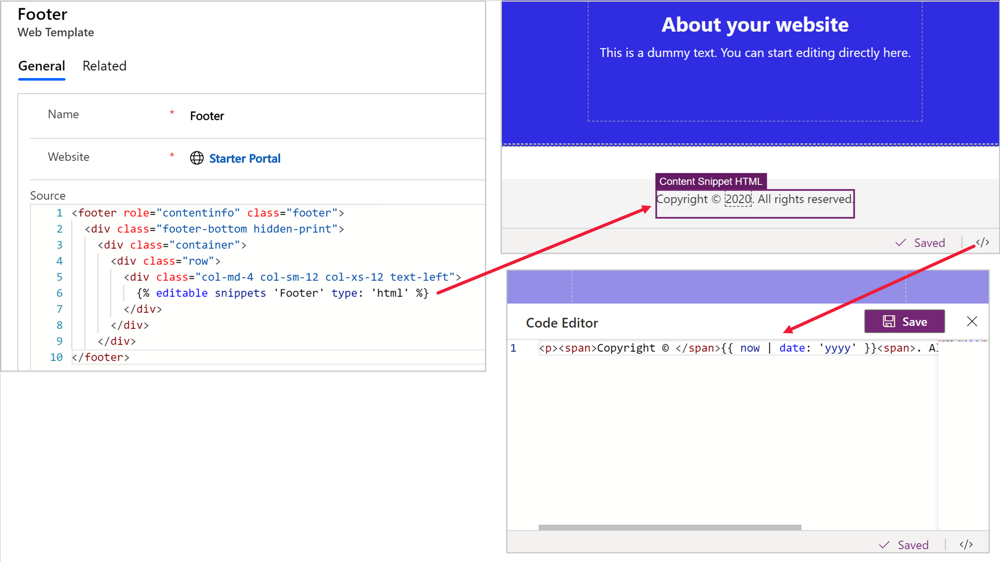

Blocks of content that can be copied and reused help to maintain the design and consistency of your portal. Power Apps portals solution offers a few ways to reuse content.

## Content snippets

Content snippets are small chunks of editable content that can be placed by a template maker on a page template, allowing for customizable content to populate any portion of a page, including header and footer.

New content snippets can only to be created in Portal Management app. If a template maker inserts a snippet as editable then the Portal Studio will display **Edit** command when user hovers over the snippet. Snippet content then can be edited using Source code editor.

> [!div class="mx-imgBorder"]
> 

Content managers editing a snippet should be aware whether the snippet is used in one place only, for example Home/Title defining the title on the portal home page, or if the snippet is used in multiple templates throughout the site, for example, an official business trading name (that can change). In the that scenario changing the content in one place will update it wherever the snippet is used.

Do not restrict your thinking that a snippet may contain only text content. Snippets can contain HTML, layout elements, styles, or even Liquid code template processing instructions. Anywhere where is the need to make a part of a portal (not necessarily even visible) customizable and reusable, a snippet could be used.

Using snippets creates consistent look and feel for the site, makes it easy to translate the multi-lingual context, and allows targeted edited of the parts of a page without affecting the overall content.

## Shortcuts

The front-side content editor can be used to create the hierarchical structure of your portal by adding child pages, child files and child shortcuts to a web page. Shortcut can be a link to an external URL, another web page, web file or a forum on your portal. What shortcuts allow you to do is to modify the sitemap without actually moving any content.

For example, consider when you have a News page with some news categories underneath. You may want to decide that you would like the latest company announcement to be listed as part of the news navigation. To do that you can define a **Latest** shortcut (with the News page as a parent) pointing to the latest announcement (which could be "buried" in the hierarchy and have a URL like `https://www.contoso.com/news/2019/Q1/profit-up-20-percent`). As a result, your navigation would place a shortcut to a page from the hierarchy directly below the top level of news.

> [!div class="mx-imgBorder"]
> 

Normally, the shortcut security is defined by the security the target. Select **Disable target validation** to define shortcut visibility by the security assigned to the parent page. This will determine whether the shortcut will be visible in the sitemap.

## Redirects

Redirects are useful in two scenarios:

* To have a simple URL that redirects to a page deeper in the site. For example, if a customer support page is located at `https://www.contoso.com/customer-engagement/customer-service`, you may want to publish a URL that is simpler to remember and quicker to type, for example `https://www.contoso.com/help`.
* To allow for a legacy or erroneous URL to be used with the site and automatically redirect to a new URL in the site.

Page redirects let you specify a URL that, when requested, will be redirected on a permanent or temporary basis to a specific webpage or web file. These redirect URLs are managed separately from the page content so that they do not have to fit directly in the web hierarchy.

> [!NOTE]
> Redirects can only be defined by using Portal Management app.
