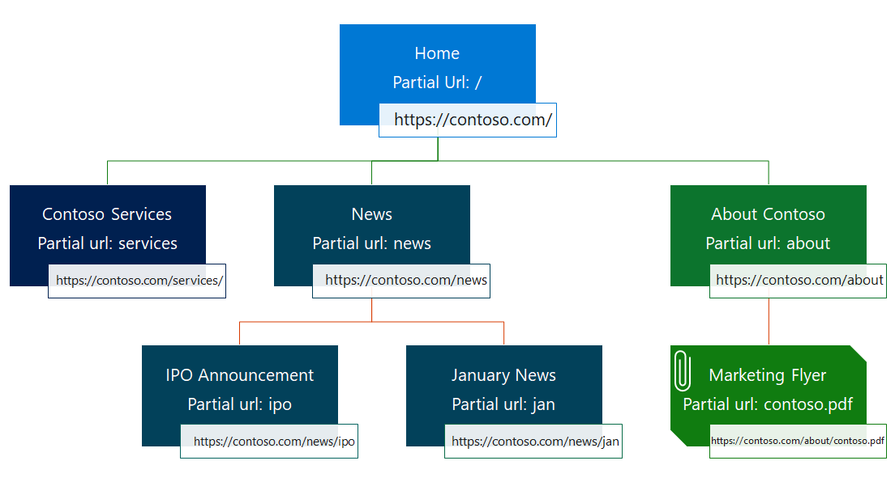
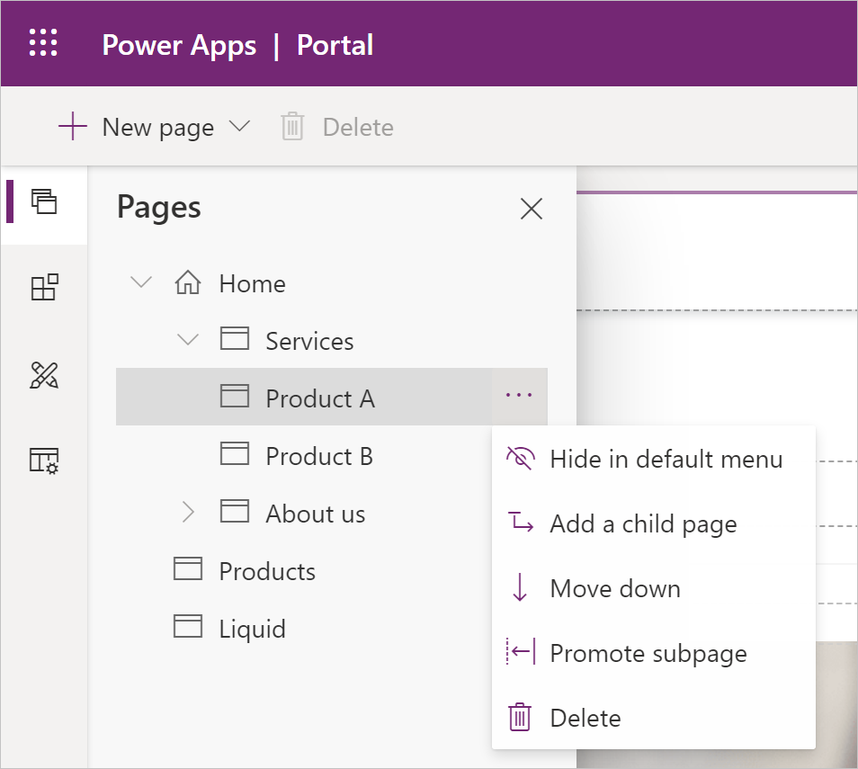
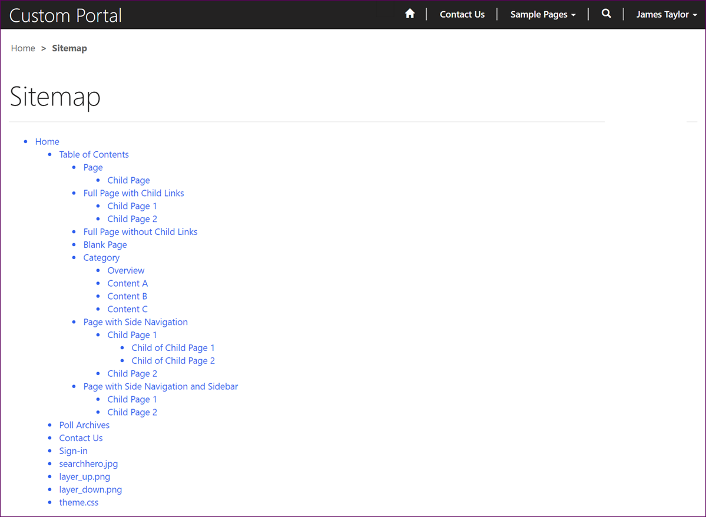

Most of the content of a portal is represented by the web pages. A web page represents a particular URL in a portals website. Portal structure is hierarchical and all web pages have a parent page except for the single root (Home) page of a website.

Web pages also form the basis for including other, specialized entity types: web files, shortcuts, forums, ideas, and blogs. Each of these records has a relationship with a parent page. Through parent and child relationships, these entities form the hierarchy of the web site, that is, its site map.

> [!div class="mx-imgBorder"]
> 

### Child pages

The parent-child relationships for a particular page can be viewed by selecting the **Pages** section of the toolbelt. That will display the ordered list of the site pages. You can rearrange the page order, add, edit, and delete, promote and demote pages, and see whether the particular page is visible in the default menu.

> [!div class="mx-imgBorder"]
> 

### Site map

You can view your site structure at `https://portal_url/sitemap`. This is a visual representation of the hierarchy of the entire site, and could be used for verification, documentation, and building navigation. The records can be hidden from the site map by setting the **Hidden from Sitemap** field.

Sitemap can be shaped by security. If a visitor doesn't have permissions to access a particular page, that page won't be visible for them in the sitemap.

> [!div class="mx-imgBorder"]
> 

The other type of sitemap, designed for consumption by search engines and crawlers, is not included with the portal out of the box but can be created by using templates.

## Web links

A **web link** can link to any URL or to a web page within the portal. It's similar to a shortcut but does not participate in the site hierarchy. In fact, web links do not exist on their own, they are always part of a **web link set**. Once a web link set is defined, it can be used by templates to build navigational elements such as main menu, footer menu, and wherever else the ordered, hierarchical list of links can be used.

When a web link is linked to a web page, the security and publishing state of the web page will apply to the web link as well. This can be disabled with the **Disable Page Validation** option of the web link.

For example, if a **Partners Only** page requires the user to sign in, it will not be visible in the navigation for anonymous visitors. However, you may want to display the link to the page regardless of the security so that anonymous visitors will see the **Partners Only** link but, when followed, they will be redirected to a sign-in page.

For more information about web links and web link sets, see [Manage web links](https://docs.microsoft.com/powerapps/maker/portals/configure/manage-web-links/?azure-portal=true).

## Other navigation

The web link sets are not the only way to navigate the website. The hierarchical relationship between parent and child web pages can also be used by page templates that display links to child pages.

How the child links are rendered is entirely up to the template. Portal templates include a number of pages demonstrating different rendering techniques for navigation.

> [!div class="mx-imgBorder"]
> 
