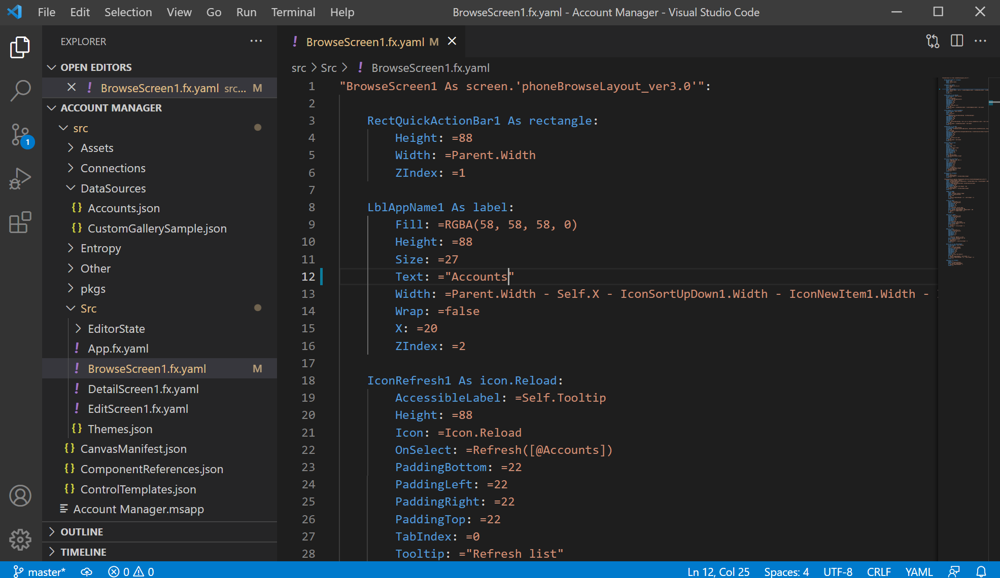
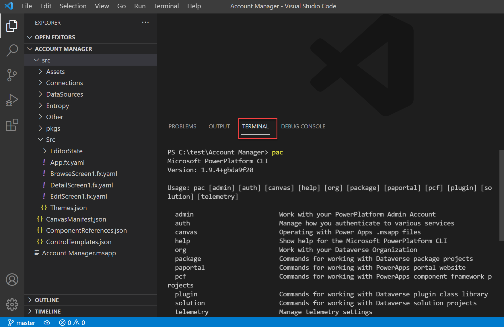

When you edit a canvas app in Microsoft Power Apps Studio, a visual representation of the app will display.

> [!div class="mx-imgBorder"]
> [](../media/canvas-app.png#lightbox)

You can drag and drop a control on the screen, use the formula bar to edit your expressions, and use the **Properties** panel to edit control property values. Most makers use these tools to create and modify apps.

You can save a copy of a canvas app to your computer as a single file with an .msapp extension. If the canvas app is a part of a Microsoft Dataverse solution, then you can use the [Microsoft Power Platform CLI (command-line interface)](/powerapps/developer/data-platform/powerapps-cli/?azure-portal=true) to download the solution and extract the app. The app file is self-contained and represents the entire app, including screens, controls, components, connections, formulas, and so on. However, internally, the app contains many separate files, each describing a part of the app. You can use the **unpack** command of Power Platform CLI to extract these files. After the files have been unpacked, you can edit most of the files by using any text editor. The following screenshot shows an example of the same app opened in Microsoft Visual Studio Code after it's been unpacked.

> [!div class="mx-imgBorder"]
> [](../media/visual-studio-code.png#lightbox)

Unpacking the canvas app into individual text files will enable the following scenarios, where you can:

-   Edit the source code directly in a text editor instead of a visual designer. For example, doing a global find and replace would be more efficient in a text editor.

-   Store individual text files in source control, allowing for granular tracking of changes in an app. For example, you could reassess when a label in the app was changed from X to Y and who made the change.

-   Use automated development tools that rely on source code, such as static code analysis, code generators, templates, and so on.

The source to your app is represented by a subset of [YAML](https://yaml.org/?azure-portal=true), which is a human-friendly data serialization language. How to work with YAML will be covered later in this module.

## Power Platform CLI 

[Power Platform CLI](/powerapps/developer/data-platform/powerapps-cli/?azure-portal=true) (or CLI) is a command-line tool that you can use for many development and administrative tasks in Microsoft Power Platform, such as building Power Apps component framework components, managing environments, working with solutions and portals, and more. You can use the CLI from a simple command prompt, as part of an automated build, or from the terminal in Visual Studio Code.

This module focuses on the canvas app and solution functionality of Power Platform CLI. You can review the other capabilities and how they work in the [product documentation](/powerapps/developer/data-platform/powerapps-cli#common-commands/?azure-portal=true). You can download and install [Power Platform CLI](https://aka.ms/PowerAppsCLI/?azure-portal=true). If you already have the CLI installed, ensure that you have the latest version by using the following command:

	`pac install latest`

### Canvas unpack command

When you download a canvas app from the cloud, it's a single file with an .msapp extension. The **canvas unpack** command takes this file as input and *unpacks* it into multiple files that represent the different parts of the app. For example, each screen in the app will have its own file in the output from the command.

To unpack the .msapp file of a canvas app, use the following command:

```pac canvas unpack --msapp "Account Manager.msapp" --sources src```

The target output folder is identified by the source's switch by using the [following folder structure](/powerapps/developer/data-platform/powerapps-cli?azure-portal=true#folder-structure).

> [!div class="mx-imgBorder"]
> [](../media/file-hierarchy.png#lightbox)

### Canvas pack command

The **canvas pack** command is the reverse of the **canvas unpack** command, where it *packs* the folder that contains individual files into a single .msapp file. To pack the app so that it's ready for upload to the cloud, or so that it's included in a solution, use this command:

```pac canvas pack --msapp "Account Manager.msapp" --sources src```

### Solution commands

You can get the .msapp file for your canvas app from the maker portal by downloading the individual app. If you use solutions to hold your apps and flows, then the exported solution will contain the .msapp file for each canvas app in the solution. By using the CLI and the **solution unpack** command, you can extract the individual .msapp files from the solution. The following example shows the **solution unpack** command:

```pac solution unpack --solution-zip C:\SampleSolution.zip --folder .\SampleSolutionUnpacked\.```

The **SampleSolutionUnpacked** folder will contain a **CanvasApps** subfolder that includes the .msapp file for each app that is included in your solution.

Similar to **canvas pack**, the **solution pack** command reassembles the files into a solution that you can import to a cloud environment. The following example shows the **solution pack** command:

```pac solution pack --solution-zip C:\SampleSolution.zip --folder .\SampleSolutionUnpacked\.```

## Power Platform vs. code extension

The Microsoft Power Platform extension helps you use Power Platform CLI from within Visual Studio Code. When you install the extension, it installs the latest Power Platform CLI for use within a Visual Studio Code terminal window.

> [!div class="mx-imgBorder"]
> [](../media/terminal.png#lightbox)

By using the extension, you can pack and unpack your canvas apps without leaving Visual Studio Code. Use the same commands that were previously discussed with the standalone CLI.

## Source control 

Unpacking a canvas app creates many files and makes it possible for you to commit the individual files to source control for each change. These steps can become part of your overall strategy for [application lifecycle management (ALM) with Microsoft Power Platform](/power-platform/alm/?azure-portal=true). By committing the individual files to source control, you get better granular tracking of the changes that you made. Specifically, if you commit only the .msapp file, the only difference between the versions to note is that "something" has changed. By unpacking and committing the individual files, you can get line-by-line differencing and you can highlight the changes in each commit. Combined with work item tracking, you will also get requirements traceability down to the change that was made to support the work item.

The rest of the module explores how to work with source control from your canvas app.
