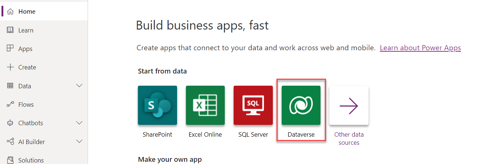
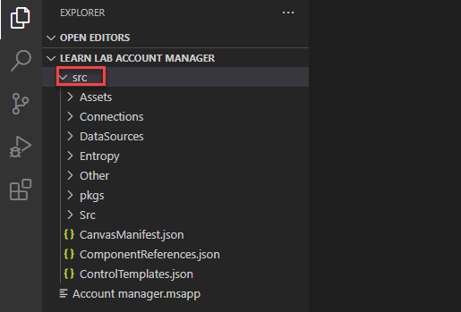

You have been asked to create an account management app for your organization. One of the development requirements within your organization is for the source of any in-house app to be available in the text form. This allows the company to perform an automatic scan of the source code for potential copyright infringements.

You decided to create a canvas app and to make the app source available in the text format.

## Requirements

Microsoft Dataverse environment with database installed.

## What you will learn

- How to create a canvas application and download it in your computer.

- How to install Power Platform extension for Visual Studio Code.

- How to unpack a canvas application in Visual Studio Code.

## Exercise 1: Create app 

In this exercise, you will create an account management canvas application and save it to your local machine.

### Task 1: Create application

1.  Navigate to [Power Apps maker portal](https://make.powerapps.com/?azure-portal=true), sign in, and select the environment you would like to use for this lab.

1.  Select **Home** and select **Dataverse**.

	> [!div class="mx-imgBorder"]
	> 

1.  If Microsoft Dataverse is selected, skip to the next step. Otherwise select **+ New connection** and select **Microsoft Dataverse**.

1.  Select **File**.
 **Create**.

1.  Choose the **Accounts** table and select **Connect**.

1.  Select **Cloud**, enter **Account manager** for Name and select **Save**. Select **Save As**.

1.  Select **This computer**.

	> [!div class="mx-imgBorder"]
	> 

1.  Select **Download**.

1. Create a new folder on your computer and name it **Learn lab account manager**.

1. Move the downloaded app to the folder you created.

	> [!div class="mx-imgBorder"]
	> 

## Exercise 2: Install tools and unpack

In this exercise, you will install Visual Studio Code, install Power Platform extension for Visual Studio, and then unpack the canvas application.

### Task 1: Install tools

In this task, you will install Visual Studio Code.

1.  Navigate to [Download Visual Studio Code - Mac, Linux, Windows](https://code.visualstudio.com/Download/?azure-portal=true) and select the download for your platform.

1.  Follow prompts to install **Visual Studio Code**.

1.  Start Visual Studio Code after installation completes.

1.  Select **View** menu and select **Extensions**. Type **power platform** in the search box and select **Power Platform** in the search results.

	> [!div class="mx-imgBorder"]
	> 

1.  Select **Install** and wait for the installation to complete.

	> [!div class="mx-imgBorder"]
	> 

1.  Select **File** menu and select **Open Folder**.

1.  Select the **Learn lab account manager** folder you created earlier.

1.  Select **Terminal** menu and select **New terminal**.

	> [!div class="mx-imgBorder"]
	> [

1.  Run the command below to unpack the Account manager application.

	`pac canvas unpack --msapp "Account manager.msapp" --sources src`

1. The unpack should succeed. Expand the **src** folder that was created.

	> [!div class="mx-imgBorder"]
	> 

1. Expand each folder inside the **src** folder and examine their content.