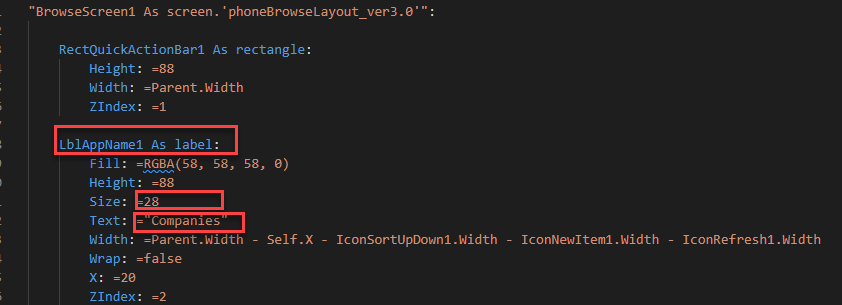
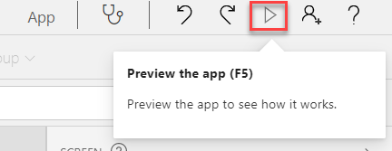
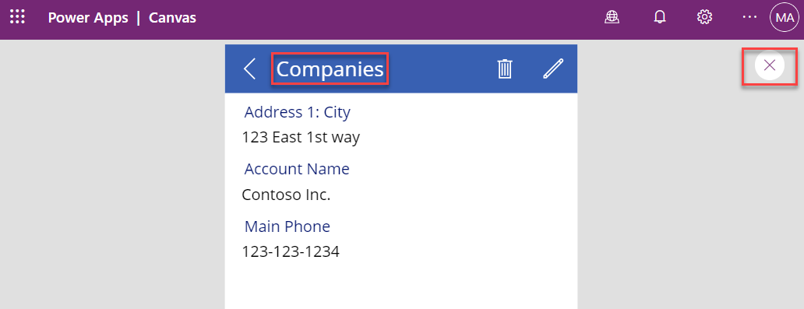
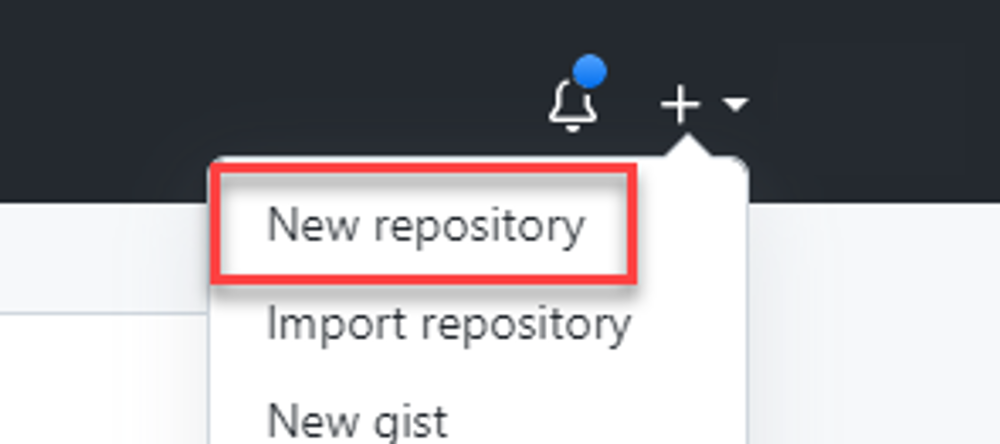
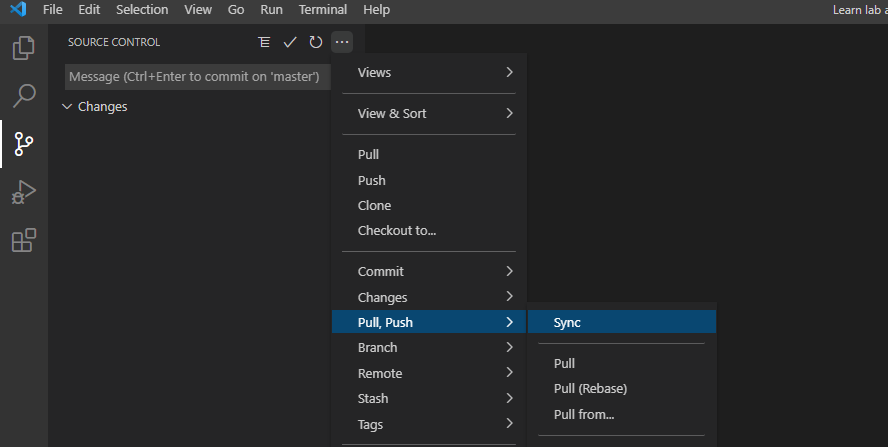
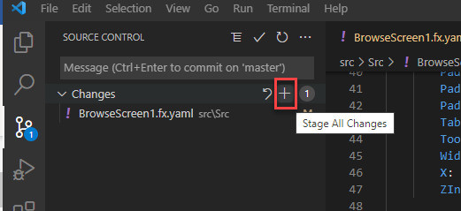

You have been asked to create an account management app for your organization. You decided to create a canvas app and to make the app source available in the text format to comply with the organization legal requirements. Your organization development policies require all assets created by developers to be stored in the source control repository. Source code should be committed to the repository in the text format wherever possible to make it easier to collaborate in a project team environment and make the source available for automatic scanning and differencing.

## Requirements

Microsoft Dataverse environment with database installed.

## What you will learn

- How to edit a canvas application in Visual Studio Code.

- How to package a canvas application in Visual Studio Code.

- How to upload a canvas application to Power Apps Studio.

- How to create and initialize local and remote git repositories.

- How to synchronize local and remote repositories and work with changes.

## Prerequisite

The prior lab from this module must be completed.

## Exercise 1: Edit application 

In this exercise, you will edit the account manager application in Visual Studio Code.

### Task 1: Edit app

1.  Open Visual Studio Code.

1.  If the **Learn lab account manager** folder is not opened automatically, select **File** menu and select **Open Folder**. Locate and open **Learn lab account manager** folder.

1.  Expand the **src** folder, expand the **Src** folder, and select **BrowseScreen1.fx.yaml** file.

	> [!div class="mx-imgBorder"]
	> 

1.  Locate **LblAppName1**.

1.  Change the **Text** value of **LblAppName1** to **Companies** and the **Size** to **28**.

	> [!div class="mx-imgBorder"]
	> 

1.  Locate **IconNewItem1**.

1.  Change the **Navigate** formula transition from **None** to **CoverRight** and add the trace expression below.

	`;Trace("New Item Selected")`

	> [!div class="mx-imgBorder"]
	> 

1.  Select the **DetailScreen1.fx.yaml** file.

1.  Locate **LblAppName2**.

1. Change the **Text** value of **LblAppName2** to **Companies** and the **Size** to **28**.

1. Select the **EditScreen1.fx.yaml** file.

1. Locate **LblAppName3**.

1. Change **Text** value of **LblAppName3** to **Companies** and the **Size** to **28**.

1. Select **File** menu and select **Save all**.

## Exercise 2: Pack and upload

In this exercise, you will package the application and upload it to your environment.

### Task 1: Pack and upload

1.  Open terminal and run the command below.

	`pac canvas pack --msapp "Account manager.msapp" --sources src`

	> [!div class="mx-imgBorder"]
	> 

1.  You may receive the message **Warning PA2001: Checksum mismatch** that can be safely ignored.

1.  Switch to browser, navigate to [Power Apps maker portal](https://make.powerapps.com/?azure-portal=true) and make sure you are in the correct environment.

1.  Select **Apps**.

1.  Select the **Account manager** app and select **Edit**.

1.  Select **File**, select **Open**, and then select **Browse**.

	> [!div class="mx-imgBorder"]
	> 

1.  Select the **Account manager.msapp** file located in the **Learn lab account manager** folder and select **Open**.

	> [!div class="mx-imgBorder"]
	> 

1.  Select Preview app.

	> [!div class="mx-imgBorder"]
	> 

1.  The label text should show the changes you make in Visual Studio Code. Select **+** add new.

	> [!div class="mx-imgBorder"]
	> 

1. The label text should show the changes you made in Visual Studio Code. Fill out the form and select **Save**.

	> [!div class="mx-imgBorder"]
	> 

1. Select to open the new account.

1. The label text should show the changes you made. Close the app preview.

	> [!div class="mx-imgBorder"]
	> 

1. Select **File** and select **Save**.

1. Select **Publish**.

1. Select **Publish this version** and wait for the publishing to complete.

## Exercise 3: GitHub (Optional)

In this exercise, you will create a new repository in GitHub, initialize repository, and work with changes.

### Task 1: Initialize remote repository

1.  Navigate to [GitHub](https://github.com/?azure-portal=true) and sign in. If this is your first time select **Sign up**, and follow the prompts to complete the sign-up process.

1.  Select **+** button and select **New repository**.

	> [!div class="mx-imgBorder"]
	> 

1.  Enter **Contoto\_Man** for Repository name, select **Private**, and select **Create repository**.

	> [!div class="mx-imgBorder"]
	> 

1.  Copy the **URL** and keep it in notepad.

	> [!div class="mx-imgBorder"]
	> 

### Task 2: Initialize local repository

1.  Open Visual Studio Code.

1.  If the **Learn lab account manager** folder is not opened automatically, select **File** menu and select **Open Folder**. Locate and open **Learn lab account manager** folder.

1.  Select **View** menu and select **SCM** (source control manager).

1.  Select **Initialize repository**.

	> [!div class="mx-imgBorder"]
	> 

1.  Hover over the **Changes** and select **+** to stage all changes.

	> [!div class="mx-imgBorder"]
	> 

1.  Type **Initial commit** for the message and select **Commit** (checkbox button).

	> [!div class="mx-imgBorder"]
	> 

### Task 3: Add remote and sync repo

1.  Select the **...** button and select **Remote > Add Remote**.

	> [!div class="mx-imgBorder"]
	> 

1.  Paste the repository URL you copied earlier and select **Add remote from URL**. Sign in if prompted.

	> [!div class="mx-imgBorder"]
	> 

1.  Type **Origin** as remote name and **[ENTER]**.

	> [!div class="mx-imgBorder"]
	> 

1.  Select the **...** button and select **Pull**, **Push > Sync**.

	> [!div class="mx-imgBorder"]
	> 

1.  Select **OK**.

1.  Go to GitHub and open the **Contoto_Man** repository.

1.  Select to open the **src** folder.

	> [!div class="mx-imgBorder"]
	> 

1.  Examine the content of the folder.

### Task 4: Work with changes

1.  Switch to Visual Studio Code and select the **BrowseScreen1.fx.yaml** file.

1.  Locate **IconNewItem1** and change the **Navigate** formula transition from **CoverRight** to **UnCover**.

	> [!div class="mx-imgBorder"]
	> 

1.  Select **File** and select **Save All**.

1.  Select **Source control** and select **Stage all changes**.

	> [!div class="mx-imgBorder"]
	> 

1.  Type **Change transition as per UX guidelines** for the message and select **Commit** (checkbox icon).

	> [!div class="mx-imgBorder"]
	> 

1.  Select the **...** button and select **Push**.

1.  Go back to GitHub and open the **Contoso_Man** repository.

1.  Select to open the commit.

	> [!div class="mx-imgBorder"]
	> 

1.  Review the changes.

	> [!div class="mx-imgBorder"]
	> 
