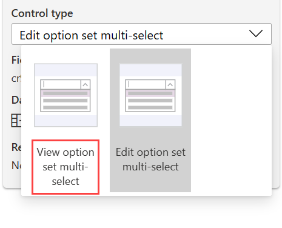

The easiest way to set a choice or choices column value is to use an [Edit form](/powerapps/maker/canvas-apps/controls/control-form-detail/?azure-portal=true). When you add a choice or choices column to the form, it configures the field to do the following:

- Configure as either a drop-down (choice) or a combo box (choices).

- Use the choices function to populate the list of values the user can select.

- Set the control current value from the row's column value.

- If the value changes, save it to Dataverse when SubmitForm function is called.

> [!div class="mx-imgBorder"]
> 

When a column is added to the form by default, it will be editable. If you have a scenario where you want to display the choice or choices column on the form but not have it editable you can change the form field control type to the view option.

> [!div class="mx-imgBorder"]
> 

## Use patch to create or update

You can also create or modify choice and choices columns using the patch() function. This approach is suitable when you're updating only few fields and they require little or no user input. For example, on a gallery item you can have a button that, when selected, will use the OnSelect behavior to run a patch function to update the row.

In the following example, we've configured a button on the gallery item to make the account a Preferred Customer. When selected the goal is to set the row's category choice field to Preferred Customer. To accomplish this, we've added a Make VIP button to the gallery item.

> [!div class="mx-imgBorder"]
> 

The OnSelect property for the Make VIP button contains the following patch formula:

> [!div class="mx-imgBorder"]
> 

## Clear values

You can also use patch to clear existing values from a choice or choices columns using the blank() function. For example, the following formula would reset the category column choice field on the current item in a gallery.

`Patch( Accounts, ThisItem, {Category:Blank()} )`

The same syntax would clear the value for a choices column. For example, the following formula would clear existing values for the 'Preferred Delivery' choices column.

`Patch(Accounts,ThisItem,{'Preferred Delivery':Blank()})`
