In this exercise, you'll be helping Contoso add choice and choices columns to an existing Dataverse table. You'll then modify their Product Management app to use the new columns.

## What you'll learn

- How to create choice column types.

- How to create choices column types.

- How to use filter data in the app using the choice and choices columns.

- How to use Patch to update and clear column values.

## Prerequisite

You'll need an environment with Microsoft Dataverse.

## Exercise 1: Import solution

In this exercise, you'll import a solution into your environment. This solution contains a product table and an application for product management.

### Task 1: Import the starting solution

In this task, you'll import a solution into your environment.

1. Navigate to [Power Apps maker portal](https://make.powerapps.com/?azure-portal=true) and select the environment you would like to use for this lab.

1. Select **Solutions** and select **Import**.

   > [!div class="mx-imgBorder"]
   > [](../media/import.png#lightbox)

1. Select **Browse**.

1. Browse to the lab resources folder, select the ContosoProductChoiceLab_1_0_0_0.zip solution, and select **Open**.

1. Select **Next**.

1. Select **Import** and wait for the solution importing to complete.

### Task 2: Run the application

In this task, you'll run the Contoso Product Manager application and add product rows.

1. Select **Apps** and select to launch the **Contoso Product Management**.

1. Select **Create new item**.

   > [!div class="mx-imgBorder"]
   > [](../media/new.png#lightbox)

1. Enter **Measuring Gadget** for Name and select **Save**.

   > [!div class="mx-imgBorder"]
   > [](../media/save.png#lightbox)

1. Add a few more product rows.

1. You should now have at least three products.

   > [!div class="mx-imgBorder"]
   > [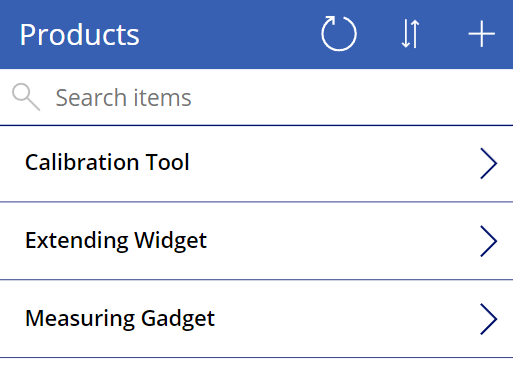](../media/products.png#lightbox)

1. Close the application browser window or tab.

## Exercise 2: Create columns

In this exercise, you'll create two columns of data type choice, one for product visibility and one for sales channel.

> [!NOTE]
> Pay close attention to which column is of data type Choice and which column is of data type Choices.

### Task 1: Create Choices columns

1. Navigate to [Power Apps maker portal](https://make.powerapps.com/?azure-portal=true) and select the environment you would like to use for this lab.

1. Select **Solutions** and select to open the **Contoso Choice Lab** solution you imported.

1. Select to open the **Product** table.

1. Make sure you have the **Columns** tab selected and select **+ Add column**.

   > [!div class="mx-imgBorder"]
   > [](../media/add-column.png#lightbox)

1. Enter **Product visibility** for Display name, select **Choice** for Data type, and select the **Choice** dropdown.

   > [!Note]
   > This is a CHOICE data type.

   > [!div class="mx-imgBorder"]
   > [](../media/choice-data.png#lightbox)

1. Select **+ New choice**.

1. Enter **Private** for the first item and select **Add new item**.

   > [!div class="mx-imgBorder"]
   > [](../media/add-new-item.png#lightbox)

1. Enter **Invite** for the second item and select **Add new item**.

1. Enter **Public** and select **Save**.

   > [!div class="mx-imgBorder"]
   > [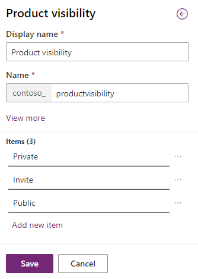](../media/public.png#lightbox)

1. Select **Done**.

1. Select **+ Add column** again.

1. Enter **Sales channels** for Display name, select **Choices** for Data type, and select the **Choices** dropdown.

   > [!Note]
   > This is a CHOICES data type.

   > [!div class="mx-imgBorder"]
   > [](../media/choices-data.png#lightbox)

1. Select **+ New choice**.

1. Enter **Wholesale** for the first item and select **Add new item**.

1. Enter **Retail** for the second item and select **Add new item**.

1. Enter **Direct** and select **Save**.

   > [!div class="mx-imgBorder"]
   > [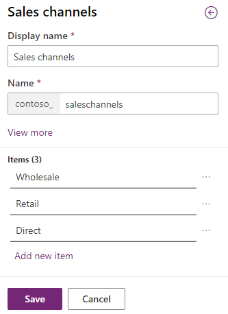](../media/save-choices.png#lightbox)

1. Select **Done**.

1. Select **Save table**.

1. Select **Solutions**, select **Publish all customizations**, and wait for the publishing to complete.

1. Don't navigate away from this page.

## Exercise 3: Modify form and gallery

In this exercise, you'll modify the edit form and the gallery of the Contoso product manager application.

### Task 1: Edit application

In this task, you'll edit the Contoso product manager application.

1. Select to open the **Contoso Product Choice Lab** solution.

1. Select to open the **Contoso Product Manager** application.

   > [!div class="mx-imgBorder"]
   > [](../media/manager.png#lightbox)

1. The application should open in the app studio.

1. Select the **Data** tab, select the **... More actions** button of the **Products** table, and select **Refresh**. This action will refresh the data source and pick up the new columns you added.

   > [!div class="mx-imgBorder"]
   > [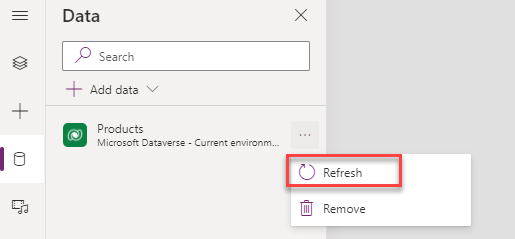](../media/refresh-data.png#lightbox)

1. Select the **Tree view** tab, expand **EditScreen1,** and select **EditForm1**.

   > [!div class="mx-imgBorder"]
   > [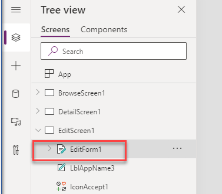](../media/edit-form.png#lightbox)

1. Select **Edit fields**.

   > [!div class="mx-imgBorder"]
   > [](../media/edit-fields.png#lightbox)

1. Select the **... More actions** button of the **Created On** column and select **Remove**.

   > [!div class="mx-imgBorder"]
   > [](../media/remove.png#lightbox)

1. Select **+ Add field**.

   > [!div class="mx-imgBorder"]
   > [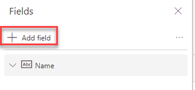](../media/add-field.png#lightbox)

1. Select the **Product visibility** and **Sales channel** columns and then select **Add**.

   > [!div class="mx-imgBorder"]
   > [](../media/add-fields.png#lightbox)

1. Close the **Fields** pane.

1. Expand **BrowseScreen1** and select **BrowseGallery1**.

   > [!div class="mx-imgBorder"]
   > [](../media/browse.png#lightbox)

1. Select the **Edit** icon of the gallery.

   > [!div class="mx-imgBorder"]
   > [](../media/edit-gallery.png#lightbox)

1. Change the **TemplateSize** to **230**.

   > [!div class="mx-imgBorder"]
   > [](../media/size.png#lightbox)

1. Select the label inside the gallery and move it to the top of the template.
   > [!div class="mx-imgBorder"]
   > [](../media/top.png#lightbox)

1. While still editing the gallery, go to the **Insert** tab, select **Input**, and select **Drop down**.

   > [!div class="mx-imgBorder"]
   > [](../media/drop-down.png#lightbox)

1. Resize and reposition the drop-down and the **Items** value of the drop-down to the formula below.

   `Choices(Products.'Product visibility')`

   > [!div class="mx-imgBorder"]
   > [](../media/items.png#lightbox)

1. Set the **Default** value of the drop-down to the formula below.

   `ThisItem.'Product visibility'`

1. While still editing the gallery, go to the **Insert** tab, and select **Label**.

1. Rename the label **Channels**.

1. Move the **Channels** label below the drop-down and resize it.

1. Set the Text value of the **Channels** label you just added to formula below. This formula will concatenate the selected options.

   `Concat(ThisItem.'Sales channels',Text(Value),",")`

1. Make sure you're still editing the gallery. Select **+ Insert** and select **Rectangle**.

   > [!div class="mx-imgBorder"]
   > [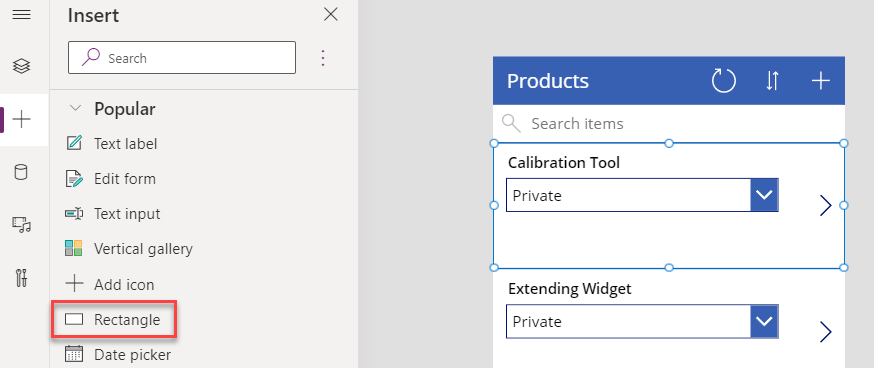](../media/rectangle.png#lightbox)

1. Set the **X** and **Y** values of the rectangle to **0**.

1. Set the **Width** of the rectangle to **6**.

1. Set the **Height** of the rectangle to **220**.

1. Set the **Fill** value of the rectangle to the formula below. This formula will give a different fill color for each choice of the product visibility column value.

   `Switch(ThisItem.'Product visibility', 'Product visibility'.Private, Red, 'Product visibility'.Public, Green, 'Product visibility'.Invite, Blue, Black)`

1. Select the Gallery and delete the **OnSelect** value.

   > [!div class="mx-imgBorder"]
   > [](../media/on-select.png#lightbox)

1. Select the **NextArrow** inside the gallery.

   > [!div class="mx-imgBorder"]
   > [](../media/next.png#lightbox)

1. Set the OnSelect value of the NextArrow to the formula below.

   `Navigate(DetailScreen1, None)`

1. Select **File** and select **Save**.

   > [!div class="mx-imgBorder"]
   > [](../media/file-save.png#lightbox)

1. Select the **<-** back button.

1. Select **Preview the application**.

   > [!div class="mx-imgBorder"]
   > [](../media/preview.png#lightbox)

1. The application should load.

1. Select the **Next** arrow of one of the products.

1. Select the Edit button.

1. Select **Sales channels**, select **Private** for **Product visibility**, and select **Save**.

   > [!div class="mx-imgBorder"]
   > [](../media/save-changes.png#lightbox)

1. Select the **<** back button.

1. Select to open another product.

1. Select **Edit**.

1. Select **Sales channels**, select **Public** for **Product visibility**, and select **Save**.

1. Select the **<** back button.

1. Select to open another product.

1. Select **Edit**.

1. Select **Sales channels**, select **Invite** for **Product visibility**, and select **Save**.

1. Select the **<** back button.

1. The gallery should now look like the image below. Close the preview.

   > [!div class="mx-imgBorder"]
   > [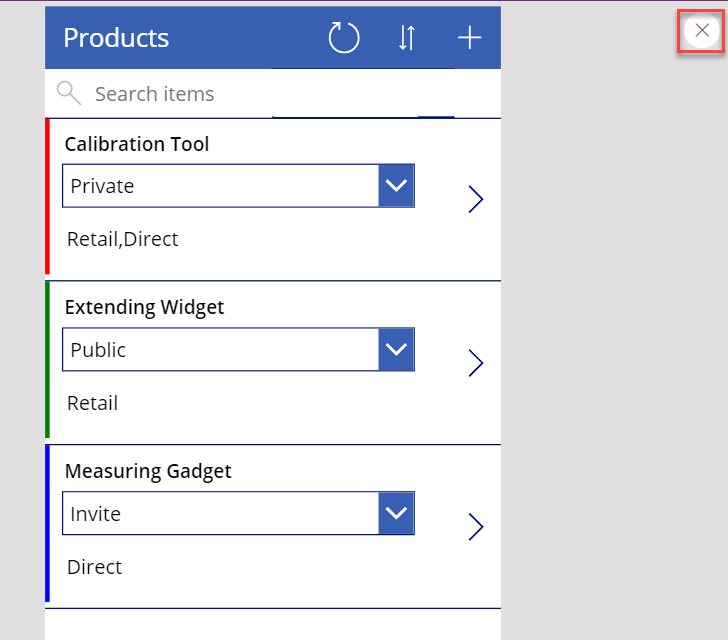](../media/products-preview.png#lightbox)

1. Don't navigate away from this page.

## Exercise 4: Use filters

In this exercise, you'll filter the gallery rows by product visibility.

### Task 1: Use filter

1. On BrowseScreen1, select **TextSearchBox**.

   > [!div class="mx-imgBorder"]
   > [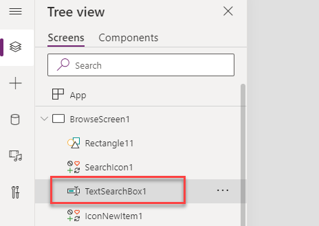](../media/text-search.png#lightbox)

1. Change the **Width** of the search box to the formula below.

   `Parent.Width/2`

1. Go to the **Insert** tab, select **Input**, and select **Drop down**.

   > [!div class="mx-imgBorder"]
   > [](../media/drop.png#lightbox)

1. Rename the drop-down **Visibility filter**.

   > [!div class="mx-imgBorder"]
   > [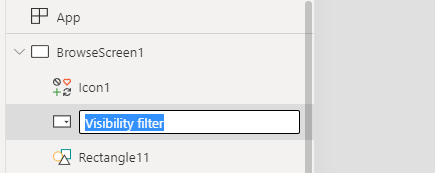](../media/visibility.png#lightbox)

1. Resize and reposition the **Visibility filter** and place it to the right of the search box.

   > [!div class="mx-imgBorder"]
   > [](../media/resize.png#lightbox)

1. Set the **Items** value of the **Visibility filter** to the formula below.

   `Choices(Products.'Product visibility')`

1. Set the **AllowEmptySelection** value of the **Visibility filter** to **true**.

1. Set the **Default** value of the **Visibility filter** to the formula below.

   `Blank()`

1. Go to the **Insert** tab, select **Icons**, and select **Cancel**.

1. Resize and reposition the **icon** and place it to the right of the dropdown.

   > [!div class="mx-imgBorder"]
   > [](../media/icon.png#lightbox)

1. Set the **OnSelect** value of the icon to the formula below.

   `Reset('Visibility filter')`

1. Set the **Visible** value of the icon to the formula below.

   `If(IsBlank('Visibility filter'), false,true)`

1. Select the **BrowseGallery1** and change the **Items** value to the formula below. This changes the existing formula to include a Filter() function that uses the user-selected values.

    ```powerappsfl
    SortByColumns(
        Search(
            Filter([@Products],IsBlank('Visibility filter'.Selected) || 'Product visibility' = 'Visibility filter'.Selected.Value),
            TextSearchBox1.Text,
            "contoso_name"
        ),
        "contoso_name",
        If(
            SortDescending1,
            Descending,
            Ascending
        )
    )
    ```

   > [!div class="mx-imgBorder"]
   > [](../media/formula.png#lightbox)

1. Select **Preview the application**.

1. Change the **Visibility filter** to **Private**. The gallery should show only the private products.

   > [!div class="mx-imgBorder"]
   > [](../media/filtered.png#lightbox)

1. Select the **X** icon. The gallery should show all products.

   > [!div class="mx-imgBorder"]
   > [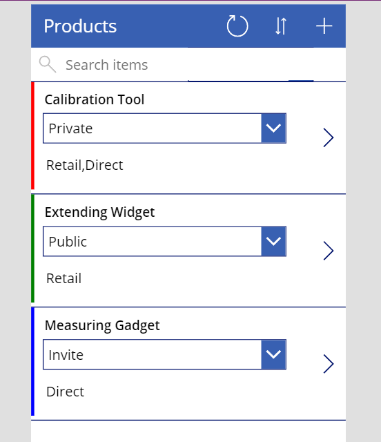](../media/all.png#lightbox)

1. Close the preview.

1. Don't navigate away from this page.

## Exercise 5: Use patch

In this exercise, you'll use patch to update product table rows

### Task 1: Use patch

1. Expand the **BrowseGallery1** and select the **Dropdown1** control.

   > [!div class="mx-imgBorder"]
   > [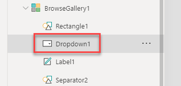](../media/drop-down-1.png#lightbox)

1. Set the **OnChange** value of the dropdown to the formula below. This formula will update the row when the value of the dropdown changes.

   `Patch(Products,ThisItem,{'Product visibility':Self.Selected.Value})`

1. Select the gallery and select the edit icon.

   > [!div class="mx-imgBorder"]
   > [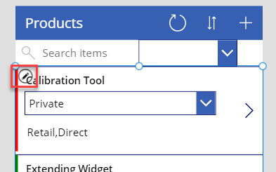](../media/edit-icon.png#lightbox)

1. Go to the **Insert** tab, select **Icons**, and select **Cancel**.

1. Place the icon on the bottom right.

   > [!div class="mx-imgBorder"]
   > [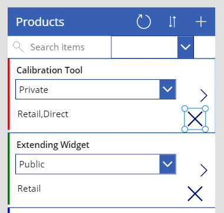](../media/bottom.png#lightbox)

1. Set the **Visible** value of the icon to the formula below.

   `If(IsBlank(Channels.Text),false,true)`

1. Set the **OnSelect** value of the icon to the formula below. This formula will remove all the selected sales channels when the icon is selected.

   `Patch(Products,ThisItem,{'Sales channels':Blank()})`

1. Select **File** and select **Settings**.

1. Select **Upcoming features**, select the **Experimental** tab, and turn on **Formula-level error management**.

   > [!div class="mx-imgBorder"]
   > [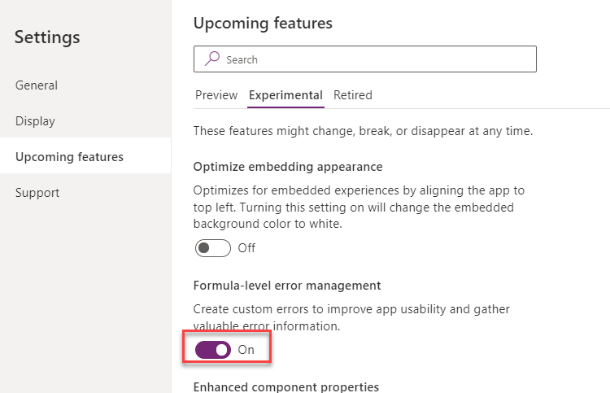](../media/on.png#lightbox)

1. Close the Settings window.

1. Select Preview the app.

1. Change the Product visibility of one of the products. The product should update.

   > [!div class="mx-imgBorder"]
   > [](../media/preview-visibility.png#lightbox)

1. Select the **X** icon of the first product. The sales channels of the product should get cleared and the X button should become hidden.

   > [!div class="mx-imgBorder"]
   > [](../media/clear.png#lightbox)

1. Close the preview.

1. Select **File** and select **Save**.
