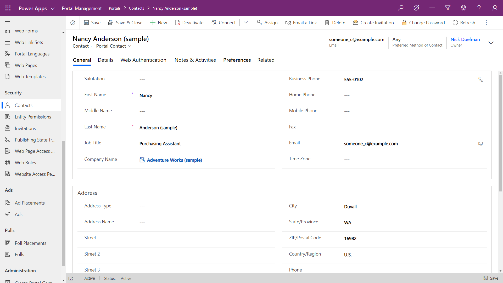
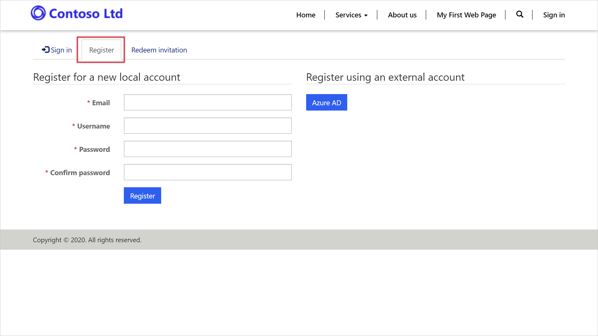

## Microsoft Dataverse customer entities

Microsoft Power Apps portals security is configured primarily around the Dataverse (or Dynamics 365) **contact** record. The contact record represents a person with which an organization has a relationship. In the Dynamics 365 apps, a contact record can represent a stakeholder such as a customer, partner, supplier, supporter, or an employee of organizational stakeholders (organizations are typically represented by using the **account** table).

[Customer entities](https://docs.microsoft.com/powerapps/developer/common-data-service/customer-entities-account-contact/?azure-portal=true)

> [!NOTE]
> For portals that are configured for internal staff access (such as the Employee portal), Dataverse system users will also need a contact record to access the portal.

## Contact record

A portal might show public information and content that can be viewed by anonymous users that do not need to authenticate. An example would be an online newsletter or an event schedule that shows details from Dataverse.

However, certain private or protected information should only be made accessible to specified authenticated users of the portal. An example of this information would be member-only protected content or private information such as invoices.

<!--image of contact record -->
> [!div class="mx-imgBorder"]
> 

A portal user will need to sign in by using an authentication process in which the portal application will recognize the visitor as a specific Dataverse contact. The portal can then show the protected and private static and dynamic content to that portal user.

[Screenshot of how to set up portal authentication for users.](https://docs.microsoft.com/powerapps/maker/portals/configure/configure-portal-authentication/?azure-portal=true)

A contact can be recognized as a portal user by accepting an invitation from the portal that is associated with an existing contact or by registering as a new contact.

Make sure that you consider strategies in adding contacts to a Power Apps portal. If starting a new initiative where you are building a new audience, you would allow new portal users to register and create new contact records.

If you have an existing customer base with thousands of contacts that already exist in your Dynamics 365 app, invite these existing contacts to the portal to avoid creating duplicate contact records.

Allowing or not allowing portal visitors to register as a new contact is configured by ensuring that the **Authentication/Registration/Enabled** portal site setting is set to **true** or **false**.

## Accounts

A common relationship in Dynamics 365 and Dataverse apps is where the contact is a child table of an account record that represents an employee-employer relationship. This relationship might have an impact on configuring table permissions because the contact might be provided access to content based on the permissions that are granted to the account record.

<!--image of portal user registering-->
> [!div class="mx-imgBorder"]
> 

## Web role

When a portal user has an associated contact, you still need to assign web roles that will be linked to webpage access control rules and table permissions that will determine information that the portal user can access.

A **Web Role** record can only be created in the Portal Management app and contains the following properties.

| Property | Details |
| --- | --- |
| Name | The name of the web role. This name should be descriptive of the purpose or audience that will be assigned the web role. |
| Website | The website to which this web role belongs. |
| Description | A description of the purpose of the web role and other descriptive information. |
| Authenticated Users Role | A Boolean field that indicates that the linked table permissions or webpage access control rules will be automatically applied to all authenticated portal users. |
| Anonymous Users Role |  A Boolean field that indicates that the linked table permissions or webpage access control rules will be automatically applied to all anonymous portal users. |

You can assign web roles by using the Portal Management app and relating an existing contact to a web role. Web roles can also be assigned to a contact from a portal invitation record.

Web roles can be configured to automatically provide access to all authenticated users or all anonymous users.

> [!div class="mx-imgBorder"]
> 
