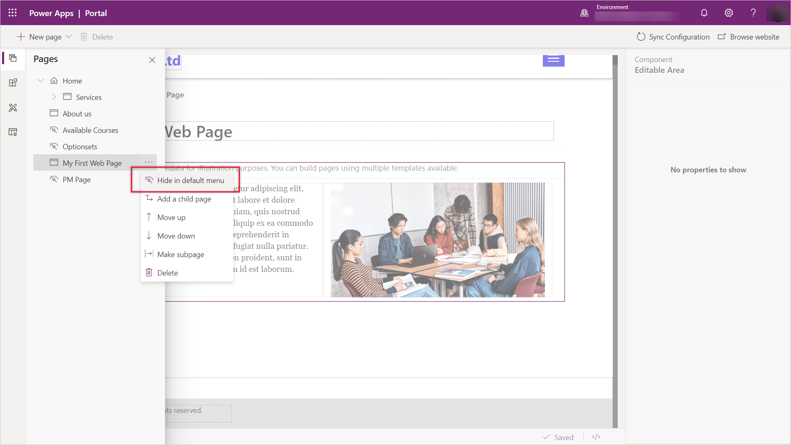

## Webpage content

A website is common way for an organization to provide content to a public-facing audience. You can create webpages to display overall organization information, offerings of products and services, or educational content.

Occasionally, certain situations will occur when content should only be made available to specific authenticated portal users, such as when a company webpage is providing members-only content or specific instructions or offers.

By default, when a maker creates a new webpage by using Power Apps portals Studio or the Portal Management app, the page is publicly available and added to the default menu.  The page can be hidden from the default menu; however, it will still be accessible from the URL.

<!--image hide page in default menu-->

> [!div class="mx-imgBorder"]
> 

## Webpage access control rule

The **Web Page Access Control Rule** table is a portal metadata record that can be linked to a specific webpage that can determine the visibility to that page.

> [!div class="mx-imgBorder"]
> 

The following table describes the **Web Page Access Control Rule** record properties.

| Property | Details |
| --- | --- |
| Name | This property can be any name to describe the rule. Ideally, it should note the webpage that is being referenced. |
| Website | This property references the website in which the rule will reside. |
| Web Page | This lookup references the webpage to which you should apply the rule. |
| Right | This property determines the level of access rights that a portal user will have to the specific webpage. The **Restrict Read** right means that the portal visitor is allowed to view the page but cannot directly edit the page. The **Grant Change** right means that the user can view the page and, if they have access to the front-side editing tools, they will be able to change the content. |
| Description | This field allows a maker to add a description of the purpose and scope of the rule. |

After you have defined an access control for a webpage, the page will not be accessible on the portal and, by default, will not appear on any menu navigation.

> [!VIDEO https://www.microsoft.com/videoplayer/embed/RE4AjtR]

> [!NOTE]
> The menu link (**WebLink**) to a page with an access rule can be made visible to all portal visitors by selecting the **Disable Page Validation** option on the **WebLink** record in the Portal Management app.

The **Web Page Access Control Rule** record can then be linked to a web role that will provide access to any related contact records so that users can access the particular webpage.

> [!div class="mx-imgBorder"]
> 
