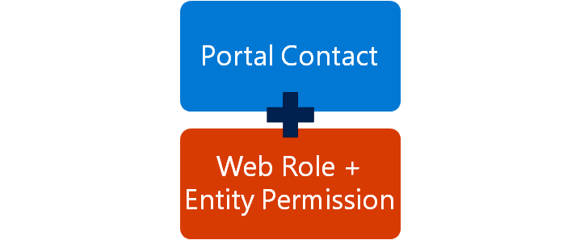
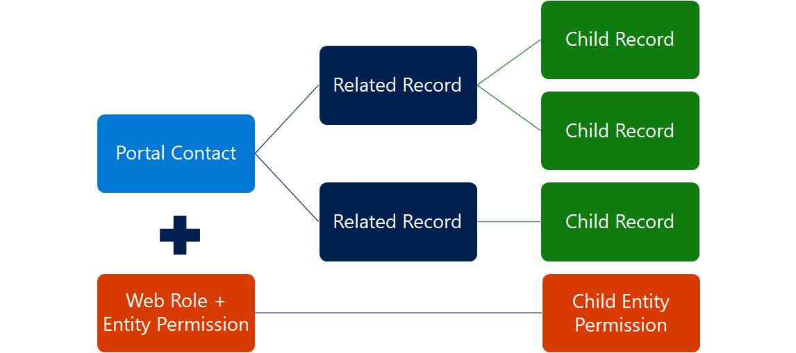

Table permissions define the access and scope that a portal user has to a particular Microsoft Dataverse or Dynamics 365 table on the portal. Dataverse rows can be accessed on a Power Apps portal by using an table form, table list, or web form, or it can be shown by using *Liquid* tags in webpage content or web templates.

> [!div class="mx-imgBorder"]
> 

You can create an table permission in the Portal Management app and associate it to a specific web role to allow portal user access.

> [!div class="mx-imgBorder"]
> 

## Create a table permission

Follow these steps to create a new **Table Permission** row:

1. Identify the table that will be secured.
1. Define scope.
1. For any scope other than Global, select the relationships that define that scope.
1. Determine the privileges that are being granted to the role through this permission.

> [!IMPORTANT]
> Rights are cumulative. If a user is in one role that grants Read rights and another role that grants Read and Update rights, the user will have Read and Update rights for any rows that overlap between the two roles. No mechanism exists to reduce the permission scope or remove a privilege by assigning another role.

The **Table Permission** row includes the following common attributes.

| Attribute                             | Description                                                  |
| ------------------------------------ | ------------------------------------------------------------ |
| Table Name                           | Name of the table that you are securing on the portal.       |
| Scope                                 | Defines which rows can be accessed.                        |
| Account/Contact/Parental Relationship | Defines the relationship from portal user, parent account, or related row to the row that is being secured. |
| Parent Table Details                 | The table Name and table Permission that defines permission to the parent table. |
| Privileges                            | Defines what privileges are being granted by this permission set: Read, Write, Create, Delete, Append, Append To. |

The following sections closely examine how these attributes are used to define scope and identify the rows that the portal user has access to.

## Global scope

If an **Table Permission** row that has Global scope is associated with a web role, any contact in that role will have specified access to all rows of the defined table in Dataverse.

For example, if a lead table is granted the Read privilege with Global scope, all users in assigned web roles will be able to see all leads. This permission will be automatically respected by any table lists, essentially showing all rows, according to the model-driven views, that have been defined for that list.

> [!div class="mx-imgBorder"]
> 

Global scope is most frequently used with Read privilege to provide access to the reference data, for example, a list of countries or currencies.

## Contact scope

With Contact scope, a signed-in user in the role for which the table permission row is defined will have the rights granted by that permission only for rows that are related to that user's contact row through a selected Dataverse relationship.

On an table list, a filter will be added to whatever model-driven views are shown by that list, which only retrieves rows that are directly linked to the current user. Depending on the scenario, this relationship can be thought of as ownership or management rights.

> [!div class="mx-imgBorder"]
> 

For example, a set of privileges can be granted to a web role that allow Contact scope access to the orders by using the customer type of relationship. In other words, any portal user with that web role will have access to a subset that can be considered as *My Orders*.

## Account scope

With Account scope, a signed-in user in the role for which the permission row is defined will have the rights granted by that permission only for rows that are related to that user's parent account row through a selected Dataverse relationship.

> [!div class="mx-imgBorder"]
> 

For example, a set of privileges is granted to a web role that allows Account scope access to the cases by using a customer type relationship between an account and case tables. In other words, any portal user with that web role will have access to a subset that can be thought of as *My Account's Cases*. 

## Parent scope

Parent scope is designed to cover most complex scenarios where a portal user will require full access to the rows but the access must be limited to a specific scope. For example, for users who have access to Cases (for example, *My Cases*), you would grant permissions to those users to access Notes that are related to the cases, but you would restrict access to the Notes for only the cases that the user already has access to.

The **Parent Permission** row defines a permission and scope for an table (Cases, in this example). With that permission in place, a child permission is created that defines a relationship from another table (Notes, in this example) to the table that is defined in the parent relationship (Cases).

> [!div class="mx-imgBorder"]
> 

Users in a web role with access to rows that are defined by parent table permissions will also have rights, as defined by the child permission row, to the rows that are related to the parent row.

## Self scope

Self scope allows you to define the rights that a user has to their own contact row. This scope allows people to use table forms or web forms to make changes to the contact row that is linked with their profile.

The default profile page has a special built-in form that allows any user to change their basic contact info and to opt in or out of marketing lists. If this form is used in your portal, users won't require the Self scope permission to use it. However, they'll require the Self scope permission to use any other custom table forms or web forms that target their contact row.

To apply table permissions to table list or table form components, a maker will need to select the **Enable table permissions** check box when configuring the component in the portals Studio.

> [!div class="mx-imgBorder"]
> 

**Table permissions** are automatically applied to data that is retrieved by using Liquid tags.

<!--VIDEO tablePermissions.mp4-->
> [!VIDEO https://www.microsoft.com/videoplayer/embed/RE4AjtN]

For more information, see [Add row-based security by using table permissions for portals](/powerapps/maker/portals/configure/assign-entity-permissions/?azure-portal=true).
