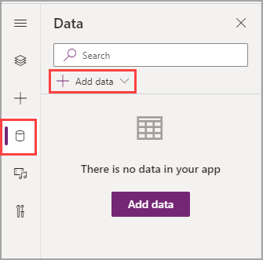

When building an app, you first spend your time creating a data model and building that model out in Dataverse. So that your solution can meet the needs of your user, it's important that we also interact with the data. We will continue to build the expense report app, and if you did not complete the earlier modules you may download the files here (insert link). The files contain the completed work on the expense report app thus far. 

1. Start by selecting the **Data** button to the left of the tree view. Once there, select the drop-down to **Add data**.

   > [!div class="mx-imgBorder"]
   > 

1. Once the drop-down has opened, a few tables from Dataverse will pop up, search **Users** and select that table to add it as a data source in your app.

   > [!div class="mx-imgBorder"]
   > 

1. Repeat this process to add your **Expense Reports** and **Expense Report Details** tables. You'll notice that Dataverse gives you the plural names for your tables. This is one reason we ensure that our plural name is a logical extension of the table name when creating custom tables in Dataverse. You may also see other data sources. To see all possible connectors for Power Apps, check out the [documentation](/connectors/connector-reference/?azure-portal=true). You can also select any data source in the link to learn more.

    We may add more data sources later, but this will be everything we need for this module.

1. Go back to the **Tree view** to continue building.
