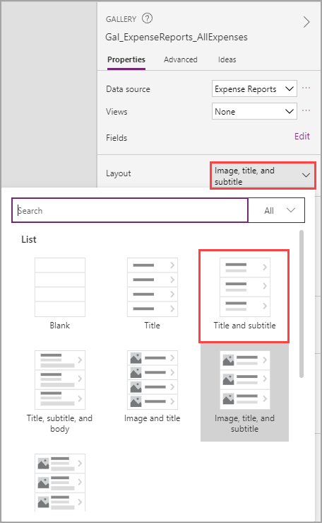
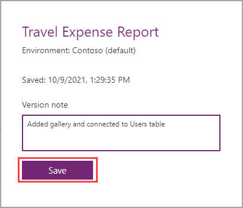

Simply adding the data doesn't mean that your users can see it in your app. You need to add a control to display it. There are two main controls meant to display repeating rows of data, the data table and the gallery.

## Decide how to display your data

Data tables are useful in that they can quickly and easily display data in a way that looks similar to an Excel spreadsheet. The downsides are that you can't edit data or do many customizations, even on individual columns (such as allowing various column widths). A gallery is much more customizable. You can include buttons to take actions on specific lines of data and format fields exactly the way you want them. The downside to galleries is the larger effort to create and customize them. Also, you can't scroll both horizontally and vertically as galleries only allow one or the other.

For this solution, we'll use a gallery since we want to customize the view beyond what a data table allows and take action on your data.

## Add a gallery

To add a gallery, follow the steps below:

1. Ensure you are on **Scr_AllExpenses**, select the **Insert** tab on the ribbon, and select the **Gallery** drop-down. You can see that you have the option of vertical or horizontal. This solution makes more sense to display in a **Vertical** gallery.

   > [!div class="mx-imgBorder"]
   > 

    Once you've inserted your gallery, you can see several lines of placeholder data. Just like the image, you need to point the gallery to the correct data.

1. Select the **Data source** drop-down on the property pane and choose **Expense Reports**.

   > [!div class="mx-imgBorder"]
   > 

1. While you're here, rename your gallery to **Gal_ExpenseReports_AllExpenses**.

    Your gallery is currently empty. We'll add data in a moment so we can see what is happening here. In the meantime, we know expense reports won't need an image, so we'll update the Layout of our gallery.

1. In your Properties pane, select the **Layout** drop down, and then select **Title and subtitle**.

   > [!div class="mx-imgBorder"]
   > 

1. Select **File** in the ribbon and **Save** your app before continuing further.

   > [!div class="mx-imgBorder"]
   > 

   > [!div class="mx-imgBorder"]
   > 

While Power Apps will save every two minutes, it's a good idea to save frequently for a couple of reasons. First, you can add version notes after development milestones to track your progress. Now you can restore a previous version if some major mess ups occur. Second, you never know where you are in the two-minute cycle and should save in case a problem arises with your internet or computer.
