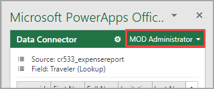

1. In a new browser tab, navigate to [make.powerapps.com](https://make.powerapps.com/?azure-portal=true).

1. Select **Dataverse/Data** and then select **Tables**.

   > [!div class="mx-imgBorder"]
   > 

1. Choose your **Expense Report** table.
   > [!Tip]
   > You may need to change the view to custom tables.

   > [!div class="mx-imgBorder"]
   > 

1. Once there, select the **Data** tab. It should say you have no records. Select the **Data** drop-down on the ribbon and select **Edit data in Excel**.

   > [!div class="mx-imgBorder"]
   > 

Once Excel loads, you'll need to **Enable Editing** and ensure you're signed in to the correct tenant by checking the logged-in user in the right-hand editing pane.

   > [!div class="mx-imgBorder"]
   > 

Afterward, you can edit the sheet like you would any other Excel sheet. The data connector panel on the right will pop up options and information for various fields, such as a date picker for your arrival and departure date fields. The Traveler field can also be chosen here.

   > [!div class="mx-imgBorder"]
   > 

After filling in the Trip Destination, Arrival Date, Departure Date, and Traveler, you can select **Publish** to push your changes to Dataverse. Feel free to add a few more rows of data with different users since we'll be filtering based on that field. Don't worry about Report Status right now. Choice fields can be difficult to edit this way, so we'll wait until we can edit in the canvas app for that one.

> [!NOTE]
> If you do not have any users in your User table, follow the above steps to populate that table first.

Once you publish, go back into Dataverse and refresh your data. You should now see the data you added in Excel.

   > [!div class="mx-imgBorder"]
   > 
