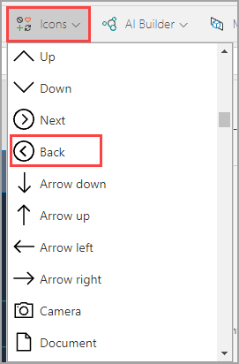
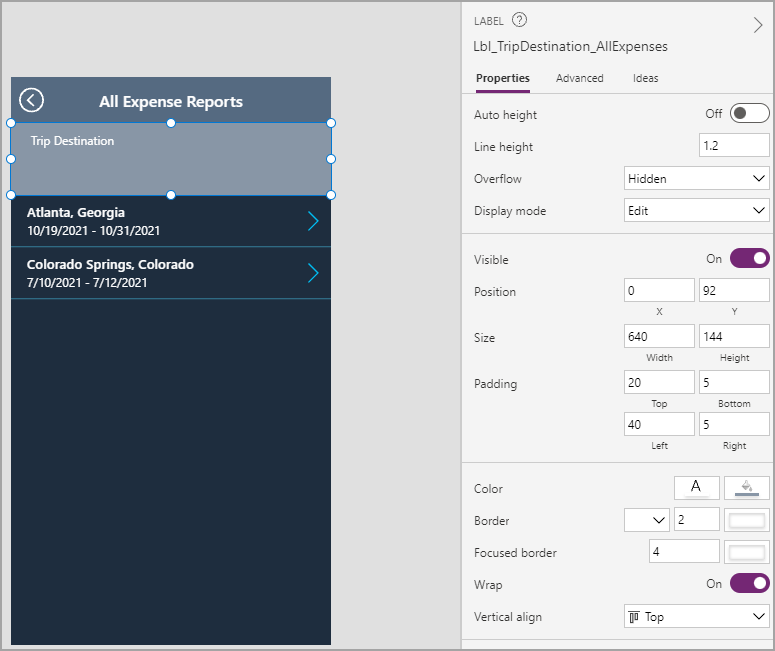
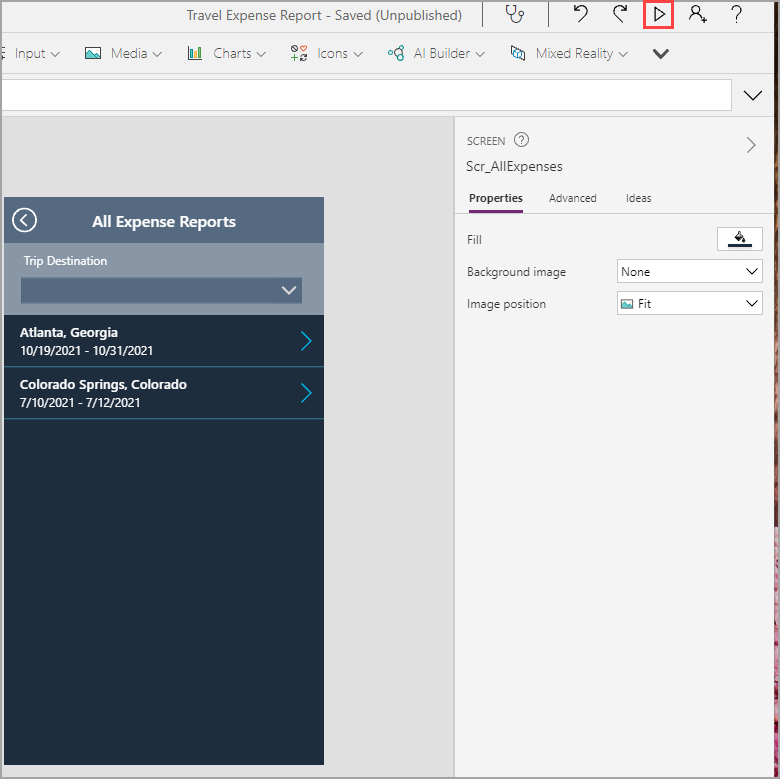

Now that we've added the data source to Power Apps, added a gallery, and populated Dataverse, we should be ready to display data. Head back over to your canvas app and go to the **Scr_AllExpenses** screen. If you had this open in another tab, you'll notice that the gallery still isn't populated. Power Apps caches your data source and doesn't always have the most up-to-date version if you're making changes.

1. To fix this, select the **Data** button on the left menu, locate **Expense Reports**.

1. Select the ellipsis beside it and then select **Refresh**.

   > [!div class="mx-imgBorder"]
   > [](../media/refresh-2.png#lightbox)

    Once you've done this, you should now see the Expense Report data is populated in the Gallery.

1. Go back to the **Tree view** so you can select various controls (hint: it's the icon that looks like stacked papers).

1. Now drag your Gallery to take up all but a small portion of the screen at the top. If you would like to know the properties affected, you can set the gallery's **Y** property to **236** and the **Height** to **900**. It should look similar to the screenshot below.

   > [!div class="mx-imgBorder"]
   > [](../media/height.png#lightbox)

    Next, we'll need to display some more useful information. The location is useful, but we only have one date showing in our gallery and are unsure whether this is the Departure Date or Arrival Date.

1. Select **Subtitle2** and check out the **Text** property in the property drop-down. Your gallery may have assigned a different field, but this one is displaying **ThisItem.'Created On'**. All information from your table in your gallery will start with **ThisItem**. It's simply specifying the row. This is why you can only manipulate the first line and have to use logic to get lines to perform differently. More on that later, for now let's change this field to the Departure Date.

1. In the Text property enter, **ThisItem.'Departure Date'**. See the screenshot below for a better visual.

   > [!div class="mx-imgBorder"]
   > [](../media/departure.png#lightbox)

    There are two issues with this departure date. First, time is displaying, and we don't need one. Second, our users still can't tell which date is displayed. Now we're going to get into some text manipulation. Often, the **Text** function is what we need when attempting to format.

1. Update the **Text** property with **Text(ThisItem.'Departure Date', DateTimeFormat.ShortDate)**.

    Now you should see that you have the same information as before in the format we want. To add strings of text together, you use an ampersand '**&**' and to define text in your formula bar, you use quotation marks as you may have noticed when we built the first screen. Combine these principles to create the departure and arrival dates to appear as a date range.

1. Update your formula to the following code and once done your Subtitle2 Text should match the screenshot below: **Text(ThisItem.'Departure Date', DateTimeFormat.ShortDate) & " - " & Text(ThisItem.'Arrival Date', DateTimeFormat.ShortDate)**.

   > [!div class="mx-imgBorder"]
   > [](../media/formula.png#lightbox)

    You may notice that 'DateTimeFormat' disappears when you click out of the formula bar. This happens for some functions and won't negatively affect your code. As soon as you click back in, the entire formula appears.

    Now we have our gallery looking the way we want, but there are more rows of data here than we need. Travelers only need to see their own records, and right now, we can see everyone's expense reports. To filter the data, we need to alter the **Items** property of the gallery. But first, we need to be able to capture the information for the logged in user.

1. Above all of the controls listed in the Tree view, you'll see **App**. Select this and in the property drop-down, select **OnStart**.

   > [!div class="mx-imgBorder"]
   > [](../media/on-start.png#lightbox)

    This property allows you to input one or more functions that will run as soon as the app is started. In this case, we're going to collect the logged in user's information. We could call this at any instance in the app, but it's a good idea to call it only once and store it for future use in the app. Anytime you call a data source (in this case your active directory), it creates a performance burden in your app and uses resources. For this reason, it's better to call as few times as possible, especially with something that isn't going to change for the entire app instance, such as user data.

    To store information for later use, we set a variable. A variable is simply information in different formats such as text, date, number, and a record (or a row of data). In traditional coding, you often have to define the type of variable you're using, but Power Apps does a good job of figuring that out for you. Just make sure that when you set a variable, you always use the same type, or definition, for that variable in the future.

1. To define this variable, type the following formula in your OnStart property: **Set(VarUser, User())**.

   > [!div class="mx-imgBorder"]
   > [](../media/variable.png#lightbox)

    **VarUser** is the name of the variable and **User()** is the definition, in this case a function gathering information from your active directory. You can use any name for your variables, but just like with the controls, it's a good idea to start them with 'var' or some other nomenclature that will help you recall them later.

    Your users won't have to prompt the OnStart to trigger, but when you change the property while building, you have to trigger it.

1. To trigger the variable, select the ellipses '**...**' next to App and select **Run OnStart**.

   > [!div class="mx-imgBorder"]
   > [](../media/run.png#lightbox)

    Now your variable is populated, and you can use it to filter your gallery.

1. Select **Gal_ExpenseReports_AllExpenses** in the Tree view and ensure you're looking at the **Items** property in the drop-down.

1. Replace '**Expense Reports**' with **Filter('Expense Reports', Traveler.'Primary Email'=VarUser.Email)**.

    Your data is now filtered down to items where you're listed as the Traveler.

   > [!div class="mx-imgBorder"]
   > [](../media/filter.png#lightbox)

    Notice as you type in formulas that Power Apps will prompt you with the correct language and offer suggestions as you go. This will help you learn formulas and how to write expressions. Also notice that we needed to drill down on our traveler information to find the email. Since this is a lookup column, it contains all the information in the Users table. You can think of the period as a shovel to help you dig deeper into whatever you're referencing. We had to do the same for VarUser since it contains all the information from the User() function that has Full Name, Email, and Photo.

    You have your gallery exactly where you want it for now, but we still need to add a few items to the page to make it more useful and improve user experience (UX). Firstly, let's add a title so users know they are on the correct screen.

1. Click in the empty space at the above your Gallery and then select the **Insert** tab.

1. Select **Label**, to add a new Label to your screen.

1. Change the following properties of your Label control using the properties drop down or the advanced properties pane (on the right).

    - Text: "All Expense Reports"

    - Size: 24

    - FontWeight: Semibold

    - X: 0

    - Y: 0

    - Align: Center

    - Height: 92

    - Width: 640

    - Fill: RGBA(85, 106, 129, 1)

    When you're finished setting those label properties, rename your label to follow the nomenclature you've learned. Your screen should look like this:

   > [!div class="mx-imgBorder"]
   > [](../media/label.png#lightbox)

    Now we need a way to navigate back to the home screen. You know you can take action on a button, but you can actually use many controls for actions. One of these controls is an icon.

1. While still on the **Insert** tab, select the **Icon** drop down. You can take time to add the icon you need, or you can select any of them and change the icon in the properties. Some developers prefer this method as it allows you to search through the icons rather than scrolling to find the one you want.

1. In this case, we're going to use the **Back** icon to indicate that pressing the icon will send you back to the homepage.

   > [!div class="mx-imgBorder"]
   > [](../media/back.png#lightbox)

1. Change the following properties of your **Back** icon using the properties drop down or the advanced properties pane (on the right).

    - X: 9

    - Y: 21

    - Height: 50

    - Width: 64

    - Color: RGBA(255, 255, 255, 1)

    - OnSelect: Back()

    Notice that while we could have used **Navigate()**, we used **Back()** which simply takes the user to the screen they were on immediately before this one. You can use either function, we're simply using **Back()** here to introduce you to another useful function.

1. Rename your icon to **Icn_Back_AllExpenses**.

   > [!div class="mx-imgBorder"]
   > [](../media/icon.png#lightbox)

    One more thing we can add to enhance the user experience is a destination filter so users can easily find the expense report they're looking for.

1. Add another Label to the screen and set the following properties:

    - Text: "Trip Destination"

    - Size: 18

    - X: 0

    - Y: 92

    - Height: 144

    - Width: 640

    - Fill: ColorFade(Lbl_Header_AllExpenses.Fill, 30%)

    - PaddingTop: 20

    - PaddingLeft: 40

    - VerticalAlign: VerticalAlign.Top

1. Rename your label **Lbl_TripDestination_AllExpenses**.

    You may notice that the function **ColorFade()** was used for the Fill property and referenced the Fill property of the first label you created. Referencing other controls is common throughout canvas apps, which is why the names of your controls are so important. ColorFade() simply takes a color and makes it lighter or darker by a certain percentage. Positive percentages will output a lighter color and negative percentages will output a darker color. It can be useful when designing apps.

    You may also notice this label looks a little odd. This is because we're going to overlay a drop-down. We could include a rectangle behind the label and drop down, but the more controls you have, the longer it takes to load your screen. For this reason, try to use as few controls as possible, combining where you can.

    Your app should look like this after adding and configuring your new label:

   > [!div class="mx-imgBorder"]
   > [](../media/destination.png#lightbox)

1. While still on the **Insert** tab, select the **Input** drop down and select the control **Drop down**.

1. Change the following properties of your Drop-down control using the properties drop down or the advanced properties pane (on the right).

    - X: 35

    - Y: 162

    - Height: 50

    - Width: 560

    - Fill: Lbl_Header_AllExpenses.Fill

    - ChevronBackground: Lbl_Header_AllExpenses.Fill

    - Size: 16

    - AllowEmptySelection: true

    - Items: Distinct(Filter('Expense Reports', Traveler.'Primary Email'=VarUser.Email), 'Trip Destination')

    You can see that there are different properties for the drop-down than exist for other controls. You'll find this as you become familiar with more controls. You may also notice that we used a new function, **Distinct()**. This function takes one field from a table and removes duplicates. This way, if you visited the same location multiple times, the location would only show up once on the dropdown.

1. Rename your drop-down control to **Ddn_Destination_AllExpenses**.

    Your app should look like this now:

   > [!div class="mx-imgBorder"]
   > [](../media/drop-down.png#lightbox)

    The last thing we have to do on this screen is ensure that the gallery is filtering according to the selection from the drop-down.

1. Change the **Items** property of your gallery to the following: 

    ```powerappsfl
    If(
         IsBlank(Ddn_Destination_AllExpenses.Selected.Result),
         Filter(
             'Expense Reports',
             Traveler.'Primary Email'=VarUser.Email
         ),
         Filter(
             Filter(
                 'Expense Reports',
                 Traveler.'Primary Email'=VarUser.Email
             ),
             'Trip Destination'=Ddn_Destination_AllExpenses.Selected.Result
         ) 
    )
    ```

    You can expand your formula bar so you have more room to type and select **Format text** when you've finished the formula to make it cleaner and easier to read.

   > [!div class="mx-imgBorder"]
   > [](../media/format.png#lightbox)

This formula has gotten a little complex, so let's break it down. We've wrapped our initial items property in an If() statement. This allows you to specify different outcomes depending on one or more conditions. In this case, the logical test (or condition) is whether the drop-down is blank. If the drop-down is blank (true value), the items for the gallery will only be filtered by the user. If, however, the drop-down isn't blank (false value), the items for the gallery will be filtered by the user and the destination.

> [!Note]
> Sometimes when you reset the items property of a gallery, certain labels switch to looking at different fields. If some of your data looks like it has disappeared, just make sure the text property of your labels is correct.

To test the gallery filter, put your app in play mode in the upper right corner.

   > [!div class="mx-imgBorder"]
   > [](../media/play.png#lightbox)

Your screen to see all your Expense Report data is now complete!
