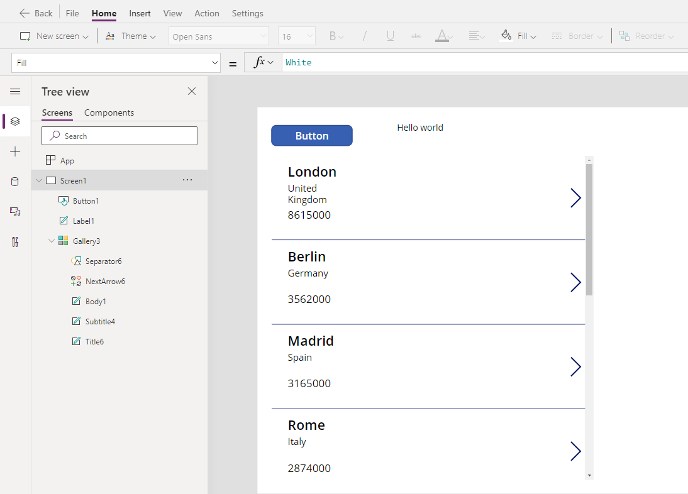

In Power Apps, text controls are used for all kinds of purposes, such as
displaying text, numbers, dates, and calculating currency.
For example, you could calculate the value of two Text input controls
and display the results in a Label control.

There are several text controls that you could incorporate into your app.
Each of these controls have slightly different purposes and use cases.
For example, maybe you're creating an employee survey app, and you want
to get employee feedback. In this scenario, you would use the **Text
input** control and modify the **Mode** property to be **Multiline**
instead of single line. Most likely, every app that you work with will have
text controls so familiarizing yourself with these controls will be
helpful as you develop your app. The follow list details the different text controls that are
available.

-   **Label** - A label shows data that you specify as a literal string
    of text, which appears exactly the way you type it, or as a formula
    that evaluates to a string of text. Labels often appear outside of
    any other control (such as a banner that identifies a screen), as a
    label that identifies another control (such as a rating or audio
    control), or in a gallery to show a specific type of information
    about an item.

-   **Text input** - A box in which the user can type text, numbers, and
    other data. For example, a user can specify data by simply typing in
    a text input control. Depending on how you configure the app, that
    data might be added to a data source, used to calculate a temporary
    value, or incorporated in some other way.

-   **HTML text** - An HTML text control not only shows plain text and
    numbers but also converts HTML tags, such as non-breaking spaces.

-   **Rich text editor** - The rich text editor control provides the app
    user a WYSIWYG editing area for formatting text. This control should
    be used if you want to allow the user to provide numbered lists or
    bullet lists. A good example is a Power Apps app that used to collect
    content for an article or newsletter, where you allow the user to add
    formatted text that would be helpful for the person compiling the
    article.

-   **Pen input** - A control in which the user can draw, erase, and
    highlight areas of an image. The user can use this control like a
    whiteboard, drawing diagrams and writing words that can be converted
    to typed text.

Here's a closer look at the Label control and a few
examples so you can get a better idea as to how it works.

First, add a label control to show text.

1.  In Power Apps Studio, add a **Label** control.

2.  Set **Text** property for the Label to **\"Hello, world\"** (including
    the double quotation marks).

Next, create a more dynamic solution by combining a button, gallery, and
multiple label controls. In this scenario, you\'ll create a collection
called CityPopulations that contains data about the population of
various cities in Europe. Next, you\'ll show that data in a gallery that
contains three labels, and you\'ll specify the type of data that each
label will show.

1.  Add a button, and set its **OnSelect** property to this formula:

```
ClearCollect(CityPopulations, {City:"London", Country:"United
Kingdom", Population:8615000}, {City:"Berlin",
Country:"Germany", Population:3562000}, {City:"Madrid",
Country:"Spain", Population:3165000}, {City:"Rome",
Country:"Italy", Population:2874000}, {City:"Paris",
Country:"France", Population:2273000}, {City:"Hamburg",
Country:"Germany", Population:1760000}, {City:"Barcelona",
Country:"Spain", Population:1602000}, {City:"Munich",
Country:"Germany", Population:1494000}, {City:"Milan",
Country:"Italy", Population:1344000})
```

2.  Press and hold **Alt Key**, and select the **Button** control. (This
    will create your collection and store all the information.)

3.  Add a **Blank vertical** gallery and set its **Items** property to
    **CityPopulations**.

4.  With the gallery selected, in the right pane, change the layout from
    blank to **Title, subtitle, and body**.

5.  Select the top or first Label, in the **Text** property the default for example shows **ThisItem.City**, you could
    change this to something else if you would like. For more
    information about the ThisItem operator, see
    [Screenshot of operators and data types in Power Apps for text property.](/powerapps/maker/canvas-apps/functions/operators/?azure-portal=true).

6.  Select the middle or second Label, which shows as
    **ThisItem.Country**.

7.  Select the last or third Label, change the **Text** property to
    **ThisItem.Population**.



These were just two simple examples demonstrating some basic
functionality of a label control. There are many other ways to utilize
label controls in your app. 
