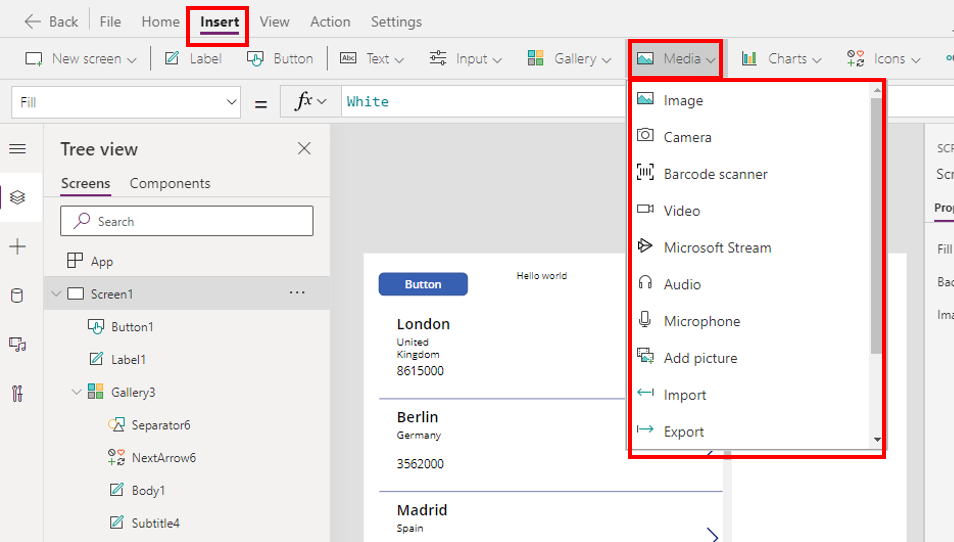

Media controls give the app designer a way to display and share an audio file or video file easily, take a picture, scan bar codes, etc.

For example, you need to build an employee safety training app. For the solution, you want to share a video with your employees and then have them acknowledge that they’ve completed the training. With the Video control, the safety video can be shown in the app and then the next screen would be a training acknowledgment form. Or maybe you have an expense report app and want to let users upload pictures of their receipts. By using the Camera control, the user can take a photo and attach the picture without leaving the app.

Here are some details about the Media controls that are available:

> [!div class="mx-imgBorder"]
> 

-   **Video** - This control plays a video clip from a file or from YouTube or Azure Media Services. Closed captions can optionally be shown when specified.

-   **Audio** - This control plays a sound clip from a file, a recording from a Microphone control, or the audio track from a video file.

-   **Camera** - A control, which allows the user to take photos by using the camera on the device.

-   **Bar code scanner** - This control opens a native scanner on an Android or iOS device. The scanner automatically detects a barcode, QR code, or data-matrix code when in view. The control doesn't support scanning in a web browser.

-   **Microphone** - A control that allows app users to record sounds from their device as long as the device has a microphone accessible. Audio is stored in 3gp format in Android, AAC format in iOS, and OGG format in web browsers.

-   **Add picture** - With this control users can take photos or upload image files from their device and update the data source with this content. On a mobile device, the user is presented with the device's choice dialog to choose between taking a photo or selecting one that is already available.

Here's how you can add a video to your app. In this example, you’ll have two screens. When a user selects the button on the first screen, they’ll navigate to the second screen where a video will start playing automatically.

1.  In Power Apps studio, add a new blank screen. You should now have two screens.

1.  Make sure that you are on the first screen and add a **Button** control.

1.  On the left, under **Screens**, select **Screen 2**.

1.  On the ribbon, add a **Video** control.

1.  For the **Media** property, in the formula box, enter a video URL from YouTube. The URL must be inside quotations.

1.  Now set the **AutoStart** property to **true**.

1.  Go back to Screen 1, set the **OnSelect** property for the button to:
    **Navigate(Screen2,ScreenTransition.Cover)**.

Test out your app. Put the app in preview or play mode and press the button.