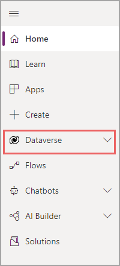
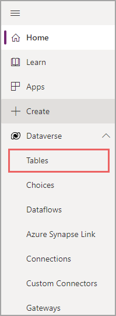
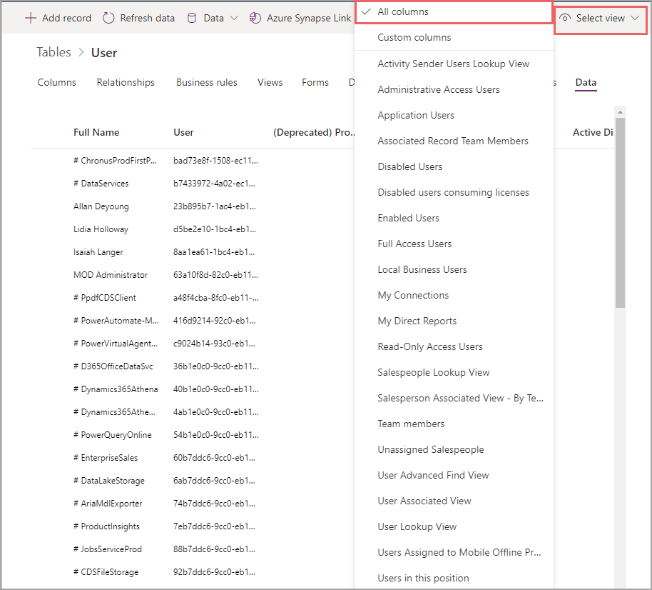

The User table, as part of the Common Data Model, has many different columns, but we will be using the following:

- **User -** This table holds information for users in your active directory, which use Dataverse and work for a business unit. For more information on the Users table, check out [this documentation](/powerapps/developer/data-platform/user-team-entities/?azure-portal=true#). For the Expense Report App, this table will hold the information for the traveler filling out the expense report.

    |Column name|Description|
    |-|-|
    |**systemuserid** |This column is an autogenerated GUID or global unique identifier. Put, this is a string of letters, numbers, and dashes, which will be   nonsense to us, but helps the system classify individual records or items in the table. Each table will have a primary key such as this one. In some   datasources that column is simply a number, but in Dataverse it is a GUID.|
    |**firstname**| This is a text column, which stores the first name of the user.|
    |**lastname**| This is a text column, which stores the last name of the user. (You can also use fullname instead of first and last) |
    |**internalemailaddress**| This is a text column, which stores the email address of the user.|
    | **mobilephone** |This is a phone type column, which stores the mobile phone number of   the user. Not all databases will allow you to designate a phone number as a   column type, but Dataverse does. In most datasources, you would use a text   field for phone number. |

1. To access the User table, navigate to [http://make.powerapps.com](http://make.powerapps.com/?azure-portal=true) and sign in with your Microsoft credentials. Expand **Dataverse/Data** and select on **Tables**.

    > [!div class="mx-imgBorder"]
    > 

    > [!div class="mx-imgBorder"]
    > 

    If no one in your organization has created tables, you will automatically see the predefined tables. To ensure you are only looking at tables from the Common Data Model.

1. Select the view filter in the upper right corner by the search and choose **Managed**.

    > [!div class="mx-imgBorder"]
    > 

    Now you can explore all the tables in the common data model.

1. Scroll down and choose **User** to see the columns in that table.

    Dataverse shows you at a glance what columns are in your table and some information about each column. You may notice that each column has two names. One is a **Display name**, or what you would typically call the column. The other is listed **Name**; this column contains no spaces or capitalization and only some symbols and will be used a lot in building your application. Dataverse is designed to be user-friendly, so it is not placing all the restrictions that some databases place on column naming, but allowing you to have two names, one for you and one for the back end.

    You can also see the data type, whether the field is required and some other information.

1. To see the data in the table, select **Data**.

    > [!div class="mx-imgBorder"]
    > 

    At first, you may only see a couple columns.

1. To see all of the information in the table, select the filter view button at the top and choose **All Columns**.

    > [!div class="mx-imgBorder"]
    > 

You can add custom columns to existing tables, but this is unnecessary for this scenario. Next, let's look at how to create a table from scratch.
