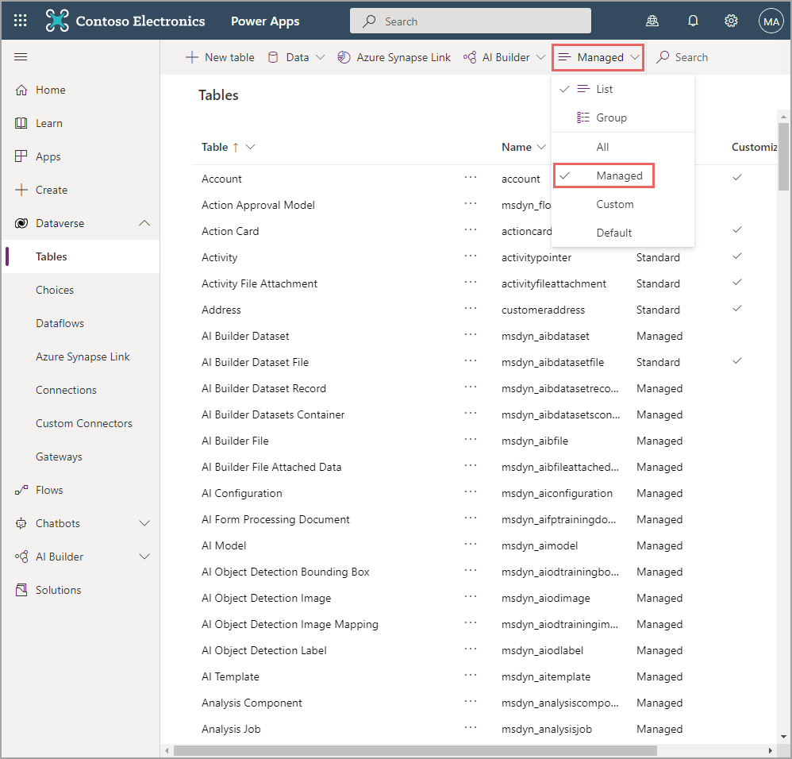

The **User** table holds information for users in your active directory, which uses Dataverse and works for a business unit. For more information on the User table, see [User and team tables](/powerapps/developer/data-platform/user-team-entities/?azure-portal=true#). For the Expense Report app, this table will hold information for the traveler who is filling out the expense report.

As part of Common Data Model, the User table has many different columns. This unit will focus on the columns that are outlined in the following table.

|Column name |Description |
|----------------|----------------|
|**systemuserid** |An autogenerated global unique identifier (GUID). This column contains a string of letters, numbers, and dashes, which might appear to be nonsense; however, it helps the system classify individual records or items in the table. Each table will have a primary key such as this one. In some data sources, that column is a number, but in Dataverse, it's a GUID.|
|**firstname**| A text column that stores the first name of the user.|
|**lastname**| A text column that stores the last name of the user. (You can also use **fullname** instead of first and last.) |
|**internalemailaddress**| A text column that stores the email address of the user.|
| **mobilephone** |A phone type column that stores the mobile phone number of the user. Not all databases will allow you to designate a phone number as a column type, but Dataverse does. In most data sources, you would use a text field for a phone number. |

To explore columns in the User table, follow these steps:

1. Access the User table by going to [http://make.powerapps.com](http://make.powerapps.com/?azure-portal=true) and then signing in with your Microsoft credentials. Expand **Dataverse/Data** and then select **Tables**.

    > [!div class="mx-imgBorder"]
    > 

    > [!div class="mx-imgBorder"]
    > 

    If no one in your organization has created tables, predefined tables will display automatically to ensure that you are only viewing tables from Common Data Model.

1. Select the view filter in the upper-right corner by the search box and then select **Managed**.

    > [!div class="mx-imgBorder"]
    > 

    Now, you can explore all tables in Common Data Model.

1. Scroll down and select **User** to view the columns in that table.

    Dataverse shows which columns are in your table, including some information about each column. You might notice that each column has two names. One column is named **Display name**, or what you would typically call the column. The other column is listed as **Name** and contains no spaces or capitalization, has only some symbols, and will be used frequently in building your application. Dataverse is designed to be user-friendly, so it doesn't place all restrictions that some databases place on column naming.

    You can also view the data type, whether the field is required, and other information.

1. To view the data in the table, select **Data**.

    > [!div class="mx-imgBorder"]
    > 

    At first, only a couple columns might display.

1. To view all information in the table, select the filter view button and then select **All columns**.

    > [!div class="mx-imgBorder"]
    > 

You can add custom columns to existing tables, but this action is unnecessary for this scenario. Next, you will learn how to create a new table.
