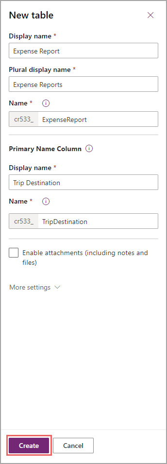
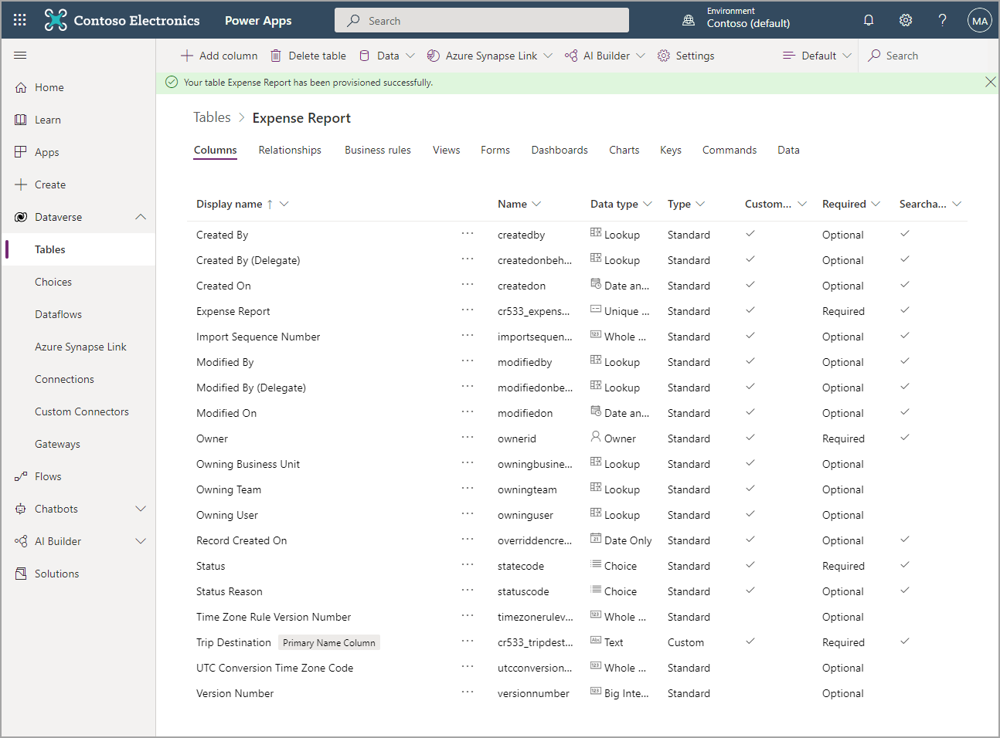
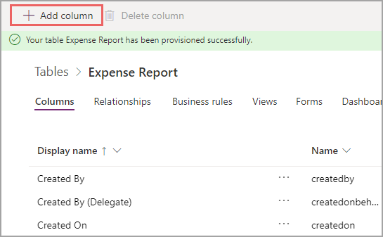

While using predefined tables in Dataverse is quick and easy, you don't always find one that fits your business needs. For that reason, it is also simple to create custom tables. Let's take a look at how to do so with our Expense Report table.

### Create a new table

To create a new table in Dataverse, follow the steps below:

1. In your browser, go to [http://make.powerapps.com](http://make.powerapps.com/?azure-portal=true) and expand **Dataverse/Data** and select on **Tables**, just like you did to access the **User** table.

1. This time, though, select + **New table** at the top.

    > [!div class="mx-imgBorder"]
    > 

    A flyout menu will open to ask questions about your new table. The first field, display name, is what you will see when you visit Dataverse. The plural name is used in model driven apps and when writing to Dataverse via Power Automate. Right now, you don't need to worry about either of those, just try to keep your display name singular and your plural name something that makes logical sense. Dataverse tries to help you out with this but isn't always perfect. The next field is Name, which is a system table name. All custom tables begin with a series of letters and numbers, which will differ from tenant to tenant. This cannot be changed. Your system name should be similar to your display name but with no spaces or symbols other than an underscore. As you type your display name, the additional names will populate. In this case, you don't need to change the other names, but always check to make sure they make sense.

    After your table information, the information for the primary name column is included. This is not the ID column but will act as a primary field for users to distinguish records. We will use trip destination since that is easily distinguishable for users. If we were expanding this to all expense reports and not solely travel related expense reports, we would use something else, like a title column. Your primary name column will always be a text column. You will notice the column also has a display name and a system name; try to follow the same rules here as you did for the table name.

    You now have the option to include attachments. If your scenario includes taking pictures of receipts or plane tickets, you may want to enable this feature, but we will not cover attachments in this learning path. You can enable attachments after creating the table, so don't worry if you are unsure on creation whether your solution requires this functionality.

1. Enter the table information to match the screenshot below and then select **Create**.

> [!div class="mx-imgBorder"]
> 

After several seconds, your table will appear. Wait until you receive the message that your table has been provisioned successfully before continuing.

> [!div class="mx-imgBorder"]
> 

You will see that Dataverse has created several columns for you to help you organize and secure your information. We will not be using all these columns but take a moment to look through them in case you need to use them later.

### Creating the columns

Now that you have created the table, we need to add a few more columns for our solution. To do so, follow the steps below:

1. Select + **Add column** at the upper left above the column names.

    > [!div class="mx-imgBorder"]
    > 

    A flyout menu similar to the one used to create a table will appear. We have gone over the display name and system name, but we have only talked a little about data types. Defining a data type is important for data validation, or to ensure that your users only input the correct data into that column. For example, if you have expense date, you don't want someone to type the text "three weeks ago". This would not be valuable for accounting. Instead, you want to ensure that the user inputs an actual date. Check out [this documentation](/powerapps/maker/data-platform/types-of-fields/?azure-portal=true#) if you would like to know more about the various types of data allowed in Dataverse.

    Required is exactly what it sounds like. You can make any column required, meaning the user has to populate that field before saving the record. Make sure users won't need to save as a draft before going and making all of your fields required instead of optional. You can also write similar data validation inside of your canvas app, such as making sure some fields are populated before saving as a draft, but that more fields are populated before pushing the expense report to the next stage.

    We will not be covering searchable or calculations or rollups in this learning path, but check out this [learning path on Dataverse](/learn/paths/get-started-cds//?azure-portal=true#) to learn more.

    Description simply allows you to describe the column or your decisions in defining it.

1. Enter the column information below and select **Done**.

    - Display name: Departure Date

        - Name: DepartureDate

        - Data type: Date Only

        - Required: Optional

        - Description: Date of departure from home city for travel

    > [!div class="mx-imgBorder"]
    > 

1. Go ahead and create the following additional columns:

    - Display name: Arrival Date

        - Name: ArrivalDate

        - Data type: Date Only

        - Required: Optional

        - Description: Date of return to home city from travel

    - Display name: Total

        - Name: Total

        - Data type: Currency

        - Required: Optional

        - Description: Total expenses from trip

    - Display name: Notes

        - Name: Notes

        - Data type: Multiline Text

        - Required: Optional

        - Description: Any notes or additional information on trip and expenses

    For the final field, we will be adding a Choice column.

1. Select + Add column and type the display name '**Report Status**' and the name '**ReportStatus**'.

1. Under Data type, select **Choices**.

1. A new field, **Choice**, will appear. Choose the dropdown under Choice and select + **New choice**.

    > [!div class="mx-imgBorder"]
    > 

1. Under the new flyout menu, add the following choices:

    - Draft

    - Awaiting approval

    - Awaiting reimbursement

    - Complete

1. Select **Save**.

    > [!div class="mx-imgBorder"]
    > 

1. Ensure Required is set to **Optional** and select **Done**.

    You should see all your newly created columns in bold. If you exit without saving the table, none of your changes will be reflected.

1. Select **Save Table** in the lower right-hand corner.

    > [!div class="mx-imgBorder"]
    > 

You have now created your first custom table in Dataverse! Now you can use the steps above to create your Expense Report Details table with the information below. Try to go through the steps without looking to see how much you learned.

### Table information

Create a new table called, **Expense Report Details** Table with the details below:

- Display name: Expense Report Detail

- Plural display name: Expense Report Details

- Name: ExpenseReportDetail

- Primary name column display name: Expense

- Primary name column name: Expense

### Column information

Now create some custom columns for this table, see the columns and details below:

- Display name: Category

  - Name: Category

  - Data type: Text

  - Required: Optional

  - Description: Category of expense

- Display name: Transaction Date

  - Name: Transaction Date

  - Data type: Date Only

  - Required: Optional

  - Description: Date transaction for expense

- Display name: Amount

  - Name: Amount

  - Data type: Currency

  - Required: Optional

  - Description: Amount of expense

When you are done adding these columns, don't forget to select **Save Table** to ensure your work on this table is saved.
