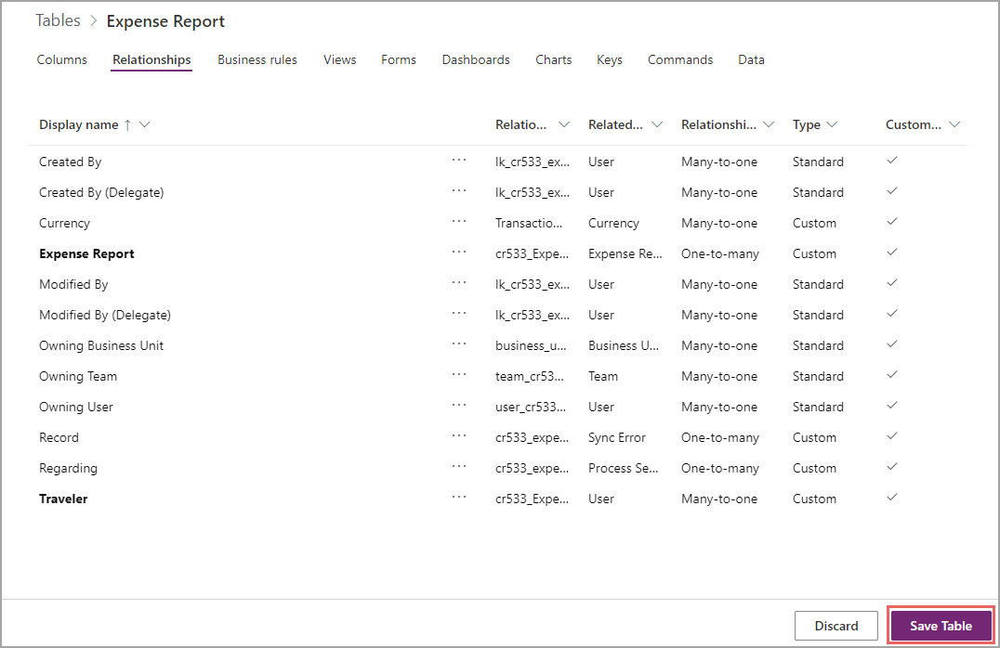

> [!VIDEO https://www.microsoft.com/en-us/videoplayer/embed/RWQA6R]

Now that you have all tables that you plan to use and have columns inside them, you need a way to relate those tables. In the previous exercise, you didn't add user information in the Expense Report table or Expense Report information in the Expense Report Details table. Dataverse helps make connecting all of these tables easier.

### Relate expense report to expense report details

To relate expense report to expense report details, follow these steps:

1. In your browser, go to [http://make.powerapps.com](http://make.powerapps.com/?azure-portal=true).

1. Expand **Dataverse** and select **Tables**.

1. Select the **Expense Report** table that you created in the previous unit. If you can't find it, change the view to **Custom**.

1. When you are in the table, select the **Relationships** tab. Some out-of-the-box relationships will display, which will help Dataverse work.

1. Select **+ Add relationship** to create a new one.

    > [!div class="mx-imgBorder"]
    > 

    Dataverse will ask which type of relationship that you want. As discussed in the previous module and in the first unit of this module, you are creating a *one-to-many* relationship because only one expense report exists for many details (or line items).

1. Select **+ One-to-many**.

    After selecting your relationship, a flyout menu will appear to request a table to which you can relate your expense reports.

1. Select the dropdown list and then select your other custom table, **Expense Report Details** (hint: it's in alphabetical order).

    After you select a table, Dataverse will display a few more fields. These fields define the name of the column in your Expense Report Details table, which is a lookup to your Expense Report table. You can keep the automatically populated column name, but you can change it if you anticipate that the name will be confusing.

1. Select **Done**.

    > [!div class="mx-imgBorder"]
    > 

    Now that you know how to define a one-to-many relationship, you can go to the User table and complete the same task because one user exists for many expense reports. Alternatively, you can complete that task in this exercise.

1. Select **+ Add relationship**. This time, select **Many-to-one**.

    > [!div class="mx-imgBorder"]
    > 

1. In the flyout menu, select the User table from the dropdown list. The **Lookup column display name** field will appear on the Expense Report side, which will always happen on the *many* side of the relationship.

1. Though you didn't need to rename the lookup column for the other relationship, name this column **Traveler** for clarity and then select **Done**.

    > [!div class="mx-imgBorder"]
    > 

1. Select **Save Table** to make sure that Dataverse saves your changes.

    > [!div class="mx-imgBorder"]
    > 

After a few seconds, your relationships will be defined. You can switch to the **Columns** tab, where the **Traveler** column should appear. Additionally, a new **Expense Report** column will show in your Details table.

Congratulations, you have successfully defined relationships inside Dataverse, allowing you to relate information inside your app.
