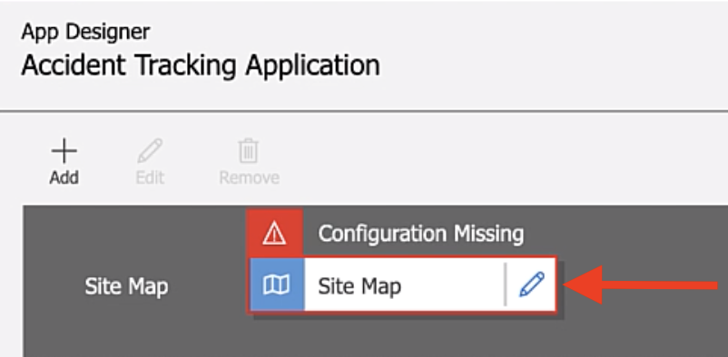
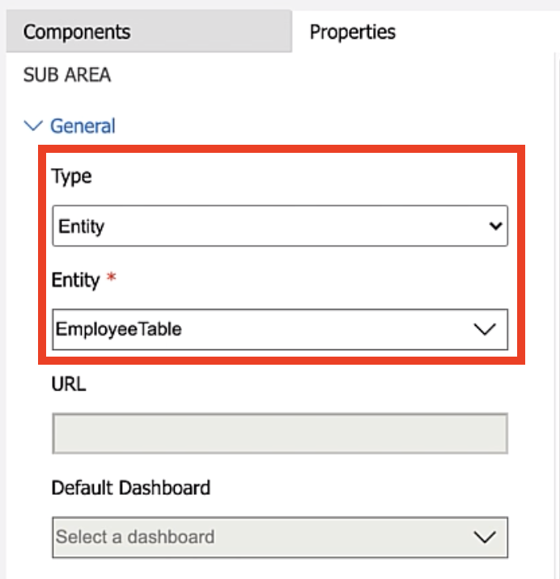

In this module, you'll continue working on the accident tracking application. 

> [!VIDEO https://www.microsoft.com/videoplayer/embed/RWSyMp]

>[!NOTE]
> If you haven't completed the previous modules within this learning path, download the [packaging files](https://github.com/MicrosoftDocs/mslearn-developer-tools-power-platform/tree/master/power-apps/create-model-driven-app). These files contain the completed work on the accident tracking app thus far.

Previously, using a Microsoft Excel workbook to track accidents gave users one location to view, review, and add new accident records. The goal of building a model-driven app is to achieve the same concept. It will package all tables, views, and forms into a business application where users can complete all activities that are related to accident tracking.

The best way to get familiar with the classic app designer is to build an app. During the app creation process, you'll learn more about the different components of Microsoft model-driven apps and how to work with the **App Designer**.

The **App Designer** is where all components of the app come together to put the tables, views, and forms that you created into a single, cohesive business application. The concept of the model-driven app is to have one business application where app users can review and update all records that are related to a business process. In this module's scenario, you'll create a model-driven app where users can view and update employees, locations, accident types, and report accidents efficiently.

The following screenshot shows an example of the **App Designer**.

> [!div class="mx-imgBorder"]
> 

The components of the **App Designer** include:

- **Site Map** - Where you will design the general navigation of the model-driven app. The site map represents the order and menus that appear on the left side of a model-driven app.

    > [!div class="mx-imgBorder"]
    > 

- **Dashboards** and **Business Process Flows** - Dashboards allow you to present data by using charts and visuals. The Business Process Flows component provides a visual guide to help users navigate a business process. More about Business process flows is discussed in the next module.

    > [!div class="mx-imgBorder"]
    > 

- **Entity View** - This section will list all tables that are being used and referenced in the model-driven app.

## Create a new model-driven app

To create a new model-driven app, follow these steps:

1. Go to [make.powerapps.com](https://make.powerapps.com/?azure-portal=true) and sign in with your Microsoft credentials.

1. Select **Apps > + New app**.

1. Select **Model-driven** apps from the dropdown menu.

1. Select **Classic app designer** and then select **Create**.

1. Give your app a name. Microsoft Power Apps will give your app a unique name by default. You can choose to change it; however, for this exercise, name it **Accident Tracking Application**.

1. Give your app a description to help users understand the general purpose and usage of the app.

    > [!div class="mx-imgBorder"]
    > 

1. Select **Done**.

This process will create the model-driven app and take you into the classic app design experience.

1. Define the **Site Map**. The site map is the general navigation menu of your app. It sits on the left of the screen and divides the app into sections that will make business sense. In the next steps, you'll observe where this component sits in the app.

1. Select the pencil icon within the **Site Map** to set up the site map.

    > [!div class="mx-imgBorder"]
    > 

1. Select **New Area** and then give it a meaningful name. For this exercise, name it **Accident Tracking**.

    > [!div class="mx-imgBorder"]
    > 

1. Select **New Group** and provide a better name. For this exercise, name it the same as the area: **Accident Tracking**.

1. Select **New Subarea** (This step is where you'll get to choose which entity to associate with your model-driven app).

1. On the right menu, under **Type**, select **Entity (Entity = Table)**.

1. From the **Entity** list, select **EmployeeTable**.

    > [!div class="mx-imgBorder"]
    > 

1. Select **Save and Close**.

1. At this point in the main designer experience, the **EmployeeTable** will be listed under **Entity View**.

    > [!div class="mx-imgBorder"]
    > 

1. Review the appearance of your newly created app. When you're finished, select **Save**.

1. Select **Publish** so that you can play a preview of your app.

1. Select **Play** to review what you've accomplished thus far.

    > [!div class="mx-imgBorder"]
    > 

In the preceding screenshot, observe the location of certain elements:

  - **Accident Tracking** is the **Group**

  - **EmployeeTables** is the **Sub Area**

  - **Active EmployeeTables** shows what you modified in an earlier section
