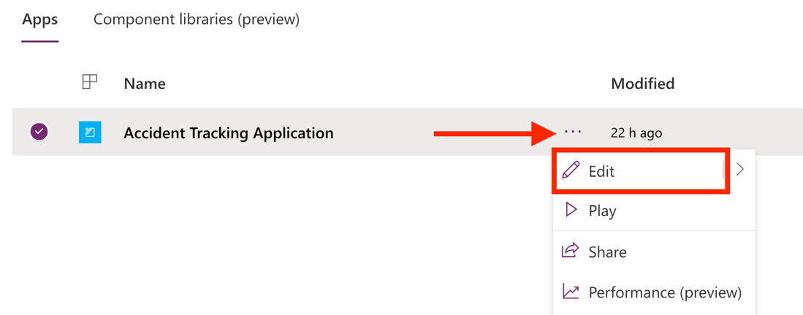
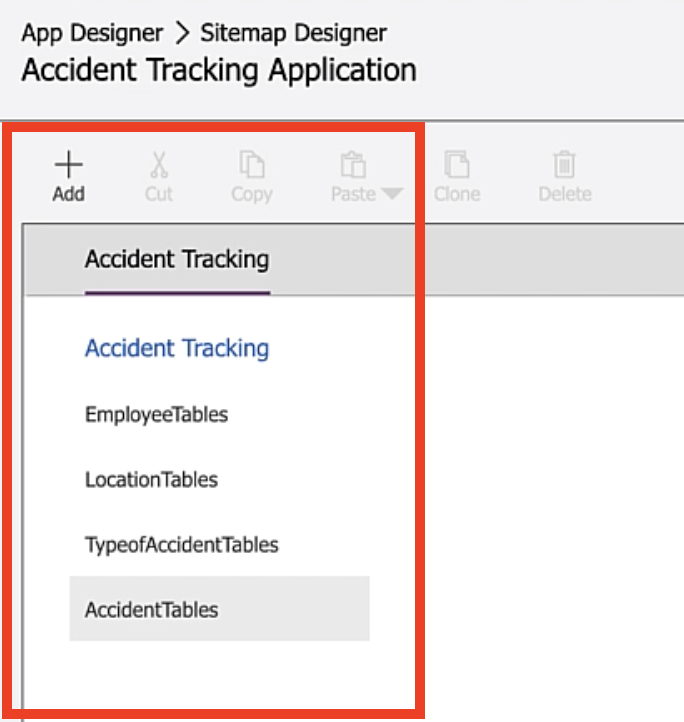

In this exercise, we'll add the other tables we created in prior modules (insert packaging note/file here).

1. Navigate back to your browser tab with the App Designer open to continue where we left off in the previous section. If you've closed the App Designer browser tab, navigate to [make.powerapps.com](https://make.powerapps.com/?azure-portal=true) and under **Apps**, find our **Employee Tracking Application**. Select the three dots and then **Edit**.

    > [!div class="mx-imgBorder"]
    > 

1. Select **Site Map**, to navigate to the sitemap designer.

1. Select the **Employees** sub area then on the right under Components, drag the new **Subarea** below your **EmployeeTables** sub area.

1. Select **Entity** as the **Type**.

1. Find the **LocationTable** in the entity list.

1. Repeat the same process to add the **TypeofAccidentTable** and the **AccidentTable**.

    > [!div class="mx-imgBorder"]
    > 

1. Select **Save and Close**, in the sitemap designer.

1. Select **Save**, in the app designer.

1. Finally, select **Publish** to review the changes.

1. Select **Play**, to view the model-driven app.

    > [!div class="mx-imgBorder"]
    > 
