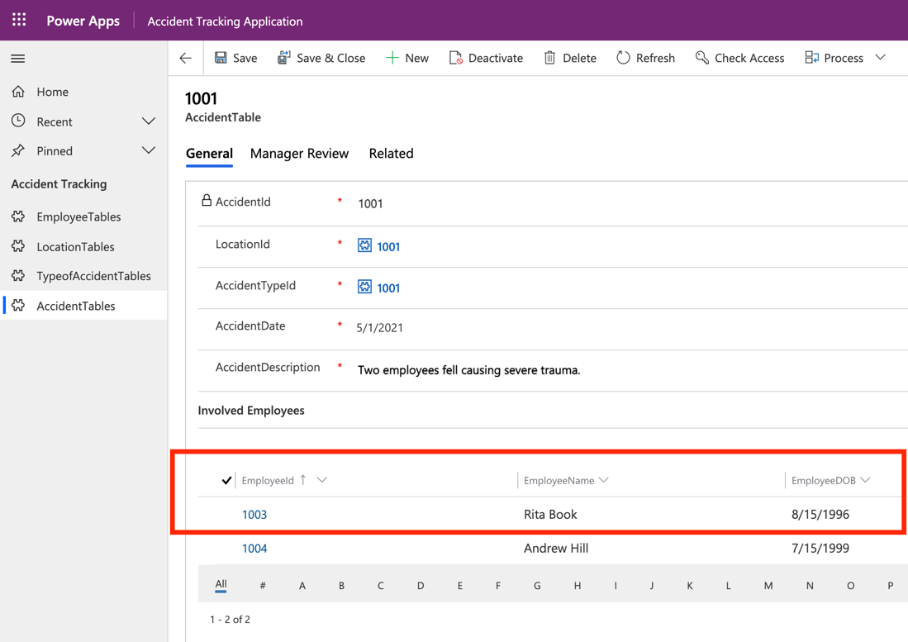

Earlier in this learning path we declared that one of the most important aspects of model-driven apps was the data model and how the different tables relate to each other. In this section, we'll review how those relationships help to simplify data navigation, and allow the user to find answers to common questions like:

- Can I see which accidents an employee has been involved in?

- Can I see which accidents have occurred in a particular location?

- Can I see a list of all accidents?

Finding the related records to answer questions like the ones above is possible because of the table relationships built during our data modeling module. In the next exercises, we'll see how to accomplish this using the **Related** view in model-driven apps.

## Create new records using model-driven apps

To see the app in its full glory, let's take the time to create some new records.

1. Under Apps, find our **Accident Tracking Application** and select it.

1. Select the **Employees** sub area and then select **New**.

   This should take us to the main form we modified in the previous unit.

1. Create two new employees:

    - **EmployeeName**: Rita Book

    - **EmployeeDOB**: 8/15/1996

    - **EmployeeEmail**: RBook@contoso.com

1. Select **Save** and then you can add a new employee picture file.

    - **EmployeePicture**: Choose a picture

    - **EmployeeName**: Andrew Hill

    - **EmployeeDOB**: 7/15/1999

    - **EmployeeEmail**: AHill@contoso.com

1. Select **Save** and then you can add a new employee picture file.

    - **EmployeePicture**: Choose a picture

1. Create a new location. Navigate to the **LocationTable** from the app and then select **New**:

    - **LocationName**: Contoso East

    - **LocationCountry**: USA

1. Create a new type of accident. Navigate to the **TypeofAccidentTable** from the app and then select **New**:

    - **AccidentName**: Head Trauma

    - **AccidentSeverity**: 5

1. Now, let's create two new accidents. Navigate to the **AccidentTable** from the app and then select **New**:

    - **LocationId**: From the dropdown, select **Contoso East**.

        > [!Tip]
        > If you press enter while on the drop down, it will reveal the Location names instead of their IDs.

    - **AccidentTypeId**: From the dropdown, select **Head Trauma**.

    - **AccidentDate**: 5/1/2021

    - **AccidentDescription**: Two employees fell causing severe trauma.

1. Select **Save**.

    Once the record is saved, the sub grid in the bottom should appear allowing you to add the involved employees.

1. Select **Add Existing Employee,** press enter in the **Look for records** box to reveal the employee names. Select both **Rita Book** and **Andrew Hill** from the list.

    > [!div class="mx-imgBorder"]
    > 

1. Select Save.

## Viewing related records from model-driven apps

In this section, you'll learn how to navigate in the app to find information with related data. Earlier in this module we created relationships between our tables to make this process easier.

For example, we create a many-to-many relationship between our **EmployeeTable** and **AccidentTable** because multiple employees can be involved in multiple accidents. In our case, let's say we wanted to review the accidents **Rita Book** has been involved in.

1. Navigate to the **EmployeeTable** from the model-driven app.

1. Select the record for **Rita Book**.

    > [!div class="mx-imgBorder"]
    > 

1. Now select **Related** and select the **AccidentTables**.

    > [!div class="mx-imgBorder"]
    > 

1. This will take you to a view that will list out the accidents **Rita** has been involved in.

    > [!div class="mx-imgBorder"]
    > 

1. Select any of the records to pull up the accident details.

    > [!div class="mx-imgBorder"]
    > 

This related action could also be done from the **LocationTable** to view all the accidents that have occurred in that location. This is because of the one-to-many relationship we built in a prior module between **LocationTable** and **AccidentTable**. Using the same concept one can view using the relate action the accidents that belong to a particular accident type. These actions are standard from model-driven apps if relationships exist between the tables.
