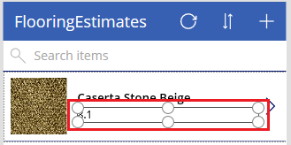
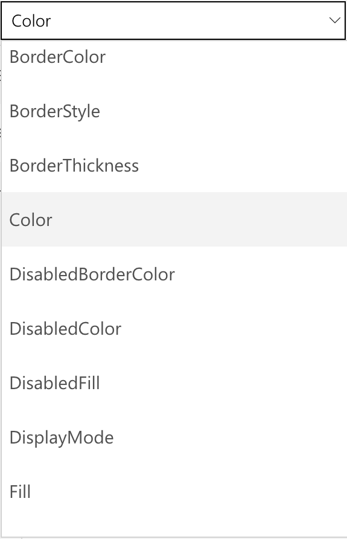

When using Microsoft Power Apps, you don't have to write complicated application code the way that a traditional developer does. However, you must express logic in an app and control its navigation, filtering, sorting, and other functionalities. This is where formulas come in.

If you've used Microsoft Excel functions, you should recognize the approach that Power Apps takes. This unit shows a couple of basic formulas for text formatting and then describes three of the formulas that Power Apps includes when it generates an app. With this information, you'll have a better idea of what formulas can do, and then you can also start to write your own.

## Get started with formulas and properties
Properties determine the appearance and behavior of controls. Each type of control has a different set of properties. 

The previous unit explored controls in all three screens of an app that Power Apps generated. In this section, you’ll use the properties of the label control to format the price in the gallery.

By default, the price appears as a plain number without a currency symbol. Suppose that you want to add a dollar sign and change the text color based on the item's cost (for example, red if it's more than $5 but green otherwise). The following graphic shows the expected result.

By default, Power Apps pulls in a price value for each item. This value is set as the **Text** property of the label that shows the price.

> [!NOTE]
> Be sure to complete the steps in unit 1 of this module as the description field is changed to price as reflected in the next steps.

1. In **BrowseScreen1**, select the price of the first item.

    

1. In the drop-down list of properties, select **Text**.

1. To add the currency symbol for US dollars, set the **Text** property to this formula:

`
Text(ThisItem.Price, "$ ##.00")
`

The **Text** function specifies how to format the number. The formula is like an Excel function, but Power Apps formulas refer to controls and other app elements instead of cells in a workbook.

If you select a control and then open the property drop-down list, a list of properties that are relevant to the control appears. For example, the following is a partial list of the properties for a **Label** control. Some properties are relevant across a wide range of controls, but others are relevant only for a specific control.

To conditionally format the price's color, set the **Color** property of the price's **Label** control to this formula:

`
If(ThisItem.Price > 5, Color.Red, Color.Green)
`

## Formulas included in the generated app
Power Apps uses a couple of formulas in every app that it generates. Both examples are from the browse screen and work with the **OnSelect** property. This property defines what happens when a user selects a control.

* The first formula is associated with the **IconNewItem1** control . Select this control to open the edit/create screen where you can create an item. To view the formula, select the  and then select it in the formula bar. The formula is as follows:

    `NewForm(EditForm1);Navigate(EditScreen1, ScreenTransition.None)`

    The formula instantiates an edit page on the edit/create screen so that users can create an item. A value of `ScreenTransition.None` means that there's no transition, such as a fade, between screens.

* The second formula is associated with the **IconSortUpDown1** control . Select this control to sort the items in the gallery. The formula is as follows:

    `UpdateContext({SortDescending1: !SortDescending1})`

    The formula uses `UpdateContext` to update a variable called `SortDescending1`. The exclamation "!" symbol in the formula is a shortcut for the Not function. The value of the variable switches back and forth as you select the control. This variable tells the gallery on this screen how to sort the items.

The app contains many other formulas, so take some time to select controls and determine what formulas are set for various properties.

For more information about these and other functions, refer to [formula reference for Power Apps](https://docs.microsoft.com/powerapps/maker/canvas-apps/formula-reference) page.

For additional information on customizing a canvas app, refer to the Use the UI and controls in a canvas app in Power Apps learning path and the Use basic formulas to make a better canvas app in Power Apps learning path.
