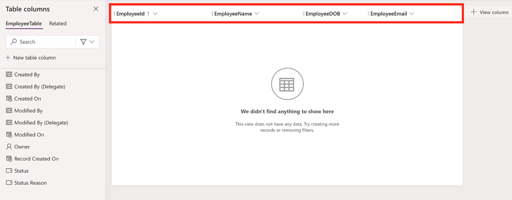
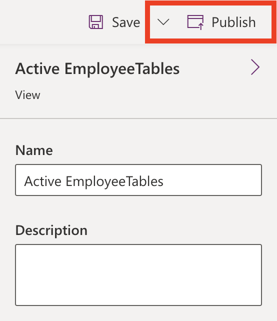

 > [!VIDEO https://www.microsoft.com/videoplayer/embed/RWSJjU]

Previously, by using a Microsoft Excel worksheet as the method to track company accidents, people could view and review logged accidents. This method also offered users the ability to filter the Excel rows based on the cell's criteria. Currently, the role of a table view is to give the user that same ability in the model-driven app. With views, users can review accident records without the risk of overriding or deleting data or causing errors, which are common issues in Excel.

>[!NOTE]
> If you haven't completed the previous modules within this learning path, download the [packaging files](https://github.com/MicrosoftDocs/mslearn-developer-tools-power-platform/tree/master/power-apps/customize-views-forms). These files contain the completed work on the Accident Tracking app thus far.

Views define how a list of records for a specific table will appear in your app. Additionally, views define the columns that are shown and the width, sort behavior, and default filters of the records that are shown in the list. Views are a way for you to present data to the user for review only.

> [!div class="mx-imgBorder"]
> 

The tables that you created in the previous module have a set of default views that you can use to show meaningful data to the users. In this module, you will focus on modifying these default views; however, keep in mind that the same concepts would apply if you wanted to create a new custom view(s). For more information, see [Understand model-driven app views](/powerapps/maker/model-driven-apps/create-edit-views/?azure-portal=true).

Now that you have an overview of views, you can begin your first exercise and observe how to modify a default table view.

### Modify default table views

In this section, and the next exercises, you will modify the standard views from the tables that you created in the Build the Dataverse table schema for the model-driven app module. You will turn these views into the one place where app users can review the data that is stored in the tables. Then, you will make sure that the presented data is organized and relevant to the app user. For example, you want to make sure that the app user can review all data that is relevant for an employee under one concise list.

Sign in to Microsoft Power Apps and then follow these steps to modify default views:

1. To get started, go to [http://make.powerapps.com](http://make.powerapps.com/?azure-portal=true) and sign in with your Microsoft credentials.

1. In the left navigation pane, expand the **Dataverse** menu and then select **Tables**.

1. Scroll until you find the **EmployeeTable** that you created in the previous module. You can also search for it by selecting **Custom** and then typing **employee** in the search bar.

    > [!div class="mx-imgBorder"]
    > 

1. After you have located **EmployeeTable**, select it and then select **Views**.

1. Locate and select the **Active EmployeeTables** view. You will be redirected to the Microsoft Dataverse view designer studio.

    > [!div class="mx-imgBorder"]
    > 

    > [!NOTE]
    > Under the **View** type are several different types of views. Essentially, the different view types present the same information, but it might be filtered on **active** versus **inactive** employees or some other filters. You can mix these views so that users can select from them as preset filters to find relevant data more easily in the model-driven app. For this exercise, you will modify one view.

   In design mode, the left side of the screen will show a list of columns from the **EmployeeTable** and a main grid (like an Excel sheet) that shows the selected columns.

    > [!div class="mx-imgBorder"]
    > 

    The goal will be to select the columns that will be relevant to users when they want to review employee information. You'll customize the view to include employee name, employee date of birth, employee ID, and employee email.

1. By default, this view already has the **EmployeeId** column and the **Created On** column. Select the **Created On** column, and from the dropdown menu, select **Remove**. The **Created On** column will no longer show in the view.

1. Add the **EmployeeName** column to the view by selecting it. The column should now show as added to the grid.

1. Repeat the previous step for **EmployeeDOB** and **EmployeeEmail**. When you're finished, the screen should appear similar to the following screenshot with the fields showing on the grid.

    > [!div class="mx-imgBorder"]
    > 

    You can also use your mouse to reorder the fields by dragging and dropping them.

1. In the upper-right corner, select **Publish** to save and publish your changes.

    > [!div class="mx-imgBorder"]
    > 
