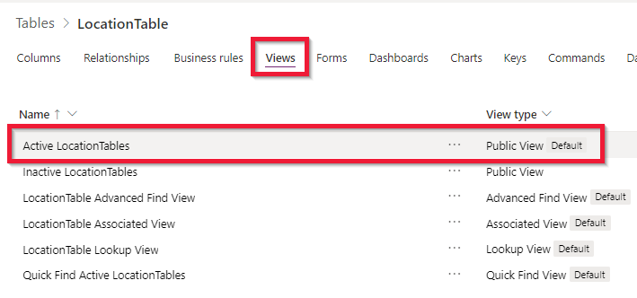
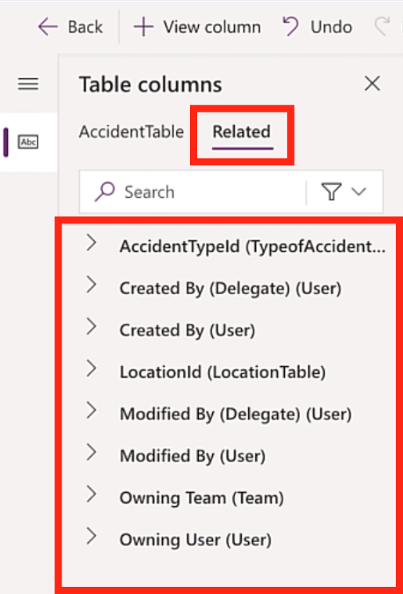

In this exercise, we will modify the views for our ***LocationTable** and **TypeofAccidentTable**.* The end goal will be to modify the existing view and add the columns of data that are most relevant to the app user into one list.

### Modify the view for the LocationTable

1. On the main menu, expand **Dataverse** and select **Tables**.

1. Find and select the custom ***LocationTable***.

1. Click **Views** and then select the **Active LocationTables** view. Once again, you will be redirected to the view designer studio.

    > [!div class="mx-imgBorder"]
    > 

1. By default, this view already has our ***LocationId*** column added and the ***Created On*** column. Remove the ***Created On*** column from the view.

1. Select the ***LocationName*** column, select it and it should be added to the grid. Repeat the same process for ***LocationCountry**.* At the end, you should have the fields showing on the grid.

1. Select **Publish**, to save, and publish your changes.

### Modify the view for the TypeofAccidentTable

1. On the main menu, expand **Dataverse** and select **Tables**.

1. Find the custom ***TypeofAccidentTable*** and select it.

1. Find **Views** and then select the **Active TypeofAccidentsTables** view to open the view designer studio.

1. Select the ***AccidentName*** column, click on it and then it should be added to the grid. Repeat the same process for ***AccidentSeverity**.* At the end, you should have the fields on the grid.

1. Click **Publish**, to save, and publish your changes.

### Modify the view for AccidentTable

The process for modifying this view is the same, the difference with this one is that we will use the relationships built in the previous module to display information in the same view from the related tables. Think of it as flattening the information to display in a tabular style view information for each accident such as:

- The location name of the accident

- The type of accident name

- The type of accident severity

1. On the main menu, expand **Dataverse** and select **Tables**.

1. Find the custom ***AccidentTable*** and then click on it to select it.

1. Click **Views** and then select the **Active AccidentTables** view to open the view designer studio.

1. Select the ***AccidentDescription*** column, click on it and then it should be added to the grid. Repeat the same process for ***ManagerComments**, **AccidentDate, and **ManagerReviewed**.* At the end, you should have the fields on the grid.

1. To add fields from the related table, select **Related** and then you will see the list of tables that have a relationship with this table. By default, all tables in **Dataverse** have standard relationships with other standard tables such as the **User** table.

    > [!div class="mx-imgBorder"]
    > 

1. Find and select the ***LocationTable**,* it will expand once you click on it to reveal the fields from the table and then select the ***LocationName*** and ***LocationCountry*** from the list.

1. In the same manner, find the ***TypeofAccidentTable**¸*click on it and select the ***AccidentName*** and ***AccidentSeverity*** from the list.

1. Change the name of this view to ***MainAccidentTrackingView***.

    > [!div class="mx-imgBorder"]
    > 

1. Select **Publish**, to save, and publish your changes.
