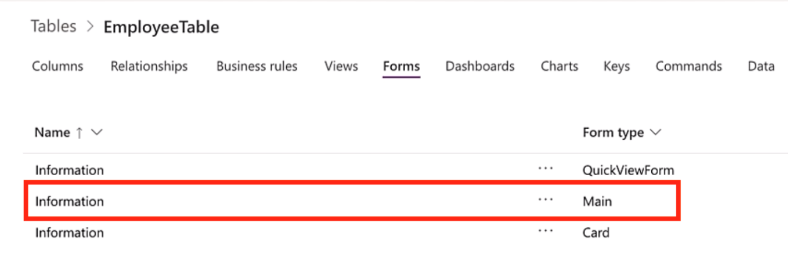
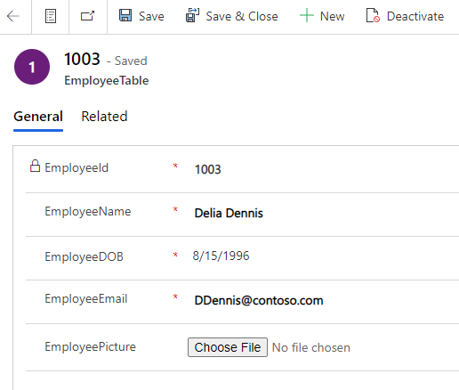

In the previous lesson, you learned about table views. Now, it's time to learn about table forms.

### Overview of forms

Previously, using the Excel workbook to track accidents provided users with the ability to log and modify accident reports. With that method, users would insert a new row for new accidents or modify existing accidents directly in the spreadsheet. The goal of table forms is to give the user the ability to log new accidents, modify existing records, or delete records. Forms offer a simple way for users to enter data and solve issues, such as a data validation process that can lead to incorrect data being collected.

Forms are part of the user interface (UI) and allow application users to interact with data that is being stored in underlying tables. By using forms, the app maker can allow users to create new records and edit and delete records from tables.

By default, all tables in Dataverse have standard forms, which you can use and implement into your solution. However, for many organizations, the standard out-of-the-box forms will still need to be customized and modified to meet business needs. When creating and/or modifying forms, you should also consider the end-user experience. Take time to customize the behavior and appearance of the forms during the user's data-entering experience.

In this section, you will customize these forms to display the fields that users will update when interacting with your model-driven app. The goal of forms is to allow the user to create, update, and delete records efficiently. This process could involve placing similar fields into groups that make sense to the business user, or you can put them in order. In the next exercises, you will modify the **Main** form for all tables. Then, you will use these forms as the main place where app users will interact with the data. 

For more information, see [Create and design model-driven app forms](/powerapps/maker/model-driven-apps/create-design-forms/?azure-portal=true).

### Modify default table forms

Follow these steps to modify default table forms:

1. From Power Apps, on the main menu, expand **Dataverse** and then select **Tables**.

1. Select the **Tables** menu and then search for **EmployeeTable** that you created in the previous module. You can search for it by selecting **Custom** and then typing **employee** in the search bar.

1. Select the table and then select **Forms**. Find and select the **Main** information form to navigate to the forms design experience.

    > [!div class="mx-imgBorder"]
    > 

1. On the left menu, a form is separated into three sections: **Header**, **General**, and **Footer**. You can customize these three components to make the data entry process more efficient, if needed.

    > [!div class="mx-imgBorder"]
    > 

1. Add the **Owner** (a Dataverse standard field that identifies the user who created the record in the table) to the **Header** section of the table by dragging the **Owner** field and then dropping it to the upper right of the header.

1. Add the fields that a user will enter for employees in the **General** section of the form. Select the **Table columns** icon on the right, which will show the different fields in **EmployeeTable**. Drag the fields and then drop them into the **General** section. Put the fields in the following order:

    1. **EmployeeId**

    1. **EmployeeName**

    1. **EmployeeDOB**

    1. **EmployeeEmail**

    1. **EmployeePicture**

    > [!div class="mx-imgBorder"]
    > 

1. Because you want the **EmployeeId** field to be automatically numbered when a new employee record is created, you will make that field **Read-only**. Select the **EmployeeId** field, and on the right under **Properties**, select the **Read-only** checkbox.

    > [!div class="mx-imgBorder"]
    > 

1. To complete the changes, select **Publish** in the upper right.

    Now, you will test your form and create a few employee records.

1. Select **Back** in the upper left to return to the table's menu.

1. Select **Data** to show the records view of the table.

1. Select the **+ Add record** button in the upper left to navigate to a new main form. This form should resemble the one that you customized in the previous steps.

1. Enter a new employee and provide the following details:

    - **EmployeeName** - Cameron White

    - **EmployeeDOB** - 10/5/1985

    - **EmployeeEmail** - [CWhite\@contoso.com](mailto:CWhite@contoso.com)

1. Select **Save** and then add a new employee picture file.

    **EmployeePicture** - Choose an image from your desktop.

1. To add another employee, select **+ Add record**.

    - **EmployeeName** - Delia Dennis

    - **EmployeeDOB** - 8/15/1996

    - **EmployeeEmail** - [DDennis\@contoso.com](mailto:DDennis@contoso.com)

1. Select **Save** and then add a new employee picture file.

    **EmployeePicture** - Choose an image from your desktop.

    > [!div class="mx-imgBorder"]
    > 

    > [!div class="mx-imgBorder"]
    > 
