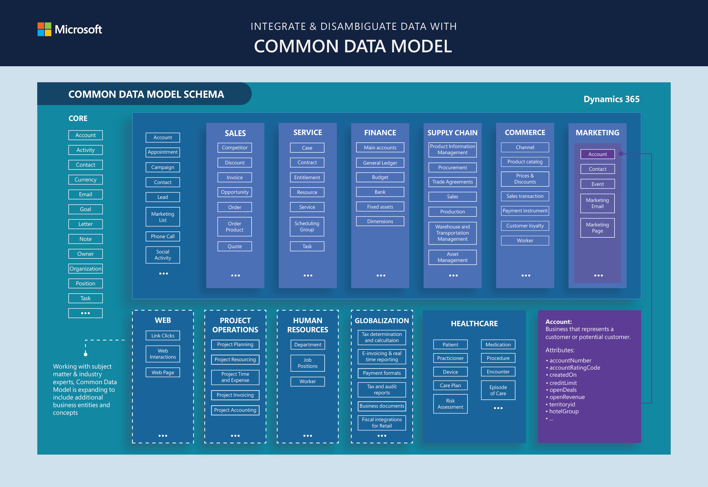

The Common Data Model standard defines a common language for business entities covering, over time, the full range of business processes across sales, services, marketing, operations, finance, talent, and commerce and for the Customer, People, and Product entities at the core of a company's business processes. The goal of Common Data Model is to enable data and application interoperability spanning multiple channels, service implementations, and vendors. Common Data Model provides self-describing data (structurally and semantically), enabling applications to easily read and understand the data.

## What is the Common Data Model

The Common Data Model is a standard and extensible collection of schemas (entities, attributes, relationships) that represents business concepts and activities with well-defined semantics, to facilitate data interoperability.

- A shared data model allows applications and data integrators to interoperate via a unified definition of data.
- Common Data Model includes a rich metadata system with standard entities, relationships,hierarchies, traits and more.
- Originated from Dynamics 365/CRM apps, open-sourced in GitHub with over 260 standard entities.
- Multiple systems and platforms implement Common Data Model today.
- Internal and external partners including Dataverse, Power BI DataFlows, Azure Data Services, Informatica and more.

> 

## Where is Common Data Model used

When you provision a Dataverse environment, the core schema in Common Data Model is used to create the tables, columns, and relationships in the Dataverse database. Some of the core tables include: Account, Contact, Lead, and Task.

When you deploy a Dynamics 365 app such as Sales, the tables are created from the Core schema, the CRM base schema, and the Sales schema.

The storage format defined by Common Data Model is also used in other tools such as DataFlows, Power BI, and Azure Data Factory. This permits interoperability between these tools making creating enterprise solutions simpler.

## Microsoft Industry Solution Accelerators

For industry-specific tables, consider using the Common Data Model. In addition to the metadata system, Common Data Model includes a set of standardized, extensible data schemas that Microsoft and its partners have published. This collection of predefined schemas includes entities, attributes, semantic metadata, and relationships. Microsoft is working closely with representatives from various industries to make the Common Data Model more relevant to them, by creating industry accelerators.

Industry accelerators are foundational components within Microsoft Power Platform and Dynamics 365 that enable ISVs and other solution providers to quickly build industry vertical solutions. The accelerators extend Common Data Model to include new entities to support a data schema for concepts within specific industries. Microsoft is currently focused on delivering accelerators for the following industries.

- Automotive
- Financial services, including banking and insurance
- Education, including higher education and K–12
- Nonprofit
- Manufacturing
- Media and entertainment

For more information see [industry accelerators](https://docs.microsoft.com/dynamics365/industry/accelerators/overview).
