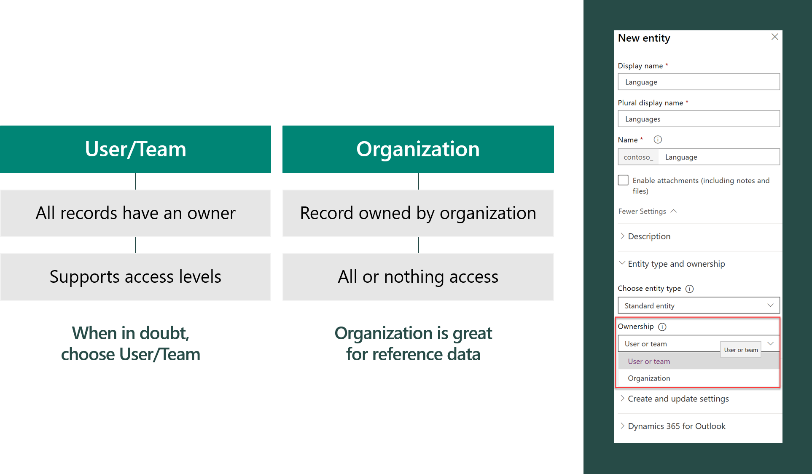
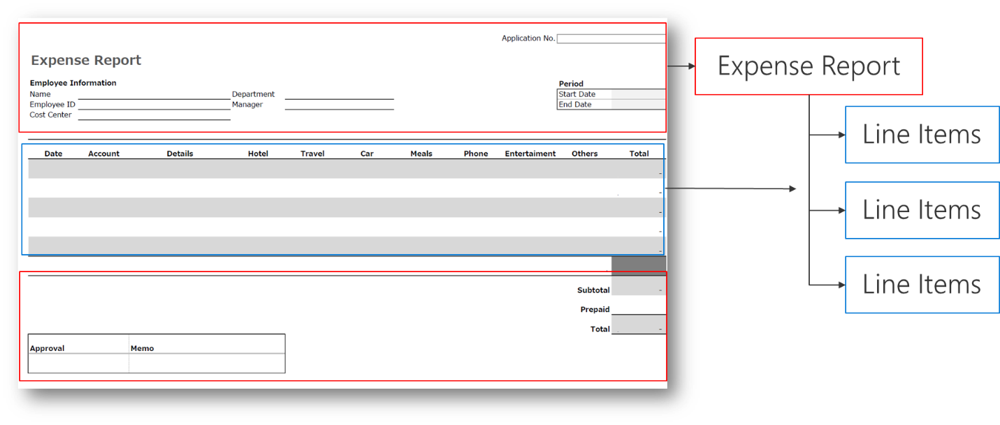
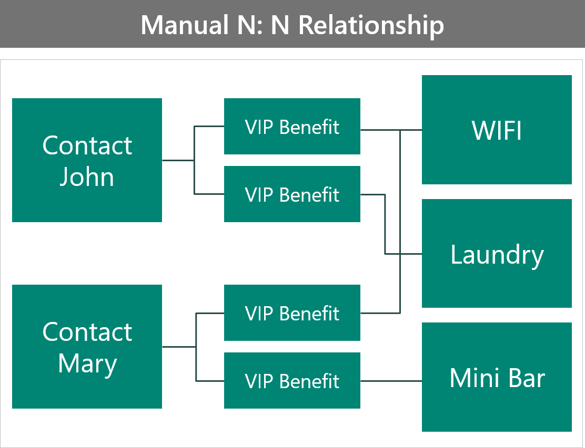
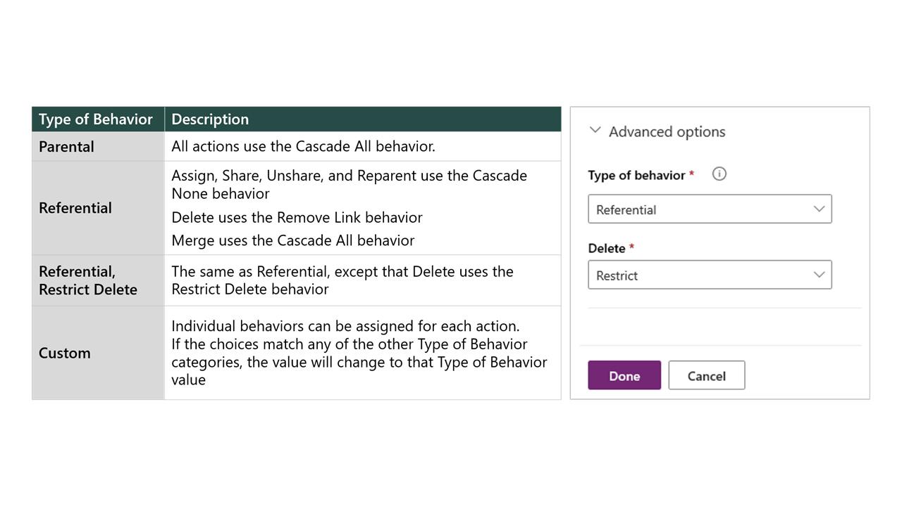

When you're storing or viewing data with your app, an important part of the design is the data structure. Consider not just how the data will be used in one specific app or screen, but how others will use the data. Referring back to your personas, tasks, business process, and goals will help you define what data to store and how to structure it.

## Table types

There are three types of table in Dataverse:

- **Standard**: Standard tables are tables where you can store data and add to the navigation in model-driven apps. Most tables you create will be standard tables. There are several standard tables created from the Common Data Model schema in a Dataverse environment.
- **Activity**: Activity tables are used to store interactions such as phone calls, tasks, and appointments. There is a set of activity tables in a Dataverse database.
- **Virtual**: Virtual tables allow you to create the table and columns in Dataverse, but then use an external data source to store the data. To the user, the data appears in their apps like any other data.

When you create a custom standard table, you must specify its ownership:

- User/Team: Default option.
- Organization: Used for reference data.

## Custom Activity tables

Activity tables are used to store interactions. They have a relationship to all tables that have **Enable for activities** set on their table metadata. Activity tables share the same set of columns and share the same security privileges. Rows in activity tables appear in the timeline on model-driven app forms. In this example, a custom activity table called Donation has been created.

There are some advantages for using custom activity tables:

- Show up in a list with other activities.
- Can be rolled up with other activities.
- Can create a "donation" on any table that supports activities.

However, there are some major disadvantages:

- Not able to configure security different than any other activity.
- Cannot control which tables are related to a "donation".

## Column data types

You need to choose the data type for columns wisely. This is especially true for numeric data types as you cannot compare numeric columns with different types and there are restrictions on data types for calculated and rollup columns. Once a type is chosen, it cannot be changed.

| Data type             | Comments                                           |
| --------------------- | -------------------------------------------------- |
| Yes/No                | Ensure you never need more choices                 |
| File and Image        | Allows storing file and images inline in Dataverse |
| Customer              | Can be either contact or customer                  |
| Lookup/Choice         | Make sure you choose the best one                  |
| Date/Time             | Make sure you choose the appropriate behavior      |
| Numeric               | Many to choose from, choose wisely                 |

### Choice vs Lookup

How do you decide between using a lookup or a Choice? The answer depends on the circumstances.

Choice:

- Only stores label and value as jet-value pair.
- Localization built-in.
- Treated as solution component.
- No built-in way to retire values.
- UX works to about 200 items.
- Can be filtered by using JavaScript.
- Stored as whole number on the row.

Lookup:

- Can store other data in columns on the row of the lookup table.
- You must build localization.
- Treated as reference data.
- Supports inactive state.
- UX scales to lots of items.
- Can filter by views and security.
- Stored as an entity reference.

Storing other data on the lookup table allows access when running workflows, or other customizations that reference the data. For example, a related property can be used in a check condition.

By being a solution component, Choices handle merge resolution by prefixing the value with the publisher prefix

Adding values on a Choice require administrator/customizer level access, while lookup values can be changed by a user if granted permission through security roles.

The user experience (UX) for choices is ideal for small quantity but does not work well for large sets. Lookups provide search type features not available on choices,

If you have multiple choice columns dependent on one another, this can only be achieved with Form-based script, while lookups can be filtered on other lookups using configuration.

### Storing file and image data

You have several choices where to store files and images:

Dataverse: Using the File and Image data typ
SharePoint: Good for collaboration but there is an issue with security. Security for the files follows SharePoint permissions and is not synchronized with Dataverse row permissions.
Azure Storage: Good for archiving and external access. Standalone security but can granted for small periods of time based on link generated for consumption (valet pattern), and can handle large files.

The file and image data types:

- Are good for upload and reference.
- The security follows record permissions.
- Are limited by size.

### Calculated columns

Calculated columns allow simple calculations to be performed on data in a row.

- Calculated on retrieve of record.
- Value is read only.
- Can include columns from the same row and columns in many-to-one relationships.
- Can include rollup columns in calculation
- Cannot trigger an event for workflow, plug-in, or Power Automate.

### Rollup columns

Rollup columns allow aggregations for related rows in one-to-many relationships.

- Calculated on scheduled basis (minimum 1 hour) and can be updated on-demand by a user.
- Value is read only.
- Can roll up calculated columns.
- Can use hierarchy of related records.
- Can filter across related tables.
- Cannot trigger an event for workflow, plug-in, or Power Automate.

You can roll up "simple" calculated columns, that is, calculated columns that include non-deterministic functions cannot be rolled up.

## Relationships

Relationships define how rows are related to one another in Dataverse. Each table in Dataverse has a primary key to provide a unique reference to the rows in the table. In Dataverse, the primary key is a Global Unique Identifier (GUID) that is generated automatically by Dataverse when a row is created. Relationships are created by adding a reference to the primary key. This is known as a foreign key. In Dataverse, relationships are created by using a column on one table to hold the foreign key value. This foreign key is a pointer to the primary key on the other table.

Two types of relationship are supported in Dataverse:

- One-to-many (1:N)
- Many-to-many (N:N)

### One-to-many (1:N)

Let us take the following expense report as an example.

You see the main part of the expense report, which has the employee name and department details. Below the main part, you see multiple rows of descriptions for each purchased item. Let's call these line items. The line items have a different structure from the main part of the expense report. So we can say that for every expense report, there are several line items.

The relationship between the expense report and the line item is an example of a one-to-many (1:N) relationship. The main part of the expense report is linked to several line items. You can also view the relationship from the perspective of the line items: each line item can only be linked to one expense report. This is a many-to-one (N:1) relationship.

### Many-to-many (N:N)

Multiple to multiple data structure is a special type. This is for cases where multiple records can be associated with multiple sets of other records. A good example is your network of business partners. You have multiple business partners (customers and vendors) that you work with, and those business partners also work with multiple colleagues of yours.

Let us look at some examples.

### Example 1: Time-off approval request

This simple example show two sets of data. One is the employee, the other is the time-off request. Because each employee will submit multiple requests, the relationship here is one-to-many, where "one" is the employee and "many" are the requests. The employee data and time-off request data are related to one another by having the employee number as the common column (also known as the key).

### Example 2: Purchase approval

Here, the data structure looks sophisticated but is similar to the expense report example that was discussed at the beginning of this article. Each vendor or supplier is associated with multiple purchase orders. Each employee is in charge of multiple purchase orders. Hence, both these sets of data have a one-to-many data structure.

Because employees might not always use the same vendor or supplier, vendors are used by multiple employees and each employee works with multiple vendors. Hence, the relationship between employees and vendors is many-to-many.

### Example 3: Expense reporting

Here we see an ERD containing multiple tables for an expense reporting solution.

## Example 4: Track which two benefits the VIP selected

In this example we have two VIPs, John and Mary. John has chosen the WiFi and Laundry benefits, and Mary has chosen the WiFi and Mini-bar benefits. We can model this in different ways. First as 1:N relationship.

In this configuration:

- The benefit record is unique to contact.
- There is no ability to look at all contacts that choose a certain benefit.
- Can do benefit record security based on owner of contact.
- Can store more data on the benefit record that is contact-specific.
- Relationship is parental to benefit otherwise you will orphan the benefit records.

Now as a N:N relationship.

In this configuration:

- Looking at the associated records from the benefit shows all contacts that choose that benefit.
- Security on benefit is shared for all contacts no ability to tailor to each contact.
- Any attributes on the benefit are shared for all contacts, no contact-specific data
- Must use reference relationship otherwise you would be removing benefit from other contact.

Neither of these configurations is ideal. Now let us create a custom (interset) table to hold the VIP's benefit.

In this configuration:

- Adds ability to store more data on the benefit table specific to that contact.
- Requires more work for the user to connect the records, they now have to create the intersect row manually
- Benefits can be secured individually
- Querying is a little more difficult you have no ability to directly access attributes on the benefit table

Now let us look at just using columns on the Contact table.

In this configuration:

- Works well for Primary and Secondary benefits but would not scale to tracking lots of benefits.
- Querying and self-service BI would be easier for users.
- Security would follow that of the contact record.
- Querying all users that choose a primary benefit would require a query scanning both primary and secondary benefits.

This configuration is a good example when the benefit must be recorded for some compliance/statistical purpose but has No impact on the business or processing.

### Relationship behaviors

Relationship behaviors control how certain actions cascade down to rows related to the primary table row through the 1:N relationship. Behaviors maintain referential integrity and can prevent orphan records from being left behind.

> [!IMPORTANT]
> Defining relationship behaviors is important as the cascade of assign can cause related records to be assigned. If in doubt, set the behavior to Referential and Restrict.

## Alternate keys

Alternate keys are used in integrations to reduce the need to perform a query to find a record. Using an alternate key, a row can be updated without knowing its GUID.

Alternate keys:

- Are Great for use in retrieves and updates.
- Can contain decimal, whole number, text fields, dates, and lookup fields.
- Can have up to five alternate keys per table.
- Create a nullable unique index behind the scenes to enforce uniqueness for the key.

When a key is created, the system validates that that key can be supported by the platform.

## Diagram best practices

When creating ERDs for Dataverse, you should:

- Avoid data duplication; every piece of data should only have one home. Rather than duplicating the same data between multiple tables, functionality like quick view forms and displaying related table data in views should be used.
- Use the ERD relationships to review and identify potential cascading behaviors that could impact business logic. For example, with parental relationships, permissions like Assign, Share, Unshare, Reparent, Delete, and Merge will automatically happen to related records when a parent record is updated.
