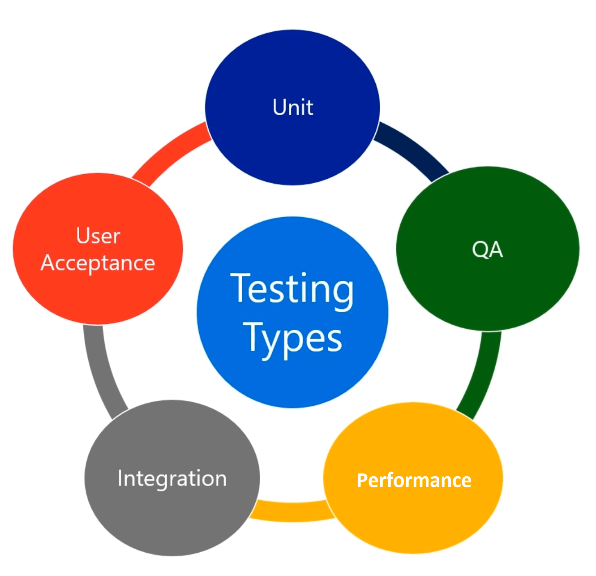

There are many types of testing that you should consider in your deployment planning. Each of these can be done either casually, or formally with a well-documented process to follow. Often in different deployments these will have slightly different expectations. Some testing options are manual (user adoption testing), and some are automated (load testing).

**Unit testing-** this is the smallest component of testing, a single unit of measure. Often this is thought to be a developer’s job. However, every person on a project should include this in their work. An example of unit testing could be: You are given a requirement to add a calculated column to a form. Before you advance the task to the testing team, you would confirm the column was on the form as expected and test that the calculation was as expected.

**Quality assurance testing**- sometimes called QA, this is when someone independently tests the task by reviewing the expectation against the work performed. Often there will be testing of the smallest components, such as the units mentioned above and also testing of a full end-to-end user story. 

**Performance testing** (sometimes also referred to as load testing)- there are many things that can be configured that will have an impact on system performance. Sometimes the number of concurrent users affects expected performance (load); sometimes it’s the combined actions of these users, and sometimes an individual user could experience problems such as a slow-loading form that has too many subgrids. Integrations with other systems might also affect performance. Performance or load testing is most often done using external tools.

**Integration testing**- did the systems we integrated with perform as expected? Did we introduce unnecessary dependencies? 

**User acceptance testing**- this is an opportunity to have direct feedback from the actual users of the system being built. User acceptance testing (hopefully) confirms the system built is the system users need. 

Regardless of the exact type or plan you are using; the following considerations should be included.

> [!div class="mx-imgBorder"]
> 

## Use of Testing Plans

A testing plan is an important scoping document in your project plan to communicate what will and will not be tested and necessary considerations for success. The testing plan is designed to be carried out by a technical resource to catch bugs before user acceptance testing. 

At a minimum, a test plan should provide a means to test each business requirement for the project. This gives the opportunity to show that each requirement was accommodated and accomplished. When there are issues in the future, a testing plan is a helpful reference of what was tested based on understandings at the time and what may be outside the original scope. The plan needs to define the level of detail to be tested, and the process for solving and retesting any issues found. 

## Environment

Requirements of the test plan outline the environment needed to test accurately. The environment for testing should be as close to the technical setup of the production environment as possible. If the application will be available in multiple formats such as desktop, mobile, and offline testing should be completed in all of these environments. 

There may be times when the needed environment is not available at the time of testing. It is important that stakeholders are aware of these needs and dependencies and how they influence deadlines. 

## Security

In creating a testing plan, it is important to consider all of the user personas that will use the application and test from the correct security roles. Common considerations on security include determining relevant security roles, column security profiles, business unit membership, and team membership. The testers mean of authenticating should be the same as the production users. For example, if users will access the application through a VPN, testing needs to be completed over VPN. 

## Dependencies

Consider data dependencies such as child rows needed to populate lookups. If needed data is uncovered during testing be sure to note it so, you can remember to make the data available to users during user acceptance testing and the rollout to production. 

Be mindful of customizations that reference specific rows such as a specific account or custom child row. If a customization such as a workflow or business rule relies on a specific row that row will need to be migrated, so the GUID is the same in both environments. Using the data import wizard will replicate the data in the new environment with a different GUID. 

## Solution Awareness

Some configurations, such as Word and Excel templates, cannot be moved between environments and will need to be configured in each environment. Any configuration that must be complete in each environment should receive extra attention in testing. 

## Resources

It is best practice to have components tested by a resource that did not create or configure the component.

> [!div class="mx-imgBorder"]
>  

## Test Plan Components

The following components are commonly found in testing plans. 

- Environmental needs

- Features tested

- Features not tested

- Testing Items

	- Related Business Requirement

	- Steps to test

	- Expected result

	- Item pass or fail

	- Time and date tested

	- Tester name

	- Testing Notes

- Testing Schedule

	- Dependencies

	- Timelines

	- Schedule risks

- Process for fixing and retesting failed test items

A good test plan describes the intention and scope of testing, guides the technical review process and supports a smooth rollout of functionality. A test plan should proceed user acceptance testing and have a means for tracking needed changes before rollout. 

 
