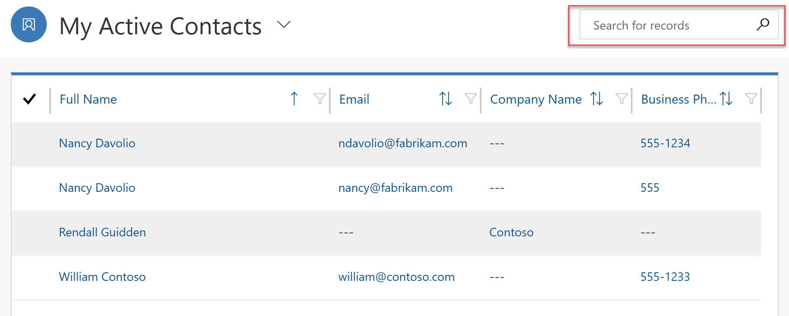
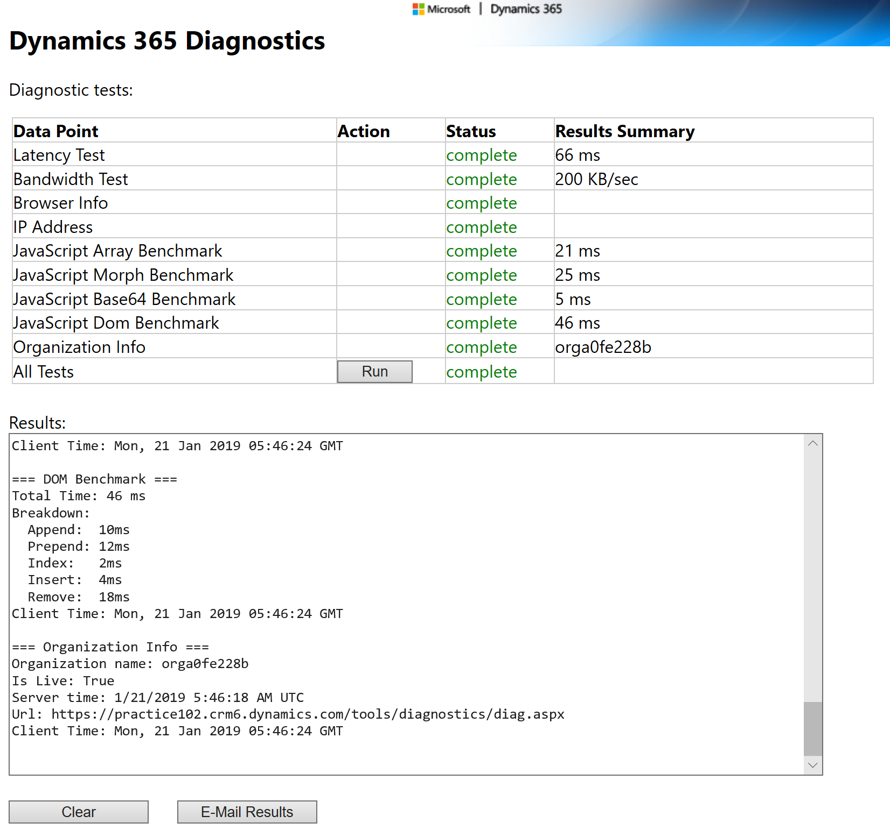
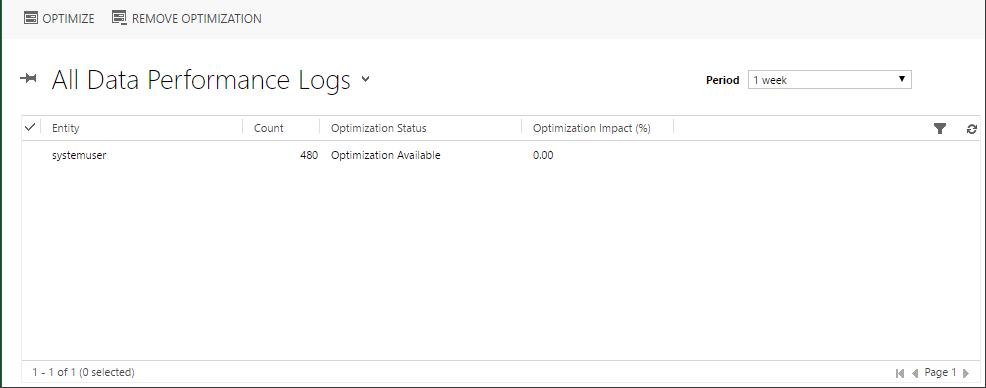
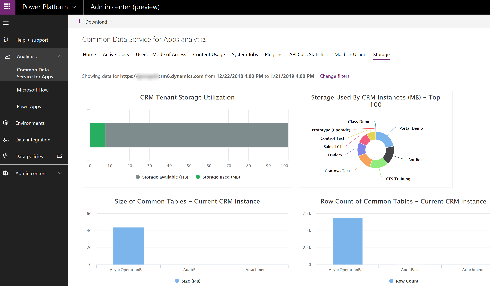

When analyzing performance of Common Data Service for Apps, it is important to understand areas affecting the performance of an app. 

## Environment

By carefully examining various environmental factors you can improve your overall experience with CDS apps, even before your business begins to use it.

### Network

Network capacity can greatly affect performance of the apps from the end-user point of view. That includes web apps, Dynamics 365 for Outlook app, and custom applications using Web API.

There are two primary network characteristics affecting the performance: network bandwidth and latency. Collaboration with your network team is essential to making sure that network configuration is adequate and does not affect app performance.

### Client Configuration

CDS apps are web-based applications and use web browsers, such as Edge or Chrome, as the user interface to view, add, or edit information that you’ve stored in the apps database. You may need to work with your system administrators to make sure that the client machines and software settings are optimized for performance. 

## App Performance

Design of the app itself can greatly affect performance. One of the strengths of the Power platform is ability to quickly build robust small apps targeting specific users and specific functionality. Instead of a monolithic app that is more likely to suffer from performance issues you now have the ability to design several separate apps. This separation ensures that each app can be analyzed and tuned independently without too much impact on the others.

Design techniques for individual components may also affect performance of an app.

### Model-driven Apps

#### Forms

To improve form performance, design them so that only the information essential for the users is included. If information required depends on the user’s role, consider creating multiple forms instead of one monolithic form that includes every single field. Hiding tabs and sections that are not required to be immediately visible can also improve form responsiveness and performance.

One of the most common sources of performance issues on the forms is custom scripts added by developers. Good collaboration within the team is a key to identify and resolve any performance bottlenecks introduced during the development. 

#### Views

To improve performance of the entity views, limit the number of columns displayed only to those required by the business. As often the case, it’s a balance between the responsiveness and bringing enough information to improve usability of the view. 

Customize your views so that they bring back an actionable number of records. For example, Active Contacts view may contain hundreds of thousands of records while My Active Contacts will limit that view only to the contacts that are owned by the user. At the same time consider limiting the number of records per page so that the views return much more quickly.

#### Quick Search

Optimizing the quick search view only to include columns that makes sense to search will make a noticeable performance impact on searches within the views. 

When a user searches for records within a view, CDS for Apps performs a query that searches only predefined fields. Which fields are searched is defined by the Find Columns settings in the system Quick View.

 

The fewer number of columns that are selected, the faster quick search will be. Balance the number of find columns with the effectiveness of the search.

### Canvas Apps

The primary source of performance issues in canvas apps are poorly designed data access, excessive or suboptimal formula use, and overly complex user interface.

#### Loading Data

Apps will perform poorly when most of the heavy lifting is done on the client and not on the server. Erroneous choice of how to query your data may lead to performance issues. Understanding [delegation](https://docs.microsoft.com/powerapps/maker/canvas-apps/delegation-overview) in canvas apps is the key to improving you app performance when it comes to data access.

There are some canvas apps features that you would want to consider when optimizing your app start performance by using Concurrent function to load data from multiple sources concurrently. 

#### Controls Optimization

Another aspect that can affect performance is the number of screens and controls used in your app. Minimizing the number of controls and reducing complexity of the controls used can help boost your app performance. It will improve the performance while authoring the app as well. There are strategies to optimizing the number of controls used in your app. For example, you can use a gallery control instead of a Canvas/Data Cards when the data displayed is uniform or vary only slightly. Gallery can be powerful in reducing complexity, making your app easier to maintain.

There are other optimizations techniques available, make sure that canvas apps developers familiarize themselves with [detailed documentation](https://docs.microsoft.com/powerapps/maker/canvas-apps/performance-tips).

### Workflows 

Real-time workflows can be very effective but, if designed poorly, will affect the performance of the most common operations such as creating or updating a record. Consider converting poorly performing or long running workflows to background ones where the impact on the system will be smaller.

Background workflows create a log record when an instance of the workflow is executed. The default setting is to delete log entries for successfully executed workflows. If this setting is changed to keep the entries, jobs log will grow and may reach the point where it affects performance of the asynchronous services. Only use this flag for troubleshooting and avoid leaving it on in production.

### Plugins

Custom extensions such as plugins are the common source of the performance issues. Work with developers to identify and resolve those.

## Performance Testing

Designing for performance is an important part of the process and so is performance testing. It is important to perform performance testing on the system where the volume of data is close to your production system. That will give you a good understanding for app performance in general and for the areas to optimize. Use the instance copy function to create a copy of the production instance including the data. 

The other important aspect of adequate performance testing is to reproduce workloads expected in the production environment. There is often a disconnect between testing environments where the system is accessed by a handful of the testers and the production instance where hundreds and thousands of users may access the system at the same time. There are load testing tools available from Microsoft and third-party vendors and you will need to collaborate with your development team to ensure that the tools are installed, configured, and used appropriately within the development lifecycle.

## Instance Statistics

CDS for Apps analytics are available via Power platform admin center [https://aka.ms/ppac](https://aka.ms/ppac). It contains various statistics that can help identify potential areas for deeper performance analysis, for example most used entities, storage consumed, failing system jobs and plugins, etc. 

## Query Performance

CDS for Apps is a service and, as any service, may not cater for your specific app design. Specific queries in your app may cause some performance issues. While you don’t have direct access to the components of the CDS for Apps such as database, there are tools available within CDS for Apps to help in tuning the environment to your specific needs. You can analyze and optimize query performance using the Data Performance view discussed in detail in the next topic.
There are a number of tools that can assist in performance tuning various aspects of PowerApps.

## Dynamics 365 Diagnostics

There are two primary network characteristics affecting the performance: network bandwidth and latency. Identify if these may impact your app performance, by using the Dynamics 365 Diagnostics tool that is available at https://&lt;myorg&gt;.crm.dynamics.com/tools/diagnostics/diag.aspx where &lt;myorg&gt;.crm.dynamics.com is the URL of your Dynamics 365 organization.

After opening the page and pressing Run, the report will become available that will assist your network team in detecting and resolving the issues. The statistic includes some browser benchmarks that may be useful in identifying if browser performance is an issue.

## Data Performance Logs

You can analyze and optimize query performance using the Data Performance view, which provides an aggregated list of entities with long-running queries. A long running query is defined as a query that takes three seconds or longer to complete. Typical examples of a component that can have a long running query is a plug-in with custom FetchXML or a sub-grid or view. 

You can access Data Performance Logs via Settings -> Administration -> Data Performance.

If one or more long running entity queries are detected, log items are displayed in the view. You can use the Optimize command to apply optimizations to the selected query.

> [!Note]
> With the most recent advances in Azure SQL database self-tuning capabilities you may no longer see any long running queries reported in the Data Performance view. Slow queries are automatically detected and optimized at the database level. 

## Analytics

CDS for Apps analytics are available via the Power platform admin center [https://aka.ms/ppac](https://aka.ms/ppac). Various statistics can help identifying potential areas for deeper performance analysis.

### Common Data Service for Apps

The Content Usage tab contains information about most used out-of-the-box and custom entities. Identifying the most used entities helps concentrate the optimization efforts on the parts of the app that matter.

The Storage tab provides a number of storage statistics across all of your tenant instances as well as breakdown of the storage within the selected instance. 

This can help identify entities with excessive storage use that would be a primary target for further performance investigations.

Other statistics are also available that may be useful. Plug-ins statistics can assist in identifying troublesome plugins, for example those with excessive average execution time.

### PowerApps Analytics

PowerApps Analytics help with performance analysis by providing detailed statistics on Service Performance across various connectors used in your app. 

Additional information such as overall app usage, location statistics, or errors seen by end users can be extracted from other tabs. While not directly performance related, this information can be useful in pinpointing overall problematic areas that may be caused by poor app performance such as specific region, specific app, etc.
