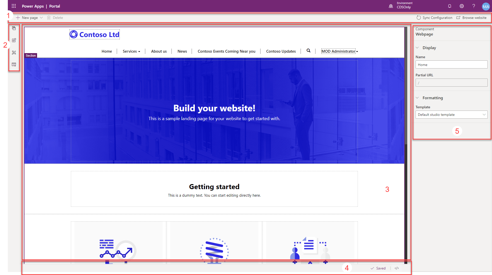

The Portal studio is a what-you-see-is-what-you-get (WYSIWYG) design tool that will allow portal makers to create web pages and content and specify specific properties of portal components.  The portal studio is accessible from Power Apps maker portal.

> [!div class="mx-imgBorder"]
> 

## Launch portal studio

You will only have access to the Power Apps portals Studio when you have a portal provisioned in your Common Data Service or Dynamics 365 environment. To access the Power Apps portal Studio:

1. Navigate to [Power Apps maker portal](https://make.powerapps.com/?azure-portal=true). 
1. Select the target environment using the environment selector in the top right-hand corner.
1. From the list of Apps select the application of type **Portal**.
1. Click **Edit** menu.

This will launch the studio and will allow makers to begin to create web pages and add static and dynamic content to the portal.  

## Portal studio anatomy

The portals studio provides the tools to allow makers to modify and add content.

> [!div class="mx-imgBorder"]
> 

| Section | Name | Description |
| ------- | ---- | ----------- |
| 1 | Command Bar | Create a new web page from an existing template Delete web page components Sync Configuration with updates from Common Data Service Clear cache and Browse to website to view current page |
| 2 | Toolbelt | Navigate the site hierarchy and organize web pages Add components to web pages such as section layouts and content components Enable custom CSS themes View and select portal templates to edit |
| 3 | Canvas | Workspace to arrange, add and edit static and dynamic content to a portal web page |
| 4 | Footer | Displays auto-save status and provides hyperlink to open up source code to allow editing of the current web page |
| 5 | Properties pane | Displays properties of the currently selected webpage or component and allows the setting of specific component properties |

All additions, configurations and updates done through the portals studio will update the portal metadata in the Common Data Service.

> [!IMPORTANT]
> The portal studio will automatically save configuration updates to Common Data Service as the maker tabs off a specific control. To ensure that all your updates are committed, check the auto-save status in the footer before browsing to preview the website.

> [!VIDEO https://www.microsoft.com/videoplayer/embed/]
