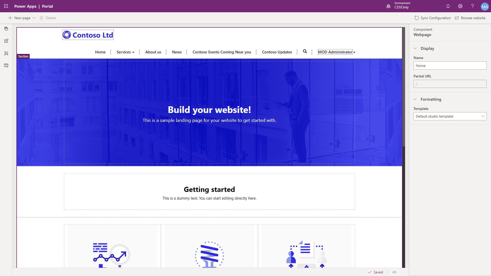

Microsoft Power Apps portals Studio is a WYSIWYG design tool that will allow portal makers to create webpages and content and specify properties of portal components. Portals Studio is accessible from the Power Apps maker portal.

> [!div class="mx-imgBorder"]
> 

## Launch portals Studio

You will only have access to the Power Apps portals Studio when you have a portal that is provisioned in your Common Data Service or Dynamics 365 environment. To access the Power Apps portal Studio:

1. Go to [Power Apps maker portal](https://make.powerapps.com/?azure-portal=true). 
1. Select the target environment by using the environment selector in the upper-right corner.
1. From the **Apps** list, select the application of type Portal.
1. Select the **Edit** menu.

This procedure will launch the Studio, where makers can begin creating webpages and adding static and dynamic content to the portal.  

## Portals Studio anatomy

The portals Studio provides the tools that makers can use to modify and add content.

> [!div class="mx-imgBorder"]
> 

| Section | Name | Description |
| ------- | ---- | ----------- |
| 1 | Command bar | Create a new webpage from an existing template Delete webpage components Sync configuration with updates from Common Data Service Clear cache and browse to website to view current page |
| 2 | Toolbelt | Navigate the site hierarchy and organize webpages Add components to webpages such as section layouts and content components Enable custom CSS themes View and select portal templates to edit |
| 3 | Canvas | Workspace to arrange, add, and edit static and dynamic content to a portal webpage |
| 4 | Footer | Displays auto-save status and provides hyperlink to open up source code to allow editing of the current webpage |
| 5 | Properties pane | Displays properties of the currently selected webpage or component and allows the setting of specific component properties |

All additions, configurations, and updates that are done through the portals Studio will update portal metadata in Common Data Service.

> [!IMPORTANT]
> Portals Studio will automatically save configuration updates to Common Data Service as the maker tabs off a specific control. To ensure that all your updates are committed, check the auto-save status in the footer before browsing to preview the website.

> [!VIDEO https://www.microsoft.com/videoplayer/embed/RE4yYtf]
