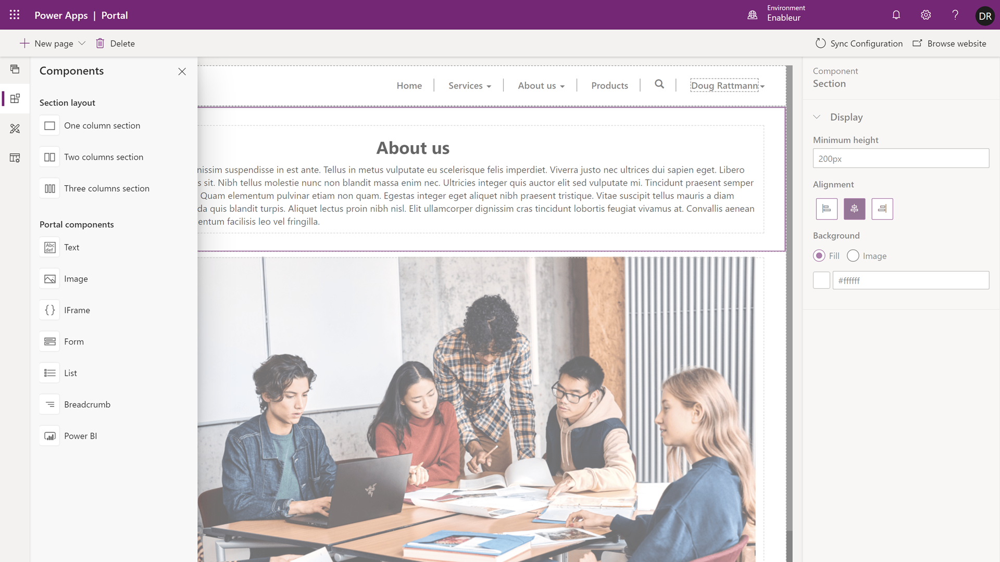

After a webpage has been created, a portal maker can add a set of predefined components on the page to format the layout and add static and dynamic content.

This simple design approach will add corresponding HTML, CSS, or Liquid code to the webpage without the maker needing to know the structure or syntax of these languages. The configuration information will be stored on the **Page copy** field of the content's webpage record.

Select the component from the toolbelt to add it to the webpage canvas. Depending on the component type, you can either enter the content directly on the canvas (for example, text) or configure the component by using the Properties pane.

> [!div class="mx-imgBorder"]
> 

| Component      | Description                                                                                                                                                                                    |
|----------------|------------------------------------------------------------------------------------------------------------------------------------------------------------------------------------------------|
| Section layout | These components will allow the maker to place a one, two, or three-column section on a page. Additional components can be embedded within the sections.                                       |
| Text           | Places a static text box on the webpage.                                                                                                                                                       |
| Image          | Places an image control on the page. A maker can choose an existing image or upload a new image. The image file will be stored as an attachment of the web file record in the portal metadata. |
| IFrame         | The IFrame will embed a particular URL from another website or application. One example could be to embed a Microsoft Power Virtual Agents bot onto the portal page.                           |
| Form           | The component will display a form based on a model-driven form that is from a specific Microsoft Dataverse record.                                                                             |
| List           | The list component will display a view based on a model-driven view from specific Dataverse records.                                                                                 |
| Breadcrumb     | The breadcrumb will display a navigational path based on the webpage hierarchy in the portal.                                                                                                  |
| Power BI       | The Power BI component will allow you to add Power BI dashboards and reports for your customers or your internal employees, or you can add a public facing Power BI web report.                |

Other components such as headings, buttons, web forms, hyperlinks, and so on, can be added to a page directly by using the code editor.
