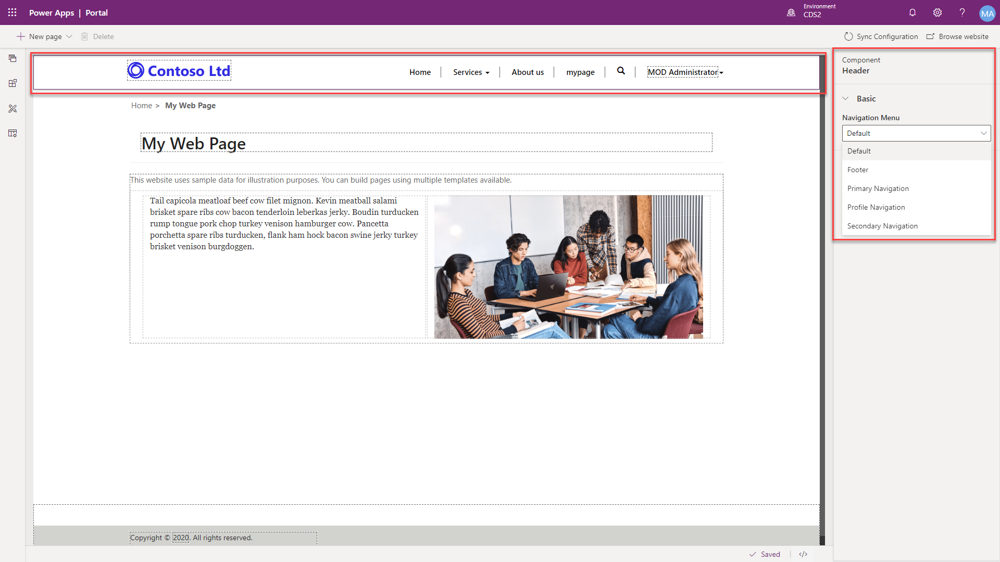
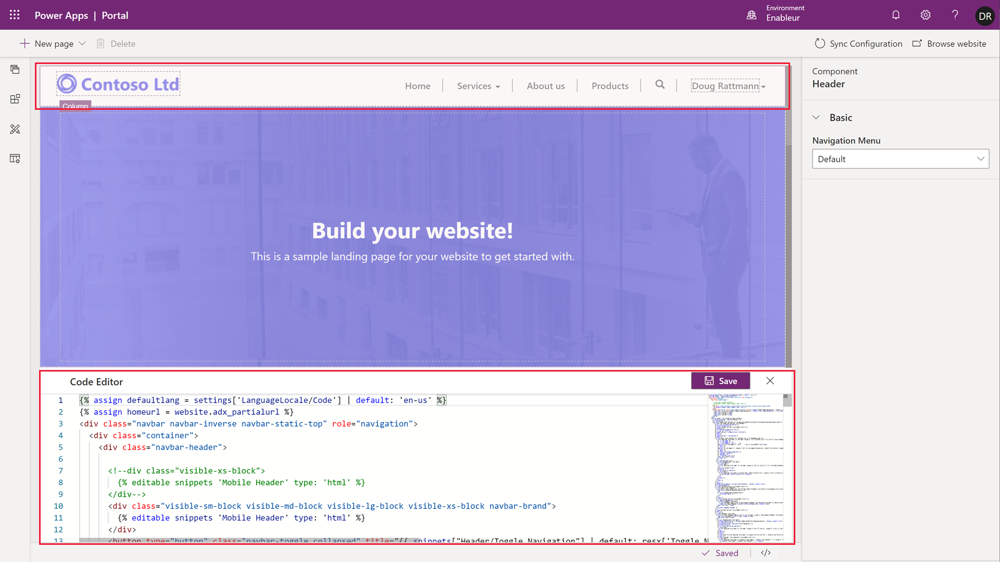

Most of the design, layout, and addition of specific components can be accomplished by using point-and-click methods in Power Apps portals Studio. However, instances might occur where you will need to modify specific components or add custom HTML, JavaScript, CSS, or Liquid code to a particular page or section of a webpage.

In the portals Studio canvas, you can select a specific section and then select the **Code Editor** (**</>**) button in the footer to expand the Code Editor, which will display the source code of the specific webpage. You can edit or add custom code through this editor.

> [!div class="mx-imgBorder"]
> 
> 
> [!WARNING] 
> You can potentially damage the layout of your page by entering incorrect syntax in the source code.

## Modify header and footer

When the header is selected in portals Studio, a maker can select the navigation record (Web Link Set) to be used as the site navigation menu.

The header and footer layout can be further customized by using the portals Studio Code Editor.

> [!WARNING] 
> Because the header and the footer apply to the website, direct modifications of the source code might result in broken layout for the entire site.
