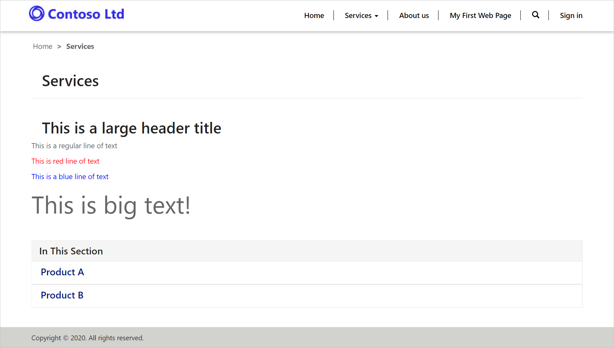

The purpose of this hands-on-lab is to edit webpage source code by using Power Apps portals Studio.

At the end of these exercises, you will be able to:

- Open portals Studio to edit your portal.
- View the source code of a webpage section.
- Add your own HTML code directly to a portal page or section.

For this exercise, you will need to have the following parameters in your environment:

1. A Power Apps portal that is provisioned. If you do not have a Power Apps portal available, follow the [Create Portal](/powerapps/maker/portals/create-portal/?azure-portal=true) instructions to create one.
1. Access to the Power Apps maker portal.

## Scenario

To ensure a consistent website appearance and define the *accessible* content that can be located and indexed, it is important to be able to edit HTML content of a page. In this exercise, you will add HTML code to the webpage copy section by using the Power Apps portals Studio Code Editor, and then you will follow these processes:

1. Open your portal in Power Apps portals Studio.
2. Open a **Services** webpage.
3. Add HTML code that contains various elements such as headings, paragraphs, and so on.
4. Save the page and browse the website to view the results.

### Launch portals Studio

To launch the Power Apps portals Studio, follow these steps:

1. Go to the [Power Apps maker portal](https://make.powerapps.com/?azure-portal=true).
1. Make sure that the correct environment is selected in the environment selector in the upper-right corner.
1. From the **Apps** list, locate your portal app (Type = Portal).
1. Select the ellipsis (**...**) and then select **Edit**, which will launch the portals Studio.

### Locate the webpage 

To locate the webpage, follow these steps:

1. From the toolbelt, select the **Pages** icon.
1. Locate the **Services** webpage and then select **Edit**.

### Edit source code

To edit the source code, follow these steps:

1. Select the page copy section on the canvas.
1. Select the **Source code editor** (**</>**) icon.
1. Replace the existing paragraph with the following HTML code:

    ```html
    <h2>This is a large header title</h2>
    <p>This is a regular line of text</p>
    <p style="color: red;">This is red line of text</p>
    <p style="color: blue;">This is a blue line of text</p>
    <p style="font-size: xxx-large;">This is big text!</p>
    ```

1. Select **Save**.

You should see the formatted text on the canvas.

### View the webpage

To view the webpage, on the Command bar, select **Browse website**.
Now, you should now see your page with the formatted text.

> [!div class="mx-imgBorder"]
> [](../media/7-edit-source-code-ss.png#lightbox)
