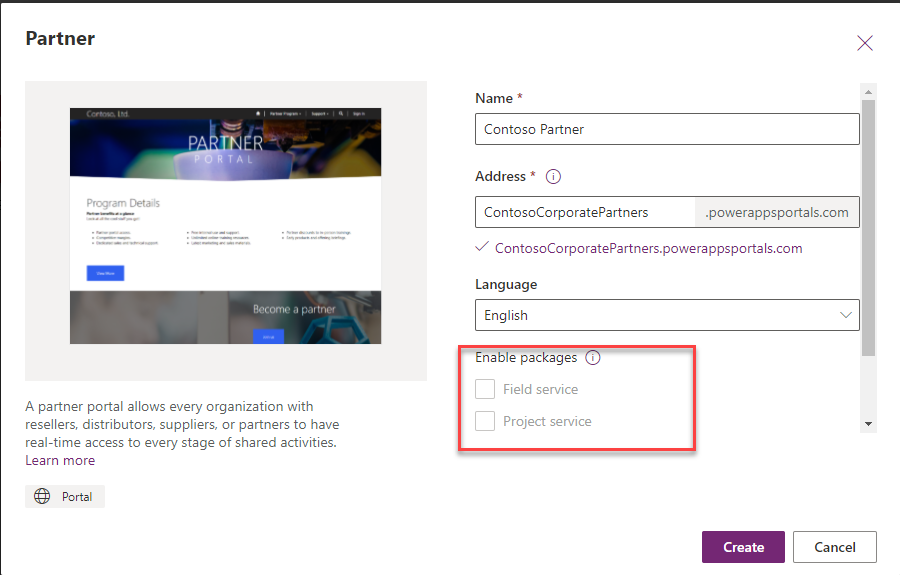

The Partner portal provides organizations that have a partner channel with a mechanism to allow partners to manage and collaborate on opportunities and customers.

> [!NOTE]
> The Partner portal is only available on Microsoft Dataverse environments with Dynamics 365 apps enabled.

> [!div class="mx-imgBorder"]
> 

Self-service and assisted service features in the Partner portal have the same functionality as in Community or Customer self-service portals, though the target audience is partners and not customers. This factor might influence how the feature is configured and used.

When you are provisioning the Partner portal, you can add more features if the Dynamics 365 organization has Field Service or Project Service solutions loaded. Selecting these options will extend portal features to these Microsoft applications.

> [!div class="mx-imgBorder"]
> 

## Partner management

With the **Partner Management** feature, you can:

- Apply to become a partner.

- Manage partner information.

- Add partner contacts.

A potential partner can navigate to the Partner portal and review the requirements of the partner program. The potential partner can apply to become a new partner through the portal. The contact will need to create a portal sign-in and fill in details of the application. This information will be stored in the corresponding **Account** and **Contact** records in Dynamics 365.

The partner organization (the organization that is selling products and services through its partner channel) will review the application on the Partner Recruitment Dashboard in the Dynamics 365 Sales application. When the application has been reviewed, the partner organization will run a workflow to either approve or reject the partner application.

After the application has been approved, the new partner contact will be able to sign in to the portal and view a dashboard with their revenue and opportunities. The new partner contact can also manage their own information (name, address, phone number, and so on) and also add and remove employee and employee access to the Partner portal.

> [!VIDEO https://www.microsoft.com/videoplayer/embed/RWrEVT]

## Customer management

A partner will be able to review and manage their customer list on the Partner portal. Additionally, they will be able to update contact information and add, remove, and associate different contacts to different accounts. All this information is stored as accounts and contacts in the partner organization's Dynamics 365 service.

Partners will not be able to see the customer lists of other partners.

## Opportunity management

The core feature of the Partner portal is that partners are able to manage and be assigned opportunities. A partner can add new opportunities through the portal. These opportunities will be added to the overall partner organizations pipeline and will appear on the partners dashboard.

The partner organization might also add opportunities and distribute them to a particular partner who would be best suited to close the deal. Alternatively, the partner might choose to add opportunities through some other allocation process.  

The partner will be identified on the opportunity and, from the portal, the partner can review the opportunity and choose to either accept or reject it.

## Knowledge articles

The **Knowledge Article** feature operates the same as it does for the Community, Customer self-service, and Employee portals. However, the knowledge articles would provide specific product and services information and also potentially information regarding partner program-specific issues.

## Forums

A partner organization might decide to allow its partners to participate in forums to share best practices, collaborate on questions, and initiate other discussions.  

The **Forums** feature operates the same as it does on the Community, Customer self-service, and Employee self-service portals.

Staff from the partner organization might also participate on the forums to encourage knowledge sharing and collaboration.

## Support cases

The **Support Case** functionality exists on the Partner portal and follows the same pattern set as the Community, Customer self-service, and Employee self-service portals.  Partners will be able to open cases with the partner organization, who will monitor and respond by using the Dynamics 365 Customer Service Hub app. The one key difference is that partners can link a particular opportunity that they are currently pursuing to the case to provide the partner organization with additional context to the specific inquiry. 
