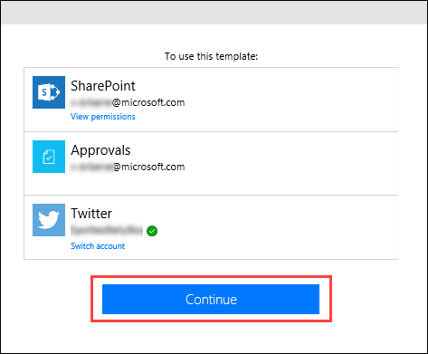
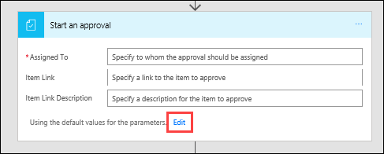
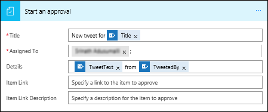
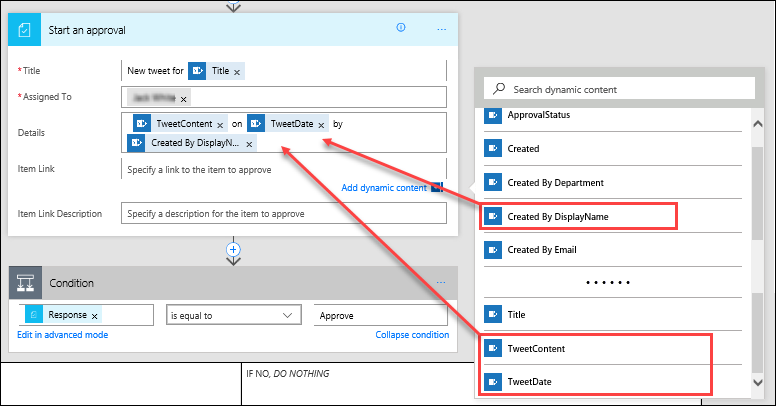
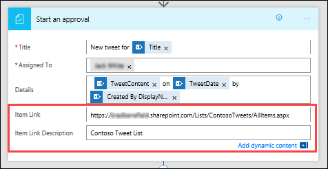
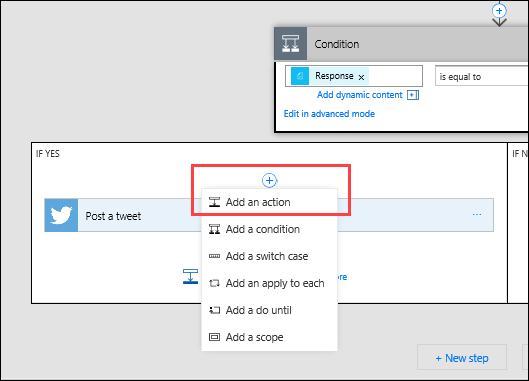
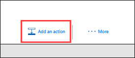
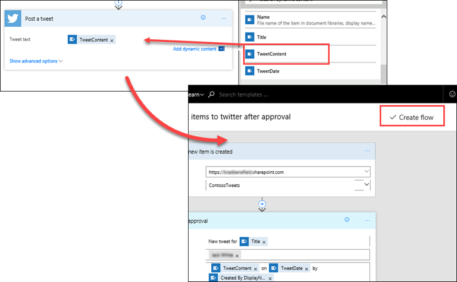

# Create an approval request
In a previous topic, you saw how to power your Twitter feed with a SharePoint list in a  simple way. In this topic, you’ll learn how to build a more business-friendly scenario using approvals.

This way, anyone with access to the SharePoint list can contribute tweets without knowing anything about Twitter. The social media team can approve or reject those tweets. The team maintains control of the account and the content that goes out to customers. 

## Step one: Create a SharePoint list for tweets
The template you'll use starts an approval process whenever a new item is created in a particular list, and if the item is approved, then it posts a tweet to Twitter. In this topic, you’ll modify this process by adding steps that update a SharePoint list with the approval response, indicate whether it was approved or not, and add any comments that the approver may have added to the proposed tweet. 

First, let's create the SharePoint list.

1. On your SharePoint site create a SharePoint list and name it **ContosoTweets**.
1. Open the list and select **Add column**.
1. Select **+ Add column** to add the following columns:
  
 - Add a **TweetContent** column and set its column type to **Multiple lines of text**. This will contain the content of the tweets for approval later.
 - Add a **TweetDate** column and set its column type to **Date and Time**. Select **More** to find the **Date and Time** type.
  - Add a **Yes/No column** and name it **ApprovalStatus**, and then  select **Save**. The approver can select Yes or No to approve or disapprove of the tweet.
  - Add a **Single line of text** column and name it **ApproverComments**. The approver can add a comment about the approval status.
4. Copy the URL to the SharePoint list. You'll use it later when you create the flow.

      

## Step two: Create an approval request flow
1. On the Microsoft Flow homepage, select **Approvals**.
1. Select **Create approval flow**, and then scroll down and select the **Post list items to Twitter after approval** template. 
   
    
2. Verify your account credentials for **SharePoint**, **Approvals**, and **Twitter**, and then select **Continue**. 
   
    

1. Back in **Microsoft Flow**, in the **When a new item is created** action, enter the following values:
   
   * **Site Address**: your team SharePoint URL
   * **List Name**: ContosoTweets
     
     
3. In the **Start an approval** action, select **Edit** to display all the fields. 
   
    
4. In **Title**, enter **New tweet for** and select **Title** from the dynamic content list. 
   
    
5. In **Assigned to**, enter and select your name, or a test user name. 
   
    
6. In **Details**, remove the default items and add **TweetContent**, **TweetDate** and **Created by DisplayName** from the dynamic content list. Be sure to add the words "on" and "by" to make the content more readable. 
   
    
7. In **Item Link**, copy and paste the URL of your SharePoint list in Step One above, and in **Item Link Description**, enter **Contoso Tweet List**. 
   
    
8. In the **Condition** action, hover over the **IF YES** box, select the plus sign “**+**”, and select **Add an action**. 
   
    
9. Search for **update item**, select the **SharePoint** connector, and select the **SharePoint – Update item** action.
   
    
10. In **Site Address** and **List Name**, enter your site URL and the **ContosoTweets** list again, and in **ID**, enter **ID** from the dynamic content list. The **ID** field is used to match the actual tweet request in the SharePoint list.
    
     
11. Select the **Title** field, and in the dynamic content list, search for **title**. Add the **Title** item from the **When a new item is created** action. 
    
     
12. Select **ApprovalStatus** and set the value to **Yes**, then select **ApproverComments** and set the value to **Comments** from the dynamic content list. 
    
     
13. Near the bottom of the **IF NO, DO NOTHING** box, select **Add an action**.
    
     
14. Using the same steps you used for the **IF YES** condition, create a **SharePoint – Update item** action and configure the fields with the same values, with the exception of setting **ApprovalStatus** to **No**. 
    
     
15. Select the **Post a tweet** action, select **Edit**, and set **Tweet text** to **TweetContent** from the dynamic content list. This will create the actual tweet and then post it to Twitter upon approval. 
    
     
1. Select **Create flow**.

Congratulations! You just create your first flow. 

This is just one way that Microsoft Flow can empower productivity for your team. Your team can contribute ideas, relevant news, or product guidance, and you still get to maintain control over what gets tweeted out to customers.

In our next topic, we’ll see what it looks like when an approver receives a new request for a proposed tweet. 

