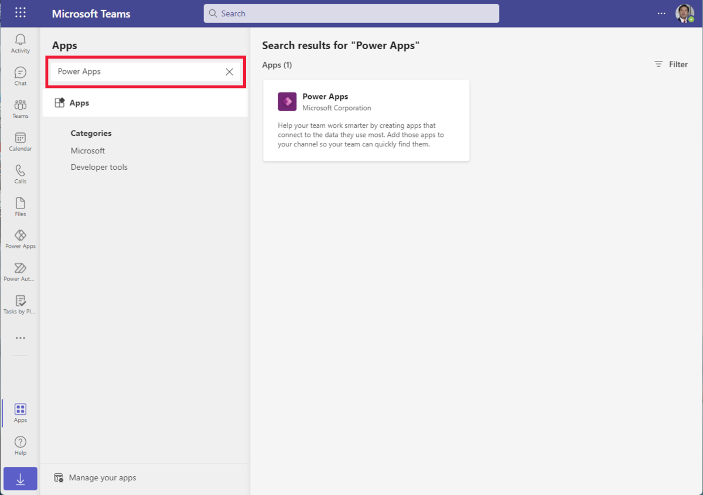
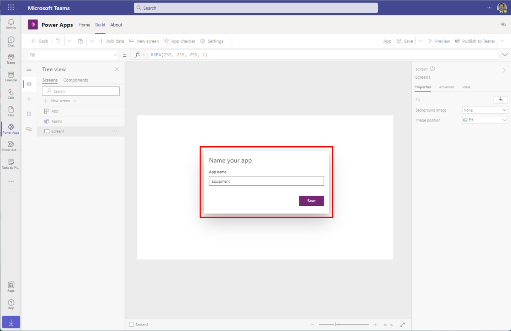

The Dataverse for Teams environment is where all of the business data, apps, and flows are stored. Each environment is associated to an O365 group for the Team. For this reason, each Team can only have one Dataverse for Teams environment. When an app or chatbot is created or installed for the first time into a Team, the Dataverse for Teams environment is provisioned automatically. Once it's created then tables and flows can be created in Dataverse.

## Install the Power Apps app inside Teams

The Power Apps app for Teams lets you create, edit, and delete apps and tables in Dataverse for Teams. To provision the Dataverse for Teams environment, we first need to install an app into Teams. 

1. To get started, open Teams and look for the **Apps** button in the bottom-left corner of the window. 

1. On the App Marketplace screen, use the Search input to find Power Apps. Select the app labeled **Power Apps.**

	> [!div class="mx-imgBorder"]
	> 

1. Select the **Add** button to add the Power Apps app to your Teams client.

	> [!div class="mx-imgBorder"]
	> 

Once Teams has successfully added Power Apps, you will be brought to the main Power Apps screen. This screen provides access to existing apps along with templates, videos, and other resources on building apps.

## Provision Dataverse for Teams to create a table

Now that we have the Power Apps app installed, we can create the first app, which will automatically provision the environment. Decide on which Team to create the environment and to store your table. See the links in the Summary unit at the end of this module if you need to create a new Team.

1. Select the **Create an app** button.

	> [!div class="mx-imgBorder"]
	> 

1. Select the Team for your app.

	> [!div class="mx-imgBorder"]
	> 

	A message appears telling you that you are the first person to create an app in this Team. 

1. Select **Create** to have the Dataverse for Teams environment built. While waiting for the process to complete, you can close the window and do other work.

	> [!div class="mx-imgBorder"]
	> 

	Once it's finished provisioning your environment, you will see a pop-up in the lower right corner of your screen letting you know the process has finished.

	> [!div class="mx-imgBorder"]
	> 

	At this stage, the Power App editor will appear. 

1. Type in the name for your app and then select **Save**.

	> [!div class="mx-imgBorder"]
	> 

With the creation of the first app, we now have a Dataverse for Teams environment to start building tables. The Power Apps editor enables you to quickly create tables with the **Create new table** button, which we will cover in the next section.