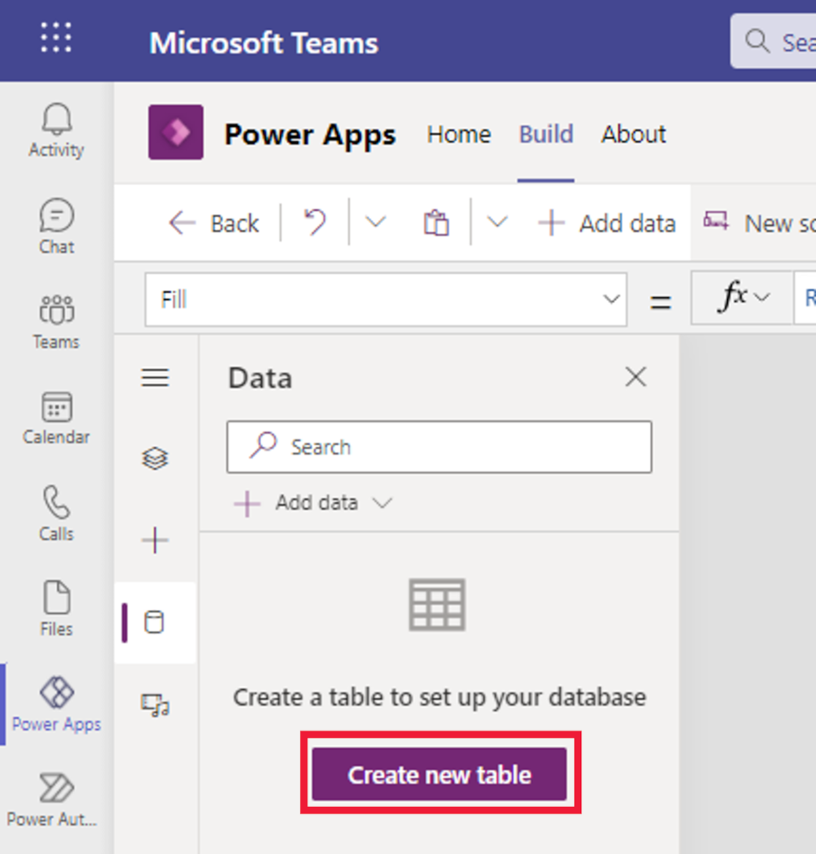
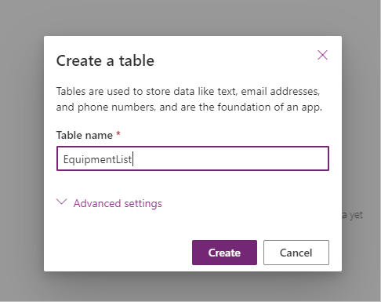

Now that you have provisioned a Dataverse for Teams environment for the Team you specified, you can begin creating solutions. Power Apps, Power Automate Flows, and Chatbots are not useful without data to drive them, so the first step in this process is to create a Table within your environment to store your data.

## Power Apps Visual Table Editor

1. While editing an app in the Power App editor for Teams, select **Create new table**.

	> [!div class="mx-imgBorder"]
	> 

1. For the **Table name**, I want my table to hold a list of Equipment so I'm going to name it "EquipmentList". Select **Create** to complete the process.

	> [!div class="mx-imgBorder"]
	> 

    After a few seconds, your Table will be provisioned and displayed in the visual table editor. The visual table editor enables you to quickly populate your table with the **+ Add Column** and **+ Add row** options.
    
    For example, to add a "location" column that will have two choices of "Engineering Bay" and "Testing Lab".

1. Select **+ Add Column**.

1. For the **Name** use "Location".

1. For the **Type** of data it will contain, select **Choice** from the menu.

1. Fill in the choice options of "Engineering Bay" and "Testing Lab", to add more select **+ New Choices**.

1. Select **Create** when finished.

	> [!div class="mx-imgBorder"]
	> 

    From the visual table editor, you can use any of the following data types. For a complete list of data types available and how they work, see the links in the Summary section at the end of the module.
    
    |     Data Type      |     Description                                                     |
    |--------------------|---------------------------------------------------------------------|
    |     Text           |     A single line   of text.                                        |
    |     Email          |     Text in email   format, will be clickable for the user.         |
    |     URL            |     A hyperlink   in URL format, will be clickable for the user.    |
    |     Auto Number    |     Defines an   autogenerated number sequence.                    |
    |     Number         |     An integer.   (for example, 10 or -10)                                  |
    |     Date           |     Allows users   to enter or search for a date.                   |
    |     Decimal        |     A number with   a decimal point (for example, 1.5 or -1.5).            |
    |     Lookup         |     References a primary column in another table.                   |
    |     Choice         |     Allow people to select one choice from a list.                  |
    |     Yes/No         |     Allow people to pick between two choices.                       |

1. Select **+ Add Rows** to fill out your table with data. You will notice that the input for the fields depends on the type of column you selected. For our example, we have two choices for the location field.

	> [!div class="mx-imgBorder"]
	> 

1. Once you have finished editing the table, select **Close** from the bottom of the editor to return to the app. Now that you have data for the app, Dataverse for Teams automatically generates a basic application using the Hero Template.

## Power Apps Table Editor

Sometimes you will want to edit your table and include more data types that are not in the visual table editor. 

1. To open your table in the full editor, select **Build** and then **See all** from the Power Apps app.

	> [!div class="mx-imgBorder"]
	> 

1. Select **Tables** and then select the ellipses for the table. **Edit** will bring up the full table editor and **Edit data** is for the visual table editor experience. Select **Edit** for the full editor.

	> [!div class="mx-imgBorder"]
	> 

At first, it seems as though there has been a mistake, lots of Columns are now showing up that you did not create! But don't worry, what you are seeing is the power of Dataverse in action!

> [!div class="mx-imgBorder"]
> 

## Understanding the different column types available

The other columns you see in your table are created by the system. Those columns are useful if you need more information about your data. For example, the **Created On** column can tell you when a record was created, while the **Modified By** column can tell you who last touched it.

You probably have some other columns of your own that you'd like to add, so let's take a look at what options you have. 

1. Select the **+ Add Column** button at the top of the screen.

	> [!div class="mx-imgBorder"]
	> 

	A blade will appear on the right-hand side of the screen. The **Display name** of your column is what your users would see if they were inputting data directly into the Table, while the **Name** column is what the column is *called in the database.

	> [!div class="mx-imgBorder"]
	> 

	The **Data type** field is perhaps the most important part of designing a column. This defines what type of data is being held within the column. 

1. Select the **Data type** dropdown to show the full range of data types available. There are lots of options to choose from here, so let's take a look at a few common ones. Each of these data types has special characteristics and settings that can be applied upon selection.

	> [!div class="mx-imgBorder"]
	> 

| Data Type            | Description                                                                                                                                                                                                                                                                                                                                                                                                                                         |
|----------------------|-----------------------------------------------------------------------------------------------------------------------------------------------------------------------------------------------------------------------------------------------------------------------------------------------------------------------------------------------------------------------------------------------------------------------------------------------------|
|     Text             | Text is like a “Single Line of Text” column that you might see in a SharePoint list, although this data type in Dataverse can hold large strings of text, as well.                                                                                                                                                                                                                                                                            |
|     Email            | Email would be used if you knew that this column should only hold email addresses – using a data type aligned with the data you’ll be inputting into the field will give you access to intelligent out-of-the-box features that are specific to the type of data you’re working with. Email records, for example, are clickable and will launch Outlook or other mail clients to allow the user a more streamlined way to send an email to someone. |
|     Date and Time    | Date and Time should be used when the time of day is important to a record, while Date Only can be used if only the date itself is relevant.                                                                                                                                                                                                                                                                                                        |
|     Whole Number     | Whole number is used for numbers that don’t have decimal points, while Decimal Number is used for numbers that do.                                                                                                                                                                                                                                                                                                                                  |
|     Currency         | Perhaps you are keeping track of dollar figures in your Table, in which case a Currency data type might be relevant for one of your columns                                                                                                                                                                                                                                                                                                         |
|     Image            | The Image data type exists specifically to hold images, something that may be valuable to you if you plan to use images in the Power App that uses this Table as a data source.                                                                                                                                                                                                                                                                     |

For a complete list of these data types, their characteristics, limitations, and more see the links in the Summary unit at the end of this module.

## Overview of the management interface

Now that you have provisioned your environment and created a table with columns of your choosing, you may be wondering how you can set administrative settings on your Table. Luckily, Dataverse for Teams includes a management interface to do just that if you are a Team Owner. Members of a Team cannot change the permissions.

1. While editing your Table within the Power Apps **Build** screen, select **Manage Permissions** from the ribbon menu, highlighted by a red box below. This option does not appear if you are not a Team owner.

	> [!div class="mx-imgBorder"]
	> 

1. On the **Manage permissions** screen, you can define who has access to your table and its data. There are different privilege levels for the Team itself, and colleagues who have this table shared with them.

	There are five different permission options available:
	
	-   **Full access**
	
	-   **Collaborate**
	
	-   **Reference**
	
	-   **Private**
	
	-   **None**

	Let's take a look at each of these independently and understand what they do.
	
	**Full access** is exactly what it sounds like; it allows users and groups who have been assigned this level full access to create new records, read or update existing records, and delete records too. This level of access should only be granted to users who need full control over the data.
	
	**Collaborate** allows the creation of new records and the ability to read existing records but denies the ability to update existing records or delete them unless they were created by the user themselves. This is a useful level of privilege for typical users who shouldn't have administrative level access over the data that they are interacting with, but who still need the ability to create new records in the table and edit or delete records that they created in the past. This is the most commonly assigned level of privilege for most use cases.
	
	**Reference** allows the assigned user or group the ability to read from the table, but not to interact with the data in any other way. This level of privilege is useful for look-up tables, for example, where an administrator should define the data that exists while the users should only be able to read from it as a reference for their work.
	
	**Private** is a unique privilege level because it allows the users or groups to create new records in the table (which Reference does not, for example), but not to read any records that were not created by them. It also allows the user or group to update and delete their own records, but not records created by other users. This level of privilege is best used in situations where sensitive information is held within the Table that should not be exposed to typical users.
	
	Lastly, the **None** level denies access entirely; the user or group cannot view or modify any records within the table, nor can they delete them.
	
	All of these levels of privilege can be assigned to either users or groups, depending on your requirements. It is not uncommon to add guest users to a Team, and those users may need to have a different level of access to internal organization users. For this reason, the Manage table permissions section will allow you to manage Members separately from Guests using the options on the left blade.

	> [!div class="mx-imgBorder"]
	> 

1. Select the user or group you want to assign access to, then select the level of access they should have. If your Team has multiple Owners, the Owners option will be visible and access can be defined for those users as well. In the above screenshot, you can see that Members of my team have Full access.