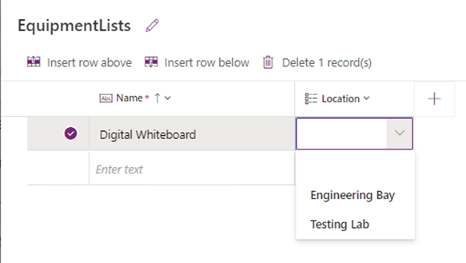
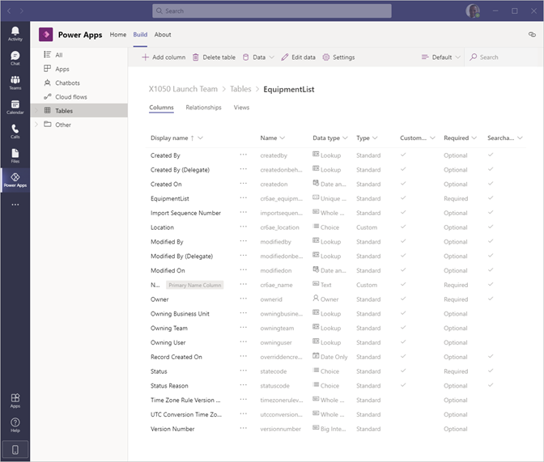
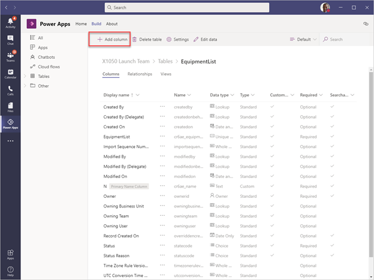
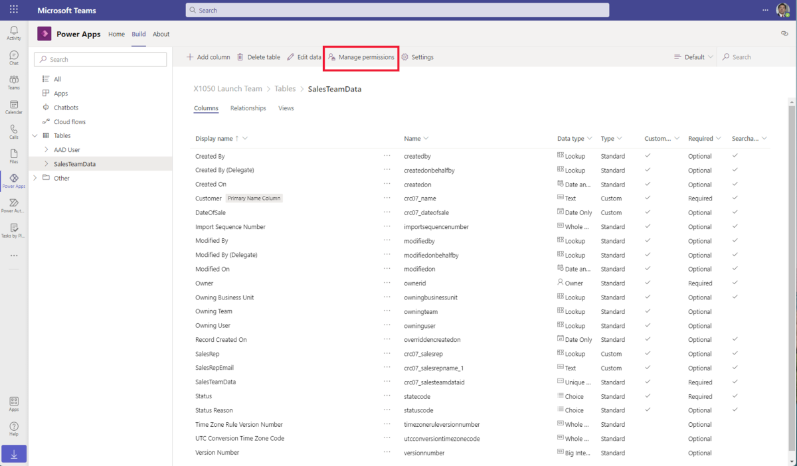

Now that you have provisioned a Dataverse for Teams environment for the team that you specified, you can begin creating solutions. Power Apps, Power Automate flows, and chatbots are ineffective without data to drive them, so the first step in this process is to create a table within your environment to store your data.

## Power Apps visual table editor

To access the Power Apps visual table editor, follow these steps:

1. While editing an app in the Power Apps editor for Teams, select the **Create new table** button.

	> [!div class="mx-imgBorder"]
	> 

1. Enter **EquipmentList** in the **Table name** field because you want the table to hold a list of equipment. Select **Create** to complete the process.

	> [!div class="mx-imgBorder"]
	> 

    After a few seconds, your table will be provisioned and will display in the visual table editor. The visual table editor enables you to quickly populate your table with the **+ Add column** and **+ Add row** options.
    
    To exemplify the process of using the visual table editor to populate your table, the following steps show how to add a **Location** column that will have two choices of **Engineering Bay** and **Testing Lab**.

1. Select **+ Add column**.

1. In the **Name** field, enter **Location**.

1. To indicate the type of data that the table will contain, select **Choice** from the **Type** drop-down menu.

1. Fill in the **Choices** options with **Engineering Bay** and **Testing Lab**. To add more choices, select **+ New choice**.

1. Select **Create** when finished.

	> [!div class="mx-imgBorder"]
	> 

    From the visual table editor, you can use any of the following data types. The Summary section at the end of this module provides links for a complete list of available data types and how they work.
    
    |     Data type      |     Description                                                     |
    |--------------------|---------------------------------------------------------------------|
    |     Text           |     A single line   of text                                        |
    |     Email          |     Text in email   format; will be selectable for the user         |
    |     URL            |     A hyperlink   in URL format; will be selectable for the user.    |
    |     Auto Number    |     Defines an   autogenerated number sequence                    |
    |     Number         |     An integer   (for example, 10 or -10)                                  |
    |     Date           |     Allows users   to enter or search for a date                   |
    |     Decimal        |     A number with   a decimal point (for example, 1.5 or -1.5)            |
    |     Lookup         |     References a primary column in another table                   |
    |     Choice         |     Allows people to select one choice from a list                  |
    |     Yes/No         |     Allows people to pick between two choices                       |

1. Select **+ Add rows** to fill out your table with data. The input for the fields depends on the type of column that you selected. For this example, two choices are available in the **Location** drop-down list.

	> [!div class="mx-imgBorder"]
	> 

1. After you have finished editing the table, select **Close** from the bottom of the editor to return to the app. Now that you have data for the app, Dataverse for Teams automatically generates a basic application by using the Hero Template.

## Power Apps table editor

Occasionally, you will want to edit your table and include more data types that are not in the visual table editor. 

1. To open your table in the full editor, select **Build** and then select the **See all** option from the Power Apps application.

	> [!div class="mx-imgBorder"]
	> 

1. Select **Tables** and then select the ellipsis (**...**) for the table. Selecting **Edit** will bring up the full table editor, or you can select **Edit data** for the visual table editor experience. For now, select **Edit** for the full editor.

	> [!div class="mx-imgBorder"]
	> 

At first, it might appear as if a mistake has been made because several columns that you did not create are displayed. This result is normal and an example of the power of Dataverse in action.

> [!div class="mx-imgBorder"]
> 

## Different available column types

The other columns in your table are created by the system. Those columns are useful if you need more information about your data. For example, the **Created On** column can tell you when a record was created, while the **Modified By** column can tell you who last touched it.

Likely, you will want to add other columns. The following steps will show you the options that you have. 

1. Select the **+ Add column** button at the top of the screen.

	> [!div class="mx-imgBorder"]
	> 

	A blade will appear on the right side of the screen. The **Display name** of your column is what your users would see if they were entering data directly into the table, while the **Name** column shows what the column is named in the database.

	> [!div class="mx-imgBorder"]
	> 

	The **Data type** field is perhaps the most important part of designing a column because it defines what type of data is being held within the column. 

1. Select the **Data type** drop-down menu to show the full range of available data types. Several options are available for you to choose from; the most common ones are explained in the following table. Each data type has special characteristics and settings that can be applied on selection.

	> [!div class="mx-imgBorder"]
	> 

| Data type            | Description                                                                                                                                                                                                                                                                                                                                                                                                                                         |
|----------------------|-----------------------------------------------------------------------------------------------------------------------------------------------------------------------------------------------------------------------------------------------------------------------------------------------------------------------------------------------------------------------------------------------------------------------------------------------------|
|     Text             | Text is similar to a **Single Line of Text** column that you might see in a SharePoint list, though this data type in Dataverse can hold large strings of text as well.                                                                                                                                                                                                                                                                            |
|     Email            | Email would be used if you knew that this column should only hold email addresses. By using a data type that is aligned with the data that you’ll be entering into the field, you will have access to intelligent, out-of-the-box features that are specific to the type of data that you’re working with. Email records, for example, are selectable and will launch Outlook or other mail clients to allow the user a more streamlined way to send an email to someone. |
|     Date and Time    | Date and Time should be used when the time of day is important to a record, while Date Only can be used if only the date is relevant.                                                                                                                                                                                                                                                                                                        |
|     Whole Number     | Whole number is used for numbers that don’t have decimal points, while Decimal Number is used for numbers that do.                                                                                                                                                                                                                                                                                                                                  |
|     Currency         | If you are keeping track of dollar figures in your table, a Currency data type might be relevant for one of your columns.                                                                                                                                                                                                                                                                                                         |
|     Image            | The Image data type exists specifically to hold images, which might be valuable if you plan to use images in the Power Apps application that uses this table as a data source.                                                                                                                                                                                                                                                                     |

The Summary unit of this module provides links that you can select for a complete list of these data types, their characteristics, limitations, and more.

## Management interface overview

Now that you have provisioned your environment and have created a table with columns of your choosing, you can set administrative settings on your table. Dataverse for Teams includes a management interface for you to complete that task, if you are a team owner. Members of a team can't change the permissions.

1. While editing your table within the Power Apps **Build** screen, select **Manage Permissions** from the ribbon menu, which is highlighted by a red box in the following screenshot. This option does not appear if you are not a team owner.

	> [!div class="mx-imgBorder"]
	> 

1. On the **Manage permissions** screen, you can define who has access to your table and its data. Different privilege levels are available for the team and colleagues who have this table shared with them.

	Five different permission options include:
	
	- **Full access** - Allows users and groups full access to create new records, read or update existing records, and delete records. This level of access should only be granted to users who need full control over the data.
	
	- **Collaborate** - Allows the creation of new records and the ability to read existing records, but it denies the ability to update existing records or delete them unless they were created by the user. This level of privilege is beneficial for typical users who shouldn't have administrative level access over the data that they are connecting with, but who still need the ability to create new records in the table and edit or delete records that they created in the past. This level of privilege is the most commonly assigned for most use cases.
	
	- **Reference** - Allows the assigned user or group the ability to read from the table but not to interact with the data in any other way. For example, this level of privilege is useful for look-up tables where an administrator should define the data that exists while the users should only be able to read from it as a reference for their work.
	
	- **Private** - A unique privilege level because it allows the users or groups to create new records in the table (which **Reference** does not), but it does not allow users or groups to read records that were not created by them. It also allows the user or group to update and delete their own records, but not records that were created by other users. This level of privilege is best used in situations where sensitive information is held within the table that should not be exposed to typical users.
	
	- **None** - Denies access entirely; the user or group can't view or modify records within the table and they can't delete them.
	
	All levels of privilege can be assigned to either users or groups, depending on your requirements. It is not uncommon to add guest users to a team, and those users might need to have a different level of access than internal organization users. For this reason, the **Manage table permissions** section will allow you to manage members separately from guests by using the options on the left blade.

	> [!div class="mx-imgBorder"]
	> 

1. Select the user or group that you want to assign access to, and then select the level of access that they should have. If your team has multiple owners, the **Owners** option will be visible, and you can define access for those users as well. In the preceding screenshot, members of the team have been granted **Full access**.
