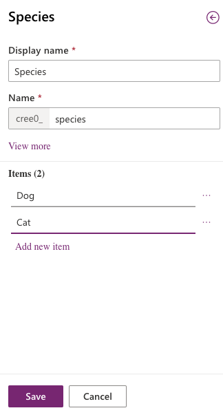
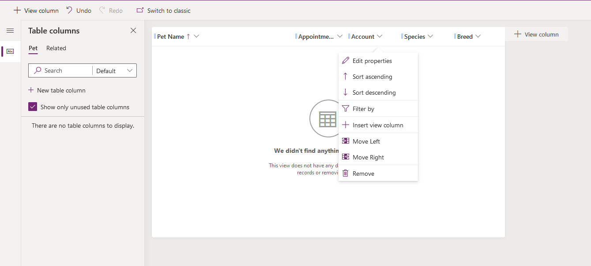

In this unit, you'll create a table and then customize key components, like columns, relationships, views, and forms. You'll learn how to:

- Create a custom table.
- Add custom columns to your table.
- Add a table relationship.
- Customize a view.
- Customize a form.

The tutorial follows the Contoso company, which is a pet grooming business that grooms dogs and cats. Contoso needs an app for client and pet tracking that can be used by employees on a variety of devices.

## Create a custom table

Sign in to [Power Apps](https://make.powerapps.com) and follow these steps to create a new custom table.

1. In the left navigation pane, expand **Data**, select **Tables**, and then select **+ New table**.

2. Under New table, enter the following:

    - **Display name**: *Pet*

3. In the Primary Column section, enter the following:

    - **Display name**: *Pet Name*

4. At the bottom, click **Create**.

You will notice in our example, the new table and primary column begins with **cree0_**. Additional columns created for this table will also begin with **cree0**, this is specific to our demo environment. When testing in your own environment this may look different.

## Add and customize columns

1. In the list of Tables, select the **Pet** table that you created in the previous section.
2. On the **Columns** tab, on the table designer toolbar, select **Add column**.
3. In the **Column properties** pane, enter the following values:

    - **Display name**: *Species*
    - **Data type**: *Choice*
    - **Choice set**: *+ New choice*
    - **Searchable**: *Yes*

4. Create the choice set:

    1. Replace *New choice* with *Dog*.
    2. Select **Add new item**.
    3. Replace *New choice* with *Cat*.
    4. Select **Save**.

    > [!div class="mx-imgBorder"]
    > 

5. Make sure **Searchable** is selected, and then select **Done**.
6. On the table designer toolbar, select **Add column**.
7. In the **Column properties** pane, enter the following values, and then select **Done**:

    - **Display name**: *Breed*
    - **Data type**: *Text*
    - **Searchable**: *Yes*

8. On the table designer toolbar, select **Add column**.
9. In the **Column properties** pane, enter the following values, and then select **Done**:

    - **Display name**: *Appointment date*
    - **Data type**: *Date and Time*
    - **Searchable**: *Yes*

10. Select **Save table**.

## Add a relationship

1. On the **Relationships** tab, on the table designer toolbar, select **Add relationship**, and then select **Many-to-one**.
2. In the right pane, in the **Related** list, select **Account**.
3. Select **Done**.
4. Select **Save table**.

    Notice that when you add a many-to-one relationship, an **Account** field of the **Lookup** data type is automatically added to your list of columns on the **Columns** tab.

    > [!div class="mx-imgBorder"]
    > 

## Customize a view

1. On the **Views** tab, right-click **Active Pets** view and select **Open Link in New Tab**. If you don't see the **Active Pets** view, select **Remove filter**.
2. In the view designer, select **+ View Column**, select the following columns, and then select **OK**:

    - Account
    - Appointment date
    - Breed
    - Species

3. Select the **Created On** column, select **Remove**.
4. To arrange the columns, select the column to move, and then select **Move Left** or **Move Right** until your view looks like this. You could also simply drag and drop the columns to arrange the order as well.

    > [!div class="mx-imgBorder"]
    > 

5. On the view designer toolbar, select **Save**.
6. Select **Publish**.

## Customize the main form

1. In the left navigation pane, expand **Data**, select **Tables**, and then select **Pet**.
1. On the **Forms** tab, select **Information** next to the **Main** form type to open the form editor.

    > [!div class="mx-imgBorder"]
    > 

1. In the form editor, drag the **Species**, **Breed**, **Appointment date**, and **Account** columns from the **Field Explorer** pane to the **General** section of the form canvas, so that the form looks like this.

    > [!div class="mx-imgBorder"]
    > 

1. Select **Save**.
1. Select **Publish**.
1. Click the back arrow in your browser to close the form designer.
