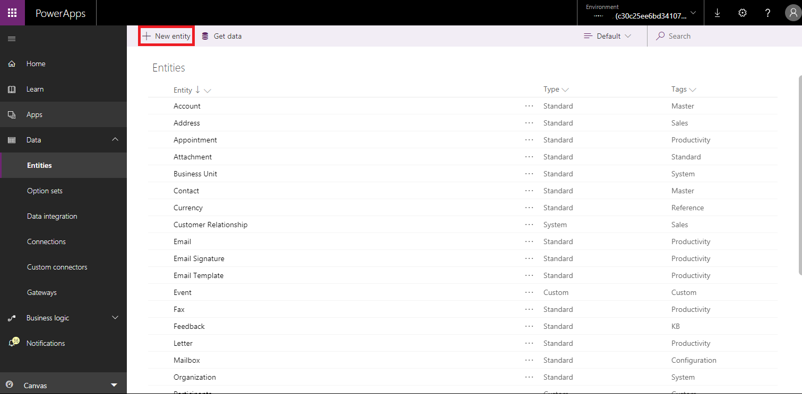

In this unit, you'll create an entity and then customize key components, like fields, relationships, views, and forms. You'll learn how to:

- Create a custom entity.
- Add custom fields to your entity.
- Add an entity relationship.
- Customize a view.
- Customize a form.

The tutorial follows the Contoso company, which is a pet grooming business that grooms dogs and cats. Contoso needs an app for client and pet tracking that can be used by employees on a variety of devices.

## Prerequisites

Sign in to [Microsoft PowerApps](https://web.powerapps.com/?utm_source=padocs&utm_medium=linkinadoc&utm_campaign=referralsfromdoc). If you don't already have a PowerApps account, select the **Get started free** link on [powerapps.com](https://web.powerapps.com/?utm_source=padocs&utm_medium=linkinadoc&utm_campaign=referralsfromdoc).

## Create a custom entity

1. In the left navigation pane, expand **Data**, select **Entities**, and then select **New entity**.

    > [!div class="mx-imgBorder"]
    > 

2. Enter the following values:

    - **Display name**: *Pet*
    - **Description**: *Custom entity to track pet services*

3. Select **Next**, and then, after the default fields are shown, select **Save Entity**.

## Add and customize fields

1. In the list of entities, select the **Pet** entity that you created in the previous section.
2. On the **Fields** tab, select the **Pet** field.
3. In the right pane, make the following changes to the **Display name** field:

    - Change the **Display name** value from *Pet* to *Pet Name*.
    - Select **Searchable**.

    > [!div class="mx-imgBorder"]
    > 

3. Select **Done**.
4. On the **Fields** tab, on the entity designer toolbar, select **Add field**.
5. In the **Field properties** pane, enter the following values:

    - **Display name**: *Species*
    - **Data type**: *Option Set*
    - **Option set**: *New option set*

6. Create the option set:

    1. Select **Add new item**.
    2. Replace *New option* with *Dog*.
    3. Select **Add new item**.
    4. Replace *New option* with *Cat*.
    5. Select **Save**.

    > [!div class="mx-imgBorder"]
    > 

7. Select **Searchable**, and then select **Done**.
8. On the entity designer toolbar, select **Add field**.
9. In the **Field properties** pane, enter the following values, and then select **Done**:

    - **Display name**: *Breed*
    - **Data type**: *Text*
    - **Searchable**: *Yes*

10. On the entity designer toolbar, select **Add field**.
11. In the **Field properties** pane, enter the following values, and then select **Done**:

    - **Display name**: *Appointment date*
    - **Data type**: *Date and time*

12. Select **Save Entity**.

## Add a relationship

1. On the **Relationships** tab, on the entity designer toolbar, select **Add relationship**, and then select **Many-to-one**.
2. In the right pane, in the **Related** list, select **Account**.
3. Select **Done**.
4. Select **Save Entity**.

    Notice that when you add a many-to-one relationship, an **Account** field of the **Lookup** data type is automatically added to your list of fields on the **Fields** tab.

    > [!div class="mx-imgBorder"]
    > 

## Customize a view

1. On the **Views** tab, select the **Active Pets** view. If you don't see the **Active Pets** view, select **Remove filter**.
2. In the view designer, select **Add Columns**, select the following columns, and then select **OK**:

    - Account
    - Appointment date
    - Breed
    - Species

3. Select the **Created On** column, select **Remove**, and then select **OK** to confirm the column removal.
4. To arrange the columns, select the column to move, and then use the arrow buttons (**\<-** and **-\>**) until your view looks like this.

    > [!div class="mx-imgBorder"]
    > 

5. On the view designer toolbar, select **Save and Close**.

## Customize the main form

1. In PowerApps, in the left navigation pane, select **Model-driven**.
2. In the left navigation pane, expand **Data**, select **Entities**, and then select **Pet**.
3. On the **Forms** tab, select **Information** next to the **Main** form type to open the form editor.

    > [!div class="mx-imgBorder"]
    > 

4. In the form editor, drag the **Species**, **Breed**, **Appointment date**, and **Account** fields from the **Field Explorer** pane to the **General** section of the form canvas, so that the form looks like this.

    > [!div class="mx-imgBorder"]
    > 

5. Select **Save**.
6. Select **Publish**.
7. Select **Save and close** to close the form designer.
