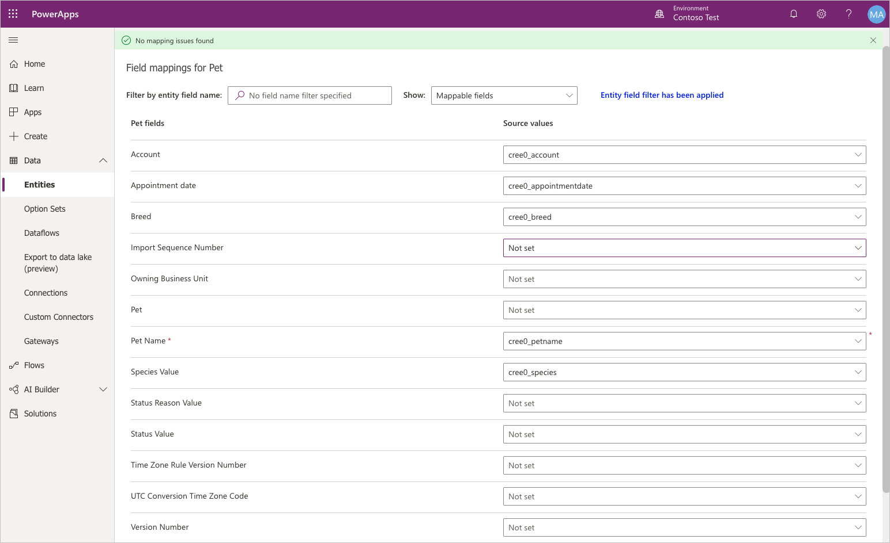

You can import data into your Microsoft Dataverse database in bulk from Microsoft Excel or CSV files. 

Every entity has required fields that must exist in your input file. We recommend that you create a template. A template will save you time and effort. First, export data from the entity. You'll use the same file (updated with your data) to import data into the entity.

## Create a file template
You can do a one-time data export from a standard entity or a custom entity, and you can export data from more than one entity at a time. If you export data from more than one entity, each entity is exported into its own Microsoft CSV file. In this example, you'll see how to export the **Pet** entity but remember you could select several entities to export if you would like.

1. On [powerapps.com](https://make.powerapps.com/), in the left navigation pane, expand **Data**, select **Entities**, and then select **Export data**.
2. Select the **Pet** entity, and then select **Export data**.
3. After the export is finished, select **Download exported data**, and save the file.

## Copy data into your template
When you add data to a template file, you must make sure the data is unique. You can use either *primary keys* or *alternate keys*.

1. Open the CSV file that you created in the previous section.
2. Add at least one new row of data but you only need to add information to the following fields below.

    - **Appointment date**
    - **Breed**
    - **Pet Name**
    - **Species**

    

3. Save the file.

## Import the file
1. In the left navigation pane, expand **Data**, and then select **Entities**.
2. Select the **Pet** entity, select the drop down arrow next to Get Data, and then select **Get data from Excel**.
3. Click **Upload** and select the file that you just updated and saved from the previous section.
4. After the file is uploaded, click **Map fields**.
5. Set the following Pet fields Source values to **None**.

    - **Import Sequence Number**
    - **Owning Business Unit**
    - **Pet**
    - **Status Reason Value**
    - **Status Value**
    - **Time Zone Rule Version Number**
    - **UTC Conversion Time Zone Code**
    - **Version Number**
 
    

6. In the upper right, click **Save changes**.

    

    You will notice under Mapping status, it states "Mapping warnings exist". The reason for this mapping status is because we set some of the fields to None or Not. This is fine because we didn't want to include those fields so this warning can be ignored. 

7. In the upper right, click **Import**.

    After the data has been successfully imported, you'll see the total number of inserts and updates. Now let's go take a quick look at the imported data

8. On the left, select **Entities**.
9. Select the **Pet** entity.
10. On the entity designer toolbar, select **Data**.

Notice that the Account field is empty, this is because when you updated the Excel export file and update fields you were not instructed to update this field. The reason you were not instructed to update the Account field is because you cannot set a lookup value when importing data from Excel, this must be done from Power Apps. 
