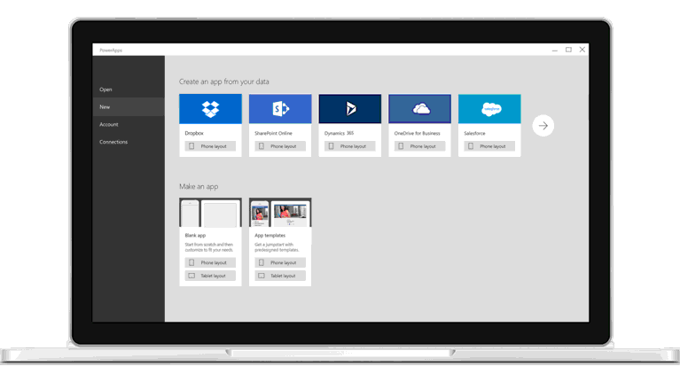

Welcome to Microsoft PowerApps. This self-paced online module helps you build apps from the ground up.

 In this module, you will:
  - Explore how PowerApps can make your business more efficient.
  - Understand which technologies to use to perform tasks in PowerApps.
  - Understand the different ways to build an app in PowerApps.
  - Create your first app from data in a Microsoft Excel workbook.

In this introductory module, you'll learn how to create an app from data in a Microsoft Excel workbook. As a prerequisite, you'll download a workbook that contains sample data. Then you'll upload the workbook to Microsoft OneDrive for Business, where you can share the data with others. Then you'll build the app without using a traditional programming language such as C#.

With PowerApps, you can:

- Quickly build an app by using the skills that you already have.
- Connect to the cloud services and data sources that you're already using.
- Instantly share your apps so that co-workers across the company or across the world can use them on their phones and tablets.

The sky's the limit when it comes to using PowerApps to get things done and keep people informed. These examples can help you think about how to use an app, instead of traditional paper notes, to run your business:

- **Equipment in the field**: Often, company representatives who visit customers in the field carry clipboards to help guarantee a paper trail of parts with scheduled replacement dates. By running an app on a tablet, reps can look up the customer's equipment, see a picture of a part, test and analyze the part, and then order new parts. Reps can perform these tasks on-site instead of leaving the customer's warehouse.
- **Restaurant employee management**: Employees of a large restaurant might fill out work schedules and vacation requests on paper that's stapled to a wall. With PowerApps running on everyone's smartphone, employees now just open the app to record the same information, anywhere, any time. The app can even send reminders for the start of the next day's shift.

If you're a beginner with PowerApps, this module gets you going quickly. If you're familiar with PowerApps, it ties concepts together and fills in the gaps.

## PowerApps building blocks
PowerApps is a collection of services, apps, and connectors that work together to let you do much more than just view your data. You can act on your data and update it anywhere and from any device.

To create, share, and administer apps, you'll use these sites:

1. [web.powerapps.com](https://web.powerapps.com) In this site, you can open apps, specify the type of app that you want to create, and create data connections and flows.
1. [PowerApps Studio](https://aka.ms/powerappswin): In this site, you build apps by configuring user interface (UI) elements and Excel-like formulas.
1. [PowerApps admin center](https://admin.powerapps.com/): In this site, you'll define environments and data policies.

When you're done with all that, you can run your apps in a browser (from Microsoft Dynamics 365) or in PowerApps Mobile (available for Windows tablets, iOS devices, and Android devices).

In this unit, you got an overview of what you can do with PowerApps. In the next unit, you'll look more closely at PowerApps components.
