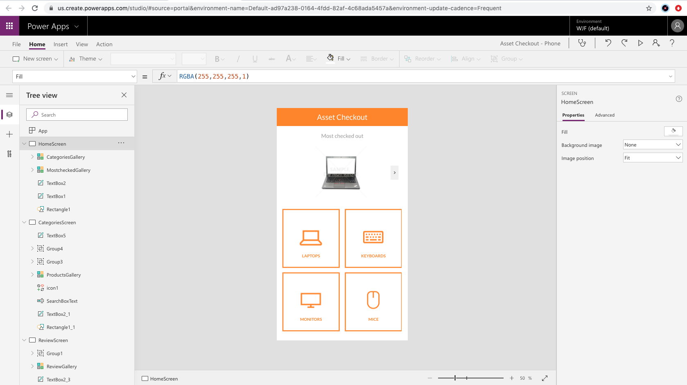

This unit explores each part of the following PowerApps components:

* **web.powerapps.com** - Apps start here, whether you build them from data, a sample app, or a blank screen.
* **PowerApps Studio** - Develop your apps further by connecting to data, adding and arranging user interface (UI) elements (known as controls), and building formulas.
* **PowerApps Mobile** - Run your apps on Microsoft Windows, Apple iOS, and Google Android devices.
* **PowerApps Admin Center** - Manage PowerApps environments and other components.

## web.powerapps.com
If you are building an app, you'll start with the web.powerapps.com component. You can build apps from sample apps, templates, or a blank screen. All the apps that you've built appear here, along with any apps that others have created and shared with you.

## PowerApps Studio
PowerApps Studio is where you can fully develop your apps to make them more effective as a business tool and to make them more attractive. PowerApps Studio has three panes that make creating apps seem more like building a slide deck in Microsoft PowerPoint:

- **Left pane** - Shows a hierarchical view of all the controls on each screen or a thumbnail for each screen in your app.
- **Middle pane** - Shows the canvas app that you're working on.
- **Right pane** - Where you set options such as the layout, properties, and data sources for certain controls.

## PowerApps Mobile
PowerApps Mobile for Windows, iOS, and Android devices allows you to use all the apps that you've created, and those others have shared with you, on your mobile device. You or your users can download the Microsoft PowerApps app from the appropriate app store. When users log in with their credentials, they will see all apps that have been shared with them. The PowerApps Mobile app only needs to be downloaded once. 

When you use apps in PowerApps Mobile, you get the most out of your device's capabilities: camera controls, GPS location, and more.

## PowerApps Admin center
The PowerApps admin center is the centralized place for managing PowerApps for an organization. On this site, you can define and manage different environments to house the apps. For example, you might have separate environments for development and production apps. Additionally, you can define data connections and manage environment roles and data policies. 

