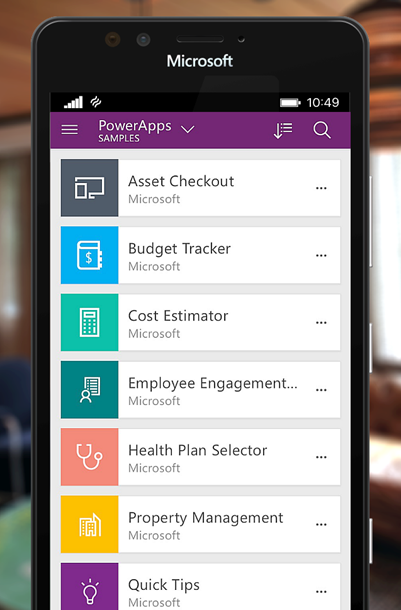

Power Apps is a collection of services, apps, and connectors that work together to let you do much more than just view your data. You can act on your data and update it anywhere and from any device.

This unit explores each part of the following Power Apps components:

- [**Power Apps Home Page**](https://make.powerapps.com/?azure-portal=true) - Apps start here, whether you build them from data, a sample app, or a blank screen.
- [**Power Apps Studio**](https://create.powerapps.com/studio/?azure-portal=true) - Develop your apps further by connecting to data, adding and arranging user interface (UI) elements (known as controls), and building formulas.
- **Power Apps Mobile** - Run your apps on Microsoft Windows, Apple iOS, and Google Android devices.
- [**Power Apps Admin Center**](https://admin.powerplatform.microsoft.com/?azure-portal=true) - Manage Power Apps environments and other components.

> [!NOTE]
> To use these sites, you'll need to sign in by using your organizational account.

## Power Apps Home Page

If you are building an app, you'll start with the [Power Apps Home Page](https://make.powerapps.com/?azure-portal=true). You can build apps from sample apps, templates, or a blank screen. All the apps that you've built appear here, along with any apps that others have created and shared with you.

## Power Apps Studio

Power Apps Studio is where you can fully develop your apps to make them more effective as a business tool and to make them more attractive. Power Apps Studio has three panes that make creating apps seem more like building a slide deck in Microsoft PowerPoint:

- **Left pane** - Shows a hierarchical view of all the controls on each screen or a thumbnail for each screen in your app.
- **Middle pane** - Shows the canvas app that you're working on.
- **Right pane** - Where you set options such as the layout, properties, and data sources for certain controls.

## Power Apps Mobile

Power Apps Mobile for Windows, iOS, and Android devices allow you to use all the apps that you've created, and those others have shared with you, on your mobile device. You or your users can download the Microsoft Power Apps app from the appropriate app store. When users sign in with their credentials, they will see all apps that have been shared with them. The Power Apps Mobile app only needs to be downloaded once.

When you use apps in Power Apps Mobile, you get the most out of your device's capabilities: camera controls, GPS location, and more.

## Microsoft Power Platform admin center

Microsoft Power Platform admin center is the centralized place for managing Power Apps for an organization. On this site, you can define and manage different environments to house the apps. For example, you might have separate environments for development and production apps. Additionally, you can define data connections and manage environment roles and data policies.

For more information, see [Best practices](/learn/paths/best-practices-environments/?azure-portal=true) Learning Path.

