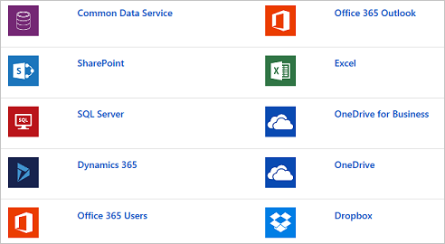

Microsoft Power Apps works with other technologies to help you build powerful apps for your organization. Some of these technologies include:

- **Data sources** - Without data, you don't have a business. Data sources bring cloud and on-premises data into your apps. You access data through built-in connections, custom connectors, and gateways.
- **Common Data Service** - A compliant and scalable data service that's integrated into Power Apps.
- **Power Automate** - Allows you to build automated workflows to receive notifications, run processes, collect data, and more.

## Data sources, connections, and gateways
In Power Apps, most canvas apps use external information that is stored in Data Sources. A common example is a table in an Excel file that is stored in OneDrive for Business or SharePoint. Apps access these data sources by using connections. Some connections allow Power Apps to read and write stored data. In Power Apps, you can add many data sources to your apps through built-in or custom connectors. Some of the most popular data sources are shown in the following figure.

Many data sources are cloud services, like Salesforce. Even Twitter can be a data source if, for example, you're tracking your company's hashtags. Connectors might not seem like the most exciting part of app development; however, they're essential when you work with data that you, your colleagues, and your customers care about. When an app shows up with your data source for the first time, you might suddenly find that they are, in fact, exciting.

For data that's stored on-premises instead of in the cloud, you can use a gateway to provide a reliable connection between Power Apps and your data source. The gateway sits on an on-premises computer and communicates with Power Apps. 

An advantage of building your business apps in Power Apps is being able to connect to many data sources in a single app. With the connectors in Power Apps, you can connect to where your data lives. To learn more about data sources in Power Apps, refer to the Working With Data learning path. 

## Common Data Service
An important data source option to explore further is the Common Data Service. Common Data Service lets you store and manage data that's used by business applications. Data within Common Data Service is stored within a set of entities. An entity is a set of records that are used to store data, similar to how a table stores data within a database. Common Data Service includes a base set of standard entities that cover typical scenarios, but you can also create custom entities that are specific to your organization and then populate them with data by using Power Query. App makers can then use Power Apps to build rich applications by using this data.

For information on purchasing a plan to use Common Data Service, refer to the [License](https://docs.microsoft.com/power-platform/admin/pricing-billing-skus) and [Pricing](https://powerapps.microsoft.com/pricing/) information pages.

## Reasons to use Common Data Service
Standard and custom entities within Common Data Service provide a cloud-based storage option for your data. Entities let you create a business-focused definition of your organization's data for use within apps. If you're unsure if entities are your best option, consider the following benefits:
- **Simple to manage** - Both the metadata and data are stored in the cloud. You don't need to worry about the details of how they're stored.
- **Helps to secure data** - Data is stored so that users can see it only if you grant them access. Role-based security allows you to control access to entities for different users within your organization.
- **Access your Dynamics 365 Data** - Data from your Dynamics 365 applications is also stored within the Common Data Service, which allows you to quickly build apps that use your Dynamics 365 data and extend your apps by using Power Apps.
- **Rich metadata** - Data types and relationships are used directly within Power Apps.
- **Logic and validation** - Define calculated fields, business rules, workflows, and business process flows to ensure data quality and drive business processes.
- **Productivity tools** - Entities are available within the add-ins for Microsoft Excel to increase productivity and ensure data accessibility.

## Power Automate
You can use Power Automate to create logic that performs one or more tasks when an event occurs in a canvas app. For example, configure a button so that, when a user selects it, an item is created in a SharePoint list, an email, or meeting request is sent, a file is added to the cloud, or all of these. You can configure any control in the app to start the flow, which continues to run even if you close Power Apps.

