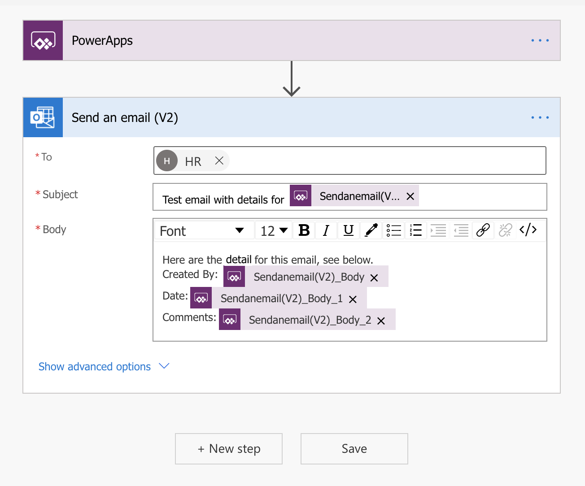
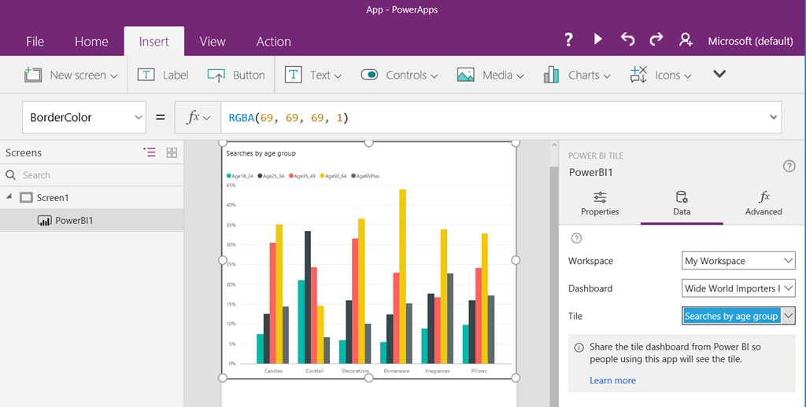
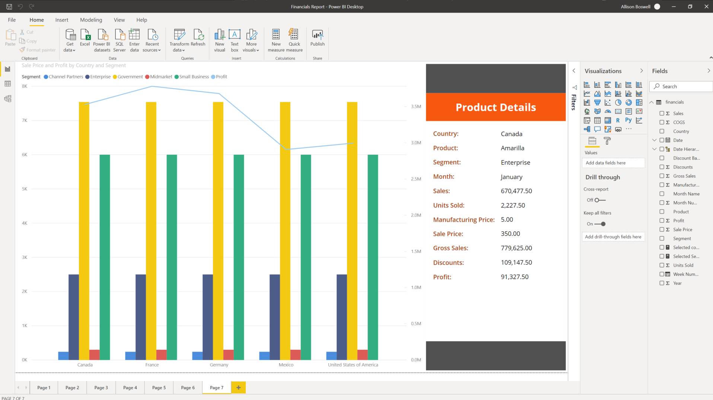
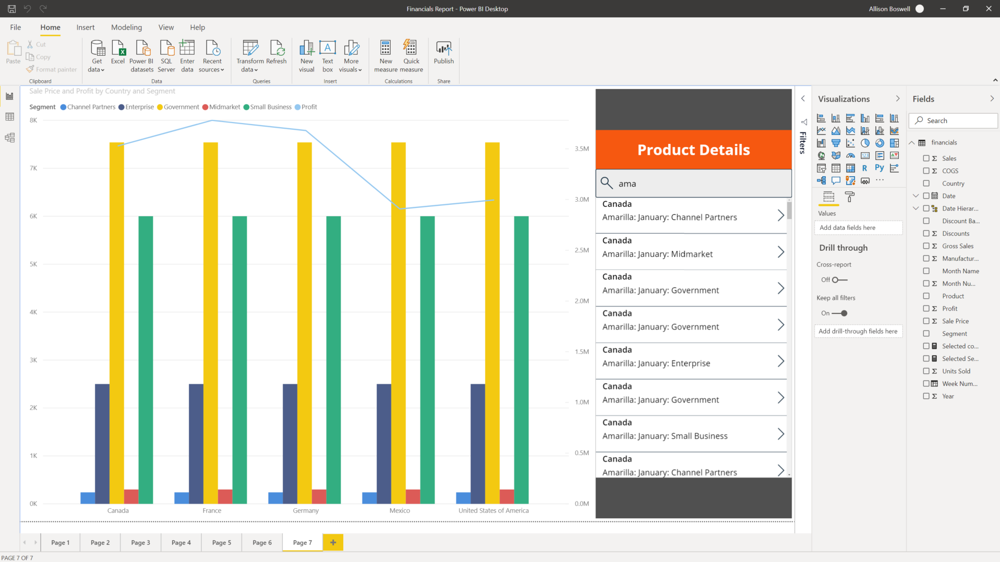

Microsoft Power Apps works with other technologies to help you build powerful apps for your organization, including:

- **Power Automate** - Allows you to build automated workflows to receive notifications, run processes, collect data, and more.

- **Power BI** - Allows you to connect data from multiple sources and transform the data into graphical visualizations to gain insights.

## Related Power Platform technologies

As you continue developing your application, you may want to consider implementing other Power Apps related technologies such as Power Automate and or Power BI. For example, you may have a simple Expense Report App that requires an approval before an item can be purchased. With Power Automate, you can create a Flow to make this happen. Or maybe you want to display your data with custom charts and graphs giving your users a more visual look into the data, which can often be useful. In this section, you will learn more about some of the other Power Platform technologies and how you could apply them in your own Power Apps solution. Keep in mind, if you decide to implement these Power Apps related technologies you should also review their licensing structure and associated costs.

### Power Automate

Power Automate brings automation to your business. This can be traditional workflows via flow, Robotic Process Automation (RPA) for automating legacy systems via desktop flow, or business process automation via Business Process Flows. Each of these capabilities increases your productivity to connect disjointed systems to build the business solution you need and make your app more powerful. 

You can use Power Automate to create logic that performs one or more tasks when an event occurs in a canvas app. For example, configure a button to execute a flow to do one of the following: create an item in a SharePoint list, send an email or meeting request, or add a file to OneDrive.  The button could be configured to do all of those in a single Power Automate flow. You can configure any control in the app to start the flow, which continues to run even if you close Power Apps.  Below is an example using Power Automate to send a flow:

### Identify flows in your solution

Now that you have a general overview of Power Automate, how do you determine if the solution you’re building requires a Flow? There are many simple functions Power Apps can do, like sending an email when a button is pressed in your application. This email generated from Power Apps can also contain dynamic/specific information and be sent to any email address you would like. Often, customers will use Power Automate to create this same functionality even though Power Apps can do this out of the box. Power Automate should be used for more complex solutions, such as the approval workflows. With Power Automate you can run an approval when a button is pressed, on a schedule, when an item is created or modified, and so on. 

For many Power Apps solutions Power Automate is used to handle complex business logic. Do you need a way to make sure someone acted on the incident report that was generated by your app? Or, do you need a process to kick off every time new data is created in another system so Power Apps will have the data it needs? Do you need to check each morning to see if an inspection is due that day and then send an email with a link to your Power Apps inspection form? These are great uses of Power Automate to transform your app from a point solution to a fully featured business solution.

## Power BI

Power BI is an analytics tool within the Power Platform suite.  Power BI connects data from multiple sources and transforms the data into graphical visualizations to gain insights.  It allows business users to utilize many different visualizations to build comprehensive reports and dashboards.  When creating Power BI reports to view and analyze your app data, you have the ability to customize them for personal use and will only be accessible by you, providing you with a more unique and custom experience. If you need to share the report with others, you and each of the report consumer will need a Power BI Pro license. This license allows you to not only share the content but also control what others are able to do with the shared report or dashboard.  

While Power Apps has capabilities to include simple graphs or tables, many solutions would be better served with a visualization provided by Power BI.  Power Apps and Power BI have two options for seamless integration:

### Embed a Power BI tile in a Power Apps app

By embedding a Power BI tile in a Power Apps solution, you are able to bring valuable visualizations into the app to allow the user to consume that data within the context of the app.  

### Embed a Power Apps app in a Power BI dashboard

Another integration between these two applications, is to embed a Power Apps app in your Power BI report.  This allows the user to act on data while never leaving the dashboard resulting in a better user experience.  Consider an inventory management dashboard for a manufacturing facility.  Without leaving the dashboard, the user can submit to purchasing an order for other material.  While the solution may have been utilizing both the Power Apps and Power BI platforms, the user simply experiences a complete end to end solution in one window on their desktop.

In the example below, we are analyzing the Sale Price and Profit by Country and Segment. Notice once you have embedded your Power App in a Power BI Dashboard you can navigate between screens.

In this next screenshot, still working with the same data as the previous example, you can utilize the native Power Apps features like Search with Power BI data.

In this last screenshot, for this example, you will see the embedded Power App is filtered by the Power BI selection.

### Translating needs to the appropriate technology

To build the best solution, think through the use cases and determine how you want to collect the data, use the data, and analyze the data.  Once you have determined how the solution will be used in each one of those cases, you can begin to select the right technology to execute each function. 

It would be difficult to cover every use case and decision point, but the number of steps in your solution/process will aid you in determining which technology best suits your needs. Power Apps is great for performing simple solutions with minimal steps but as your solutions become more complex and requires multiple steps, Power Automate would be the better solution.

When deciding whether to use the basic charts, graphs, and visuals that come with Power Apps out of the box or to utilize a more powerful software like Power BI it really depends on your business solution and requirements. For example, if in your solution, you are wanting to add some basic graphs and charts to improve the apps overall look and feel while adding some visual flair for your users, Power Apps has you covered.

On the other hand, if your solution requires in-depth analysis of your data, and robust visuals, Power BI will be the best product for your solution. Keep in mind, with Power BI, each app user will need another license on top of the Power Apps license. This is a small price to pay though if our solution relies on intuitive dashboards, charts, graphs, and several other features to help you get the most out of your solution.

By identifying the needs of related Power Apps technologies in your solution and strategically implementing them, you will be able to provide your users with a better overall experience when using the solution.