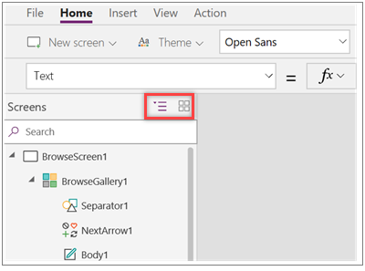

OK, let's get started.

Now that you're familiar with all the parts of Microsoft PowerApps and the options for creating apps, it's time to actually build an app. In this unit, you'll generate a phone app where the data source is a Microsoft Excel workbook that's stored in Microsoft OneDrive for Business. This Excel workbook lists a company's inventory of flooring samples with pictures and prices.

Keep in mind that you can use data from lots of other sources, including Microsoft SharePoint, cloud services like Salesforce, and on-premises sources like Microsoft SQL Server.

> [!NOTE]
> This flow will work only if you have a license for Office 365 and the required Dynamics 365 license or free Dynamics 365 trial. Learn more about which [Microsoft products include Microsoft PowerApps and Microsoft Flow](https://docs.microsoft.com/powerapps/administrator/pricing-billing-skus#licenses).”

## Connect to a data source

1. Download the [Flooring Estimates workbook](https://az787822.vo.msecnd.net/documentation/get-started-from-data/FlooringEstimates.xlsx), and save it to OneDrive for Business.

1. Go to [https://web.powerapps.com](https://web.powerapps.com), and sign in with your organizational account.

1. In the left pane, select **Apps**.

1. Select **Canavas app** from balank from the dropdown menu​

1. Select **Create an app**. 
1. For the **OneDrive for Business** data source, select **Phone layout**.

    

    Generated apps are always based on a single list or table, but you can add more data to the app later. The next three steps explain how to connect to the Excel workbook.

1. Under **Connections**, select **OneDrive for Business**.

    You may need to select **New Connection** to see the **OneDrive for Business** connection.
1. Select **Create**.
1. Under **Choose an Excel file**, select the Excel workbook.
1. Select **Connect**.

PowerApps generates the app by inspecting your data and matching it with PowerApps capabilities so that you get a working app as a starting point.

Please note that you have to choose to preview the app before you can get to the PowerApps Studio.

## Explore the generated app
Success! Your new three-screen app opens in PowerApps Studio.

On the left, you'll see the **Screens** pane. In the upper-right corner of the screens pane, select the thumbnail view.

Select the thumbnail for each screen to view the controls on that screen. 

Here is the main development window for PowerApps Studio, which you'll learn more about in later units.

Select **Play**  in the upper-right corner to try out the app. You'll see that it includes all the data from the list and provides a good default experience.

All apps generated from data have the same set of screens that you can view from the Thumbnail pane:

* **Browse screen**: This screen appears by default. In it, you can browse, sort, filter, and refresh the data from the data source. In the browse screen, you add items to the data source by selecting the plus sign (**+**).
* **Details screen**: Select an item in the browse screen to open the details screen, which shows all details about an item. In this screen, you can open an item for editing or delete it.
* **Edit/create screen**: In this screen, you edit an existing item, or you create one.

To make your app visible on the phone it needs to be saved. ​Click **File**, **Save as** with the title "flooring-estimates app". ​You will see green checkmark when all changes are successfully saved.
Now open **PowerApps** app on your phone and select "flooring-estimates app". If you cannot find the app try search mode within the PowerApps on your mobile device.

## Install the app on your device
You'll want to install your app on your phone to see how it looks there.

1. Download PowerApps Mobile from the app store for the platform that you want to use.

2. Sign in by using your user name and password.

3. On your phone or tablet, run the flooring-estimates app in PowerApps Mobile. Otherwise, run the app in a browser.

In just a few minutes, you learned how to connect to a data source and generate an app. You also got acquainted with PowerApps Studio and the three screens in a generated app. In later modules, you'll learn how to customize generated apps.